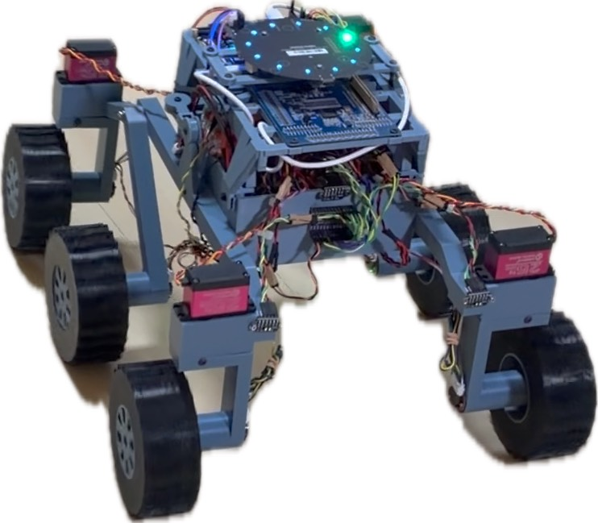
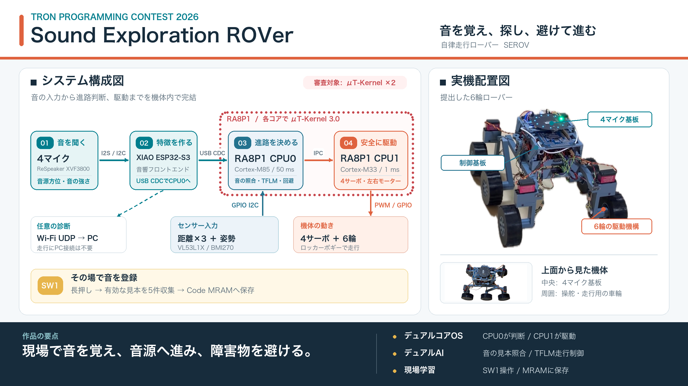
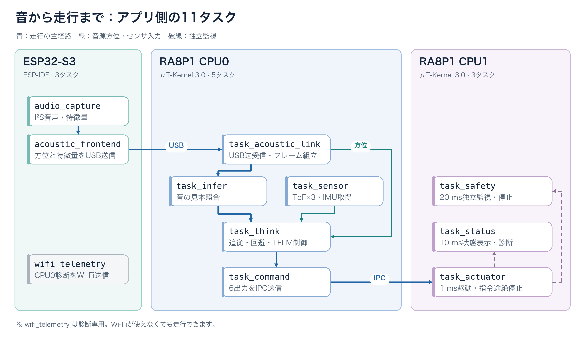

# Sound Exploration ROVer（SEROV）

**現場で覚えた音を聞き分け、その方向へ進み、障害物を避けるμT-Kernel 3.0ローバ。**

**デュアルコアOS**（RA8P1の両コアでμT-Kernel 3.0）、**デュアルAI**（音の見本照合とTFLMの走行制御）、**現場学習**（SW1で音を登録）が特長です。

TRONプログラミングコンテスト2026の審査用に、実機を発送済みです。鳴子の学習から追従までと、プランターへの非接触回避を実機で確認しました。工場などで異常音を探す用途は、今後の展開として想定しています。

- [応募資料・実機評価手順](docs/contest/README.md)
- [ソースの取得と再現方法](docs/contest/SOURCE_AND_BUILD.md)

## ローバが音を追うまで

1. **音を覚える：** 本体のSW1で鳴子を登録します。電源を切っても学習した見本は残ります。
2. **音を選び、方向を知る：** 4つのマイクで音源の方位を求め、保存した見本と照合します。
3. **進路を決めて走る：** 音源方位と距離・姿勢の情報から進路を決め、6輪で走ります。

## 技術上の3つの特長

### デュアルコアOS：二つのコアでμT-Kernel 3.0を動かす

RA8P1のCortex-M85（CPU0）とCortex-M33（CPU1）で、μT-Kernel 3.0をそれぞれ動かします。CPU0は50 ms周期で追従と回避を判断し、CPU1は1 ms周期で駆動を制御します。

CPU0は4つのサーボ角度と2つのモーター出力を一組の指令として送ります。CPU1は指令が1.5秒途絶れると停止します。

### デュアルAI：音の見本照合とTFLMの走行制御を組み合わせる

ここでいうデュアルAIは、追う音を選ぶ見本照合と、進路を決める制御MLPの二方式を指します。

| 役割 | 提出版で動く方式 |
|---|---|
| **追う音を選ぶ** | ESP32-S3が作った音の特徴をCPU0で192次元に要約し、現場で登録した見本と照合します。主な周波数帯も確かめます。 |
| **進路を決める** | `software/control-sim`で学習した3,880バイトの制御モデルを、CPU0上のTensorFlow Lite Microで実行します。音源方位と距離センサなどから車輪の向きと速度を求めます。 |

制御モデルの判断に、センサ値の確認と障害物回避のルールを組み合わせます。音響用のニューラルネットワークは[実機検証の結果](docs/firmware/validation/ACOUSTIC_TFLM_INTEGRATION_FINDINGS.md)、提出版では無効にしています。

### 現場で学習した音を保持する

SW1を約2秒長押しすると見本の収集が始まり、有効な見本が5件集まった後にもう一度長押しするとCode MRAMへ保存します。PCや再ビルドを使わずに目標音を切り替えられます。新しい学習を始めると以前の見本は消えるため、審査では[鳴子の試験を先に行う手順](docs/contest/EVALUATION.md)にしています。

## システム全体像

XVF3800が音源の方向を求め、ESP32-S3が音の特徴を抽出します。CPU0は音響情報と距離・姿勢を使って進路を決め、CPU1へ駆動指令を送ります。車体には[Papaya Pathfinder](hardware/papaya-pathfinder/README.md)のロッカーボギー式6輪機構を採用しました。

## 機能説明：動いているタスク

次の図には、提出時の設定で起動するアプリ側のタスクをすべて載せています。実線は走行の主な流れ、点線は監視・診断です。

`task_infer`は現場で登録した音を見本照合します。音響用ニューラルネットワークは、実機の走行音や反響がある環境で誤検知が増えたため、提出版では無効にしました。（[参考](docs/firmware/edgeai/control_mlp_avoidance.md)）

`task_think`は障害物回避用のTFLM制御モデルで進路を決めます。

`wifi_telemetry`は診断用で、起動できなくても走行処理は続きます。

各タスクの実装は[CPU0](firmware/ra8p1/SoundExplorationRover_CPU0/src/tasks/)・[CPU1](firmware/ra8p1/SoundExplorationRover_CPU1/src/tasks/)・[ESP32-S3](firmware/esp32s3/src/)にあります。

## 実機で確認したこと

| 確認内容 | 根拠 |
|---|---|
| 電源投入、鳴子の現場学習、保存、音の検知と追従 | [チュートリアル動画](https://youtu.be/HlEqVrhAsqA) |
| プランターを避け、鳴子へ接触せずに進む | [主試験Bの動画](https://youtube.com/shorts/4OGVpEJQ6OY?si=xfHyg3C4lrh2D03t) |

音源への到着を自動判定して停止する機能や、工場などでの運用は今回の実機評価に含めていません。

## 審査時に試せる四方向試験

発送済みの鳴子を前・右・後ろ・左から鳴らす[主試験A](docs/contest/EVALUATION.md#3-主試験a四方向からの鳴子)の手順を用意しました。この試験の動画は撮影していません。

## ソースと詳細資料

| 見たい内容 | 入口 |
|---|---|
| 審査員向けの操作・充電・動画・紹介スライド | [提出資料一覧](docs/contest/README.md) |
| 実機確認済みコミット、取得・ビルド・書き込み | [ソースの取得と再現](docs/contest/SOURCE_AND_BUILD.md) |
| CPU0・CPU1・ESP32-S3の設計 | [ファームウェア設計書](docs/firmware/ARCHITECTURE.md) |
| 制御モデルの学習とPC上の試験 | [control-sim](software/control-sim/README.md) |
| ローバの仕組みを順に読む | [総合教科書](docs/textbook/index.html) |

## ライセンス

独自のソースコードは[MIT License](LICENSE)で公開します。第三者のコードと車体設計には、それぞれのライセンスが適用されます。主な資材の参照先は[ソースの取得と再現](docs/contest/SOURCE_AND_BUILD.md#ライセンス)にまとめています。

---

## サードパーティライセンス

Bosch Sensortec BMI270 SensorAPI

`firmware/ra8p1/SoundExplorationRover_CPU0/src/drivers/bmi270.c` contains the `bmi270_maximum_fifo_config_file` configuration image from the Bosch Sensortec BMI270 SensorAPI v2.86.1.

Source: https://github.com/boschsensortec/BMI270_SensorAPI

Copyright (c) 2023 Bosch Sensortec GmbH. All rights reserved.

Redistribution and use in source and binary forms, with or without
modification, are permitted provided that the following conditions are met:

1. Redistributions of source code must retain the above copyright notice,
   this list of conditions and the following disclaimer.
2. Redistributions in binary form must reproduce the above copyright notice,
   this list of conditions and the following disclaimer in the documentation
   and/or other materials provided with the distribution.
3. Neither the name of the copyright holder nor the names of its contributors
   may be used to endorse or promote products derived from this software
   without specific prior written permission.

THIS SOFTWARE IS PROVIDED BY THE COPYRIGHT HOLDERS AND CONTRIBUTORS "AS IS"
AND ANY EXPRESS OR IMPLIED WARRANTIES, INCLUDING, BUT NOT LIMITED TO, THE
IMPLIED WARRANTIES OF MERCHANTABILITY AND FITNESS FOR A PARTICULAR PURPOSE ARE
DISCLAIMED. IN NO EVENT SHALL THE COPYRIGHT HOLDER OR CONTRIBUTORS BE LIABLE FOR
ANY DIRECT, INDIRECT, INCIDENTAL, SPECIAL, EXEMPLARY, OR CONSEQUENTIAL DAMAGES
(INCLUDING, BUT NOT LIMITED TO, PROCUREMENT OF SUBSTITUTE GOODS OR SERVICES;
LOSS OF USE, DATA, OR PROFITS; OR BUSINESS INTERRUPTION) HOWEVER CAUSED AND ON
ANY THEORY OF LIABILITY, WHETHER IN CONTRACT, STRICT LIABILITY, OR TORT
(INCLUDING NEGLIGENCE OR OTHERWISE) ARISING IN ANY WAY OUT OF THE USE OF THIS
SOFTWARE, EVEN IF ADVISED OF THE POSSIBILITY OF SUCH DAMAGE.

