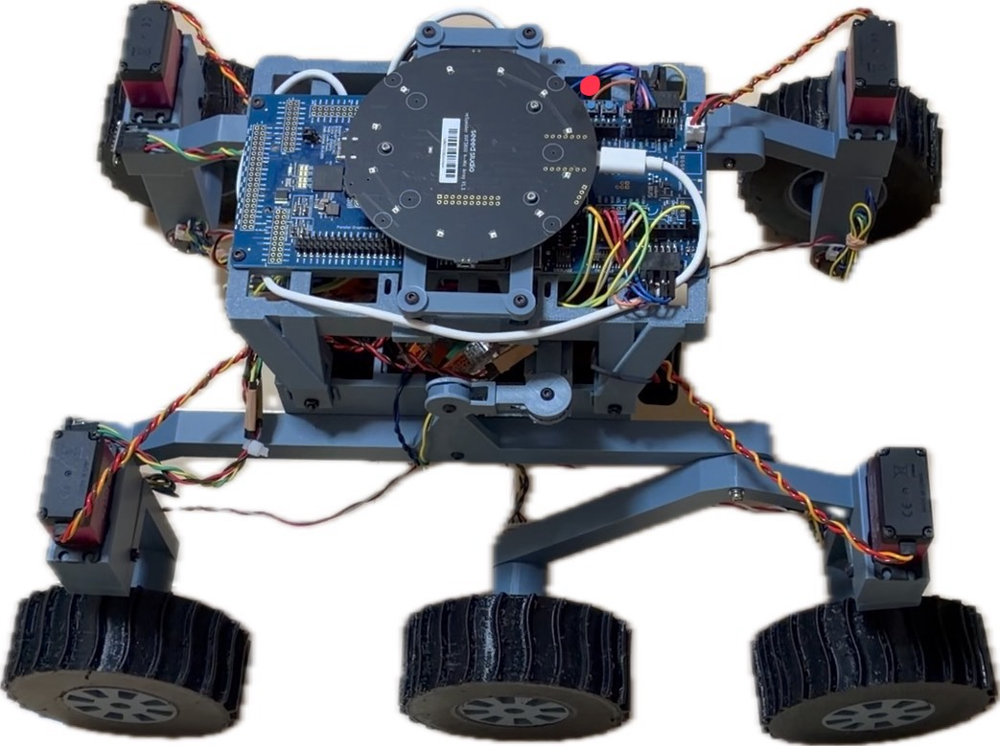

# SEROV 実機評価手順

この手順は、発送済みのローバをそのまま使う審査員向けです。鳴子の見本はローバ内の不揮発性メモリに保存済みです。通常の試験では書き込み機材やPCを使いません。まず1〜4節に沿って動作を確認してください。5節の再学習、6節の充電、7節の対処は必要なときに参照できます。

## 1. 同梱物と準備

- ローバ本体。電源スイッチは**後面に1個**あります。
- 目標音を出す鳴子。
- 障害物として使うプランター。
- 専用袋に入れた予備のLiPoバッテリーと充電器。

同梱物の状態は[梱包写真](assets/shipped-kit.jpg)、ローバの外観は[斜めからの写真](assets/rover-angle.jpg)と[上面写真](assets/rover-top.jpg)で確認できます。

人や壊れやすい物のない、平坦な床で試験してください。走行方向と周囲に余裕を設け、操作中は後面の電源スイッチに手が届く位置で見守ってください。プランターを使わない最初の試験では、ローバの進路を空けてください。

## 2. 電源投入と停止

1. ローバ前面（ToF距離センサが付いた側）が走らせたい方向を向くように置く。
2. 後面の電源スイッチをONにする。
3. ローバ本体の緑LEDが点灯していることを確認する。点灯は学習済み見本の読み込みを示します。
4. 試験終了時は鳴子を止め、ローバが停止したことを確認してから後面の電源スイッチをOFFにする。すぐに止める必要がある場合もOFFにする。

鳴子の音が消えると、ローバは追従をやめて停止します。ソースコード上の音消失判定時間は1.5秒です。これは車体が機械的に停止するまでの保証時間ではありません。電源投入から鳴子の学習、検知、走行までの流れは[チュートリアル動画](https://youtu.be/HlEqVrhAsqA)で確認できます。

## 3. 主試験A：四方向からの鳴子

鳴子をローバの前、右、後ろ、左の順に置き、各位置で**断続的に**鳴らします。鳴子は同じ位置で繰り返し鳴らし、ローバがその方向へ旋回・前進するかを見てください。音を止めると追従も止まることを確認できます。

方向を変えるたびに鳴子を止め、車体の停止を確認して初期位置へ戻してください。手で動かす前に電源をOFFにします。電源を入れ直しても、保存済みの鳴子の見本は残ります。

四方向の試験を撮影した動画はありません。発送済みの鳴子を使って、この手順で各方向をお試しください。

## 4. 主試験B：プランターの回避

[配置図](assets/test-map.png)を参考に、ローバの正面約90 cmにプランターを置き、鳴子をプランターの向こう側、ローバから約220 cmの位置に置きます。寸法は目安です。ローバの前面をプランターへ向け、鳴子を断続的に鳴らしてください。

確認するのは、鳴子を追いながらプランターに接触せず進む動作です。ToF距離センサの値と音源方位を入力とするTensorFlow Lite Microの制御モデルが、走行中の操舵角と速度を決めます。異常があれば後面の電源スイッチをOFFにしてください。この動作は[主試験Bの動画](https://youtube.com/shorts/4OGVpEJQ6OY?si=xfHyg3C4lrh2D03t)で確認できます。

## 5. 任意試験：別の音の識別と現場学習

この試験には音を再生するスマートフォンが必要です。スマートフォンは同梱していません。鳴子の主試験を終えてから行ってください。

上面写真で黒い円形基板の右上にある**赤い印の位置がSW1**です。SW1は後面の電源スイッチとは別の学習ボタンです。学習開始時と保存時にそれぞれ約2秒長押しし、間はいったん離します。

1. 鳴子を止めた状態で、鳴子とは異なる口笛の音をスマートフォンから鳴らす。保存済みの鳴子の見本では口笛に反応して走り出さないことを確認する。確認済みの組み合わせは鳴子と口笛です。
2. ローバを停止させ、写真で示したSW1を約2秒長押しする。ローバ本体の緑LEDがゆっくり点滅し、新しい見本の収集が始まる。鳴子を学習させるときのSW1操作は[チュートリアル動画](https://youtu.be/HlEqVrhAsqA)でも確認できます。
3. 登録したい音を繰り返し鳴らす。5件の見本が集まると、ローバ本体の緑LEDが速く点滅する。5件そろうまで待つ。
4. SW1をもう一度約2秒長押しする。ローバ本体の緑LEDの点灯を確認する。新しい見本が不揮発性メモリへ保存される。
5. 新しく登録した音を鳴らし、方向へ旋回・前進することを確認する。

**SW1で新しい学習を始めた時点で、以前の鳴子の見本は消去されます。** 5件未満でSW1を再び長押しして取り消しても、以前の見本は戻りません。鳴子へ戻すには、鳴子を使って同じ手順で5件を登録してください。

## 6. バッテリーの充電

充電器はHITEC X1 SHOOTです。[接続箇所の写真](assets/charging-connectors.jpg)にある**赤丸の2か所**をつなぎます。充電前に、ローバ後面の電源スイッチが**OFF**であることを必ず確認してください。

1. 充電器にACケーブルをつなぎ、コンセントへ接続する。
2. 写真の赤丸で示した、ローバから出ている白いコネクタと充電器側のコネクタを、向きを合わせて接続する。無理に押し込まない。
3. バッテリー接続後、充電器の1S・2S・3SのLEDが**3つとも赤く点灯**すれば充電中です。3つとも緑の点灯に変われば充電完了なので、コネクタを外す。

**バッテリーを接続した後にLEDが赤く点滅した場合は、充電を続けないでください。** 過放電など電池の異常が考えられるため、充電器から外して予備バッテリーを使ってください。バッテリーをつないでいない待機中の赤い点滅とは区別してください。1台の充電器へバッテリーを2本同時に接続しないでください。

LEDの表示と端子の仕様は[HITEC X1 SHOOT公式取扱説明書](https://hitecrcd.co.jp/material/manual/hitec/X1SHOOT_JP%20Manual_181026.pdf)にも記載されています。

## 7. LED表示と困ったとき

| 表示 | 意味と対処 |
|---|---|
| 緑LED点灯 | 保存済みの学習見本あり。主試験を始められます。 |
| 緑LED消灯 | 有効な学習見本なし。SW1で鳴子を再学習します。 |
| 緑LEDゆっくり点滅 | 見本を収集中。登録したい音を断続的に鳴らします。 |
| 緑LED速く点滅 | 5件の見本を取得済み。SW1を約2秒長押しして保存します。 |
| 緑LEDが短く2回点滅 | 不揮発性メモリの初期化・保存・読出しでエラー。電源をOFFにし、試験を中断します。 |

音を鳴らしても動かない場合は、ローバ本体の緑LEDが点灯しているか、前面がふさがれていないか、鳴子を断続的に鳴らしているかを確認してください。障害物を取り除いても動かない、あるいはLEDがエラーを示す場合は、電源をOFFにしてください。

提出時のLED動作は上表と[実装](../../firmware/ra8p1/SoundExplorationRover_CPU0/src/tasks/task_think.c)を参照してください。
