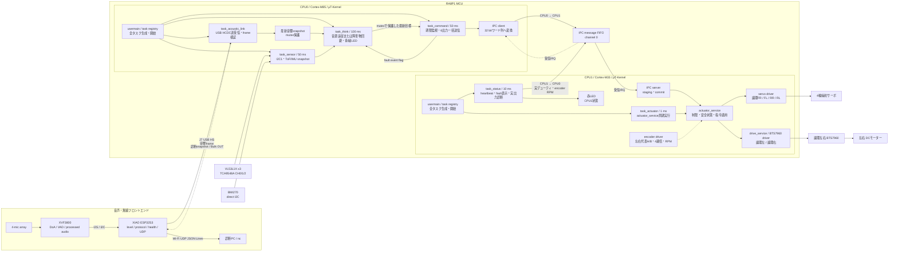
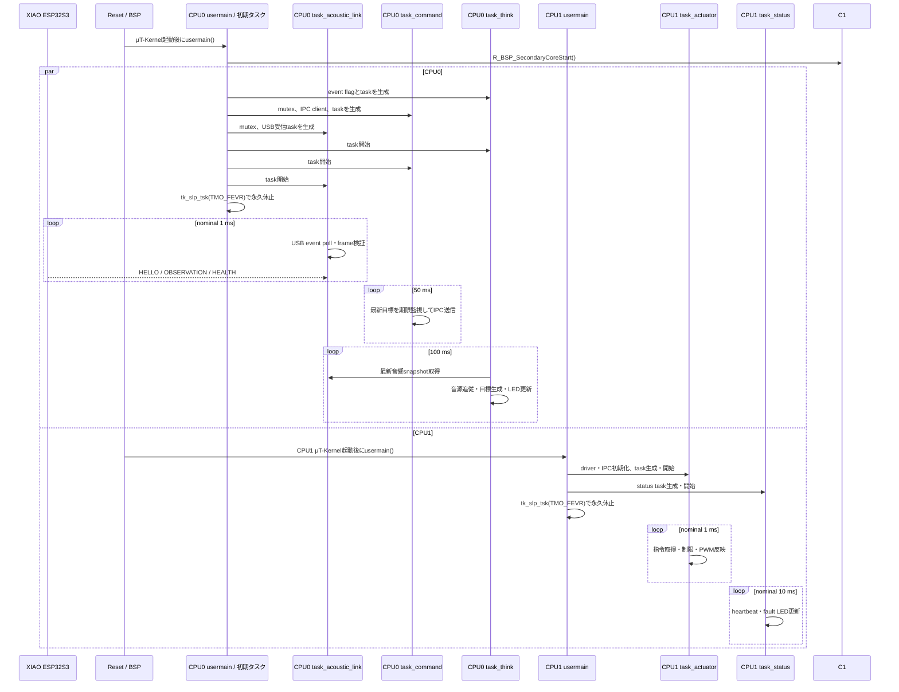
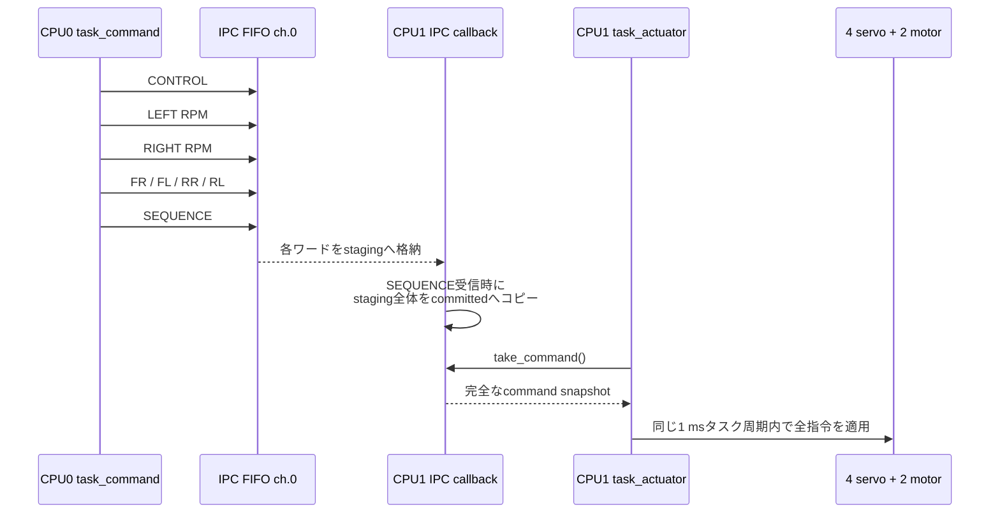
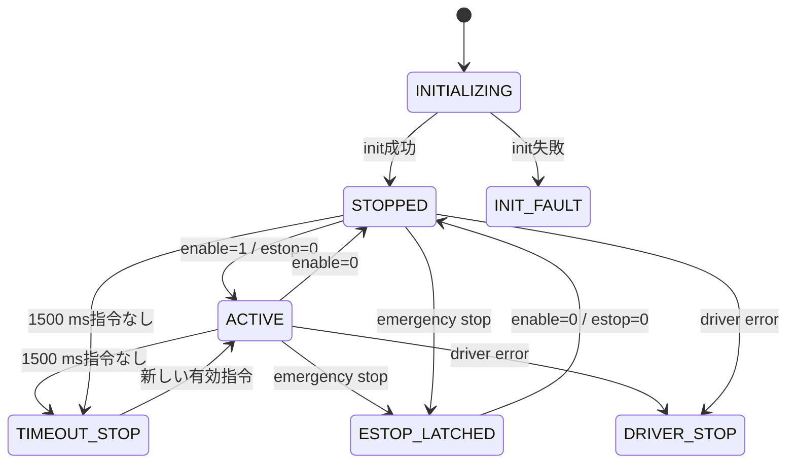
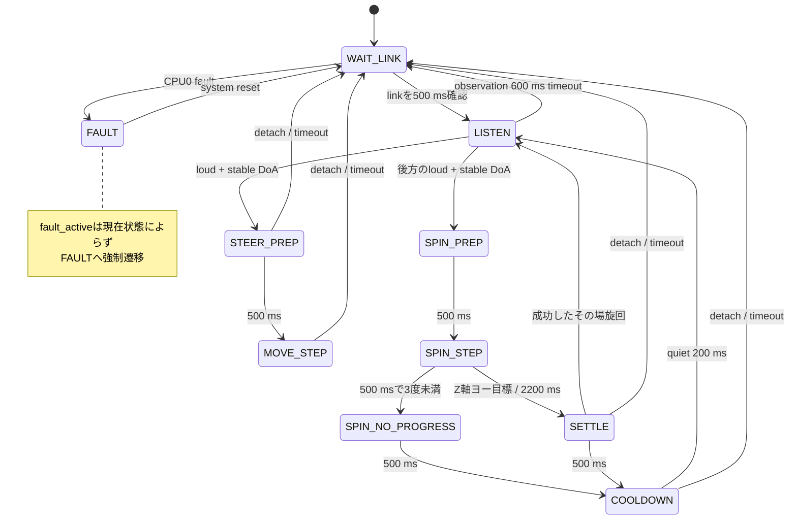
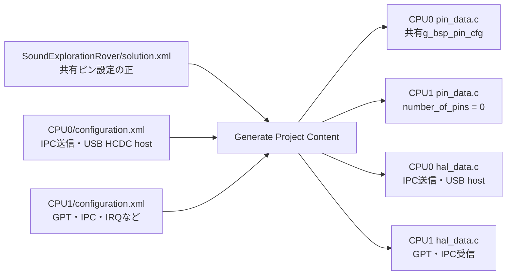

# ローバー ファームウェア設計書

最終更新: 2026-09-08 / 対象: RA8P1 CPU0/CPU1、ReSpeaker/XIAO、I2Cセンサー統合の現行ファームウェア実装

参考用のインタラクティブな全体図は、[構造図](archify/SEROV_ARCHITECTURE.html)を参照する。現行のディレクトリ構成、RA8P1ユーザーコードの層構成、および依存方向は本書を正とする。

- [ローバー ファームウェア設計書](#ローバー-ファームウェア設計書)
  - [1. 目的と設計方針](#1-目的と設計方針)
  - [2. システム全体像](#2-システム全体像)
  - [3. ソースコード構成](#3-ソースコード構成)
    - [3.1 RA8P1ユーザーコードのレイヤー構成](#31-ra8p1ユーザーコードのレイヤー構成)
  - [4. 起動シーケンス](#4-起動シーケンス)
    - [4.1 μT-Kernelの両コア構成](#41-μt-kernelの両コア構成)
  - [5. CPU0タスク設計](#5-cpu0タスク設計)
    - [5.1 目標データの流れ](#51-目標データの流れ)
    - [5.2 CPU0 LED表示](#52-cpu0-led表示)
    - [5.3 I2Cセンサー走行モード](#53-i2cセンサー走行モード)
  - [6. CPU間IPC設計](#6-cpu間ipc設計)
    - [6.1 通信形式](#61-通信形式)
    - [6.2 6出力の一括commit](#62-6出力の一括commit)
  - [7. CPU1アクチュエータ設計](#7-cpu1アクチュエータ設計)
    - [7.1 タスクと安全状態](#71-タスクと安全状態)
    - [7.2 サーボ制御](#72-サーボ制御)
    - [7.3 DCモーター制御](#73-dcモーター制御)
  - [8. 停止聴取型の音源追従](#8-停止聴取型の音源追従)
  - [9. FSP、Solution、ピン設定](#9-fspsolutionピン設定)
    - [9.1 USB High Speed割当](#91-usb-high-speed割当)
    - [9.2 アクチュエータ・センサ割当](#92-アクチュエータセンサ割当)
  - [10. 安全設計](#10-安全設計)
  - [11. ビルド・生成・書き込み](#11-ビルド生成書き込み)
  - [12. デバッグ観測点](#12-デバッグ観測点)
    - [CPU0](#cpu0)
    - [CPU1](#cpu1)
  - [13. 変更時の参照先](#13-変更時の参照先)
  - [14. MRAMを用いたプロトタイプ保存](#14-mramを用いたプロトタイプ保存)


## 1. 目的と設計方針

この文書は、Sound Exploration Roverについて、XVF3800、XIAO ESP32S3、RA8P1 CPU0/CPU1の責務、μT-Kernelタスク、USB音響入力、CPU間通信、アクチュエータ制御、安全動作、FSP生成コードとの境界を現行ソースに対応させて説明する。ReSpeakerの配線、USB protocol、DoA校正、段階試験の詳細は[ReSpeaker統合設計](RESPEAKER_INTEGRATION.md)に分離する。

設計上の要点は次のとおりである。

1. XVF3800はDoA/VADと処理済み音声を生成し、XIAO ESP32S3は音響・無線フロントエンドとして観測値を整形する。
2. CPU0（Cortex-M85）はUSB hostとして音響観測を検証し、μT-Kernel上で音源追従判断と指令送信を行う。
3. CPU0の`task_acoustic_link`、`task_think`、`task_command`は、それぞれ`tk_cre_tsk()`で生成する独立カーネルタスクである。`task_registry.c`は`usermain()`から呼ばれるタスク登録・初期化モジュールである。
4. CPU1（Cortex-M33）はμT-Kernel上の1 msアクチュエータタスクで指令を検証し、4サーボと論理左右DCモーターを駆動する。
5. 6個のアクチュエータ指示値は、IPCの`SEQUENCE`をcommit markerとして1つのスナップショットで確定する。
6. USBや音響データが異常・timeoutになってもCPU1の実時間制御を巻き込まず、CPU0停止目標とCPU1ローカルtimeoutを重ねる。
7. CPU0とCPU1は1個のRA8P1内の2コアであり、物理ピンを共有する。ピン多重化設定はSolutionを正として一元管理する。

## 2. システム全体像

| 要素 | 実行方式 | 主責務 |
|---|---|---|
| XVF3800 | 専用audio firmware | 4マイクDSP、DoA、VAD、処理済みI2S音声 |
| XIAO ESP32S3 | ESP-IDF / FreeRTOS | I2S/I2C取得、dBFS算出、USB CDC device、frontend health、Wi-Fi UDP診断gateway |
| CPU0 / Cortex-M85 | μT-Kernel 3.0 | USB HCDC host、I2C1センサー取得、観測検証、思考、走行目標、IPC指令送信・状態受信、青/緑LED |
| CPU1 / Cortex-M33 | μT-Kernel 3.0 | IPC指令受信・状態送信、1 msアクチュエータタスク、制限、安全監視、PWM/GPIO、encoder、赤LED状態タスク |

CPU0の主周期はcommand 50 ms、think 100 msで、CPU1はnominal 1 msである。IPC channel 0はCPU0→CPU1の指令とCPU1→CPU0の診断に双方向利用し、両CPUの受信をIRQ/callbackで処理する。USB eventはCPU0の`task_acoustic_link`がtask contextからpollし、USB callbackからμT-Kernel APIを直接呼ばない。



アクチュエータ制御経路はCPU0からCPU1への一方向である。USB CDCだけは音響観測のESP32S3→CPU0と診断snapshotのCPU0→ESP32S3を双方向に使う。UDPは外部診断専用で、PCやESP32S3からCPU1へ制御を迂回させない。将来Wi-Fi手動操作を追加する場合も、CPU0を権限・安全・timeoutの境界として維持する。

## 3. ソースコード構成

```text
firmware/
├─ common/
│  ├─ acoustic_protocol.h/.c          ESP32S3/CPU0共通USB protocol
├─ esp32s3/
│  ├─ CMakeLists.txt                  ESP-IDF project
│  └─ src/
│     ├─ app_main.c                   frontend初期化入口
│     ├─ xvf3800_control.c/.h         I2C DoA/VAD取得
│     ├─ audio_capture.c/.h           I2S取込・dBFS算出
│     ├─ acoustic_frontend.c/.h       観測/health生成
│     ├─ usb_link.c/.h                TinyUSB CDC双方向device
│     └─ wifi_telemetry.c/.h           Wi-Fi station・UDP JSON診断
└─ ra8p1/
   ├─ common/
   │  ├─ ipc_message.h              CPU0/CPU1共通IPC契約
   │  ├─ mtkernel/config.h          両コア共通μT-Kernel設定（1 ms tick）
   │  └─ mtk3_bsp2/                 CPU0/CPU1共通μT-Kernel submodule・FSPポート
   ├─ SoundExplorationRover/
   │  └─ solution.xml                 デュアルコアSolution、共有ピン設定
   ├─ SoundExplorationRover_CPU0/
   │  ├─ configuration.xml            IPC、USB HCDC hostなどのFSP設定
   │  ├─ ra/、ra_cfg/、ra_gen/        FSPコード・設定・生成物
   │  └─ src/
   │     ├─ hal_entry.c               μT-Kernel起動入口
   │     ├─ app/main.c                CPU1起動とCPU0タスク群初期化
   │     ├─ app/tasks/task_common.h   CPU0共通fault定義
   │     ├─ app/tasks/task_registry.c       タスク登録配列、生成・開始・失敗時解放
   │     ├─ app/tasks/task_acoustic_link.c      USB event、frame parser、音響snapshot、テレメトリ送信
   │     ├─ app/tasks/task_sensor.c     I2C定周期取得、センサーsnapshot
   │     ├─ app/tasks/task_think.c      音源追従、青/緑LED、faultラッチ
   │     ├─ app/tasks/task_command.c    目標共有、期限監視、IPC送信
   │     ├─ app/control/sound_follow_controller.c
   │     │                              停止聴取型の状態機械
   │     ├─ app/control/obstacle_avoidance_controller.c
   │     │                              ToF/IMUの安全・回避ルール
   │     ├─ app/sensors/               I2C bus、TCA9548A、VL53L1X、BMI270、hub
   │     ├─ ipc/actuator_ipc_client.c IPC送信処理
   │     └─ config/{task,control,sensor,ipc,pin}_config.h             周期、閾値、優先度、LED設定
   └─ SoundExplorationRover_CPU1/
      ├─ configuration.xml            GPT、IPC、IRQ設定
      ├─ mtk3_bsp2 -> ../common/       共通μT-Kernel submoduleへのlinked resource
      ├─ ra/、ra_cfg/、ra_gen/        FSPコード・設定・生成物
      └─ src/
         ├─ hal_entry.c               μT-Kernel起動入口
         ├─ mtkernel_config/include/  Cortex-M33、250 MHz、CPU1 RAM領域の上書き定義
         ├─ app/main.c                CPU1タスク群初期化
         ├─ app/tasks/task_registry.c       タスク登録配列、生成・開始・失敗時解放
         ├─ app/tasks/task_actuator.c   1 msアクチュエータ周期タスク
         ├─ app/tasks/task_status.c     10 ms状態表示タスク
         ├─ app/actuator_service.c        指令検証、安全状態、driver統合
         ├─ ipc/actuator_ipc_server.c IPC受信・スナップショット確定
         ├─ drivers/servo.c           4サーボPWM
         ├─ drivers/drive_service.c / bts7960.c        左右モーターPWM・ランプ
         ├─ drivers/encoder.c         A/B相カウント・RPM算出
         └─ config/{task,actuator,drive,servo,pin}_config.h             制限、PWM、校正
```

### 3.1 RA8P1ユーザーコードのレイヤー構成

RA8P1のユーザーコードは、責務に基づいて次の5層へ分ける。ディレクトリ名には層番号を含めず、役割を表す名称を使う。

```text
L4 tasks
    ↓
L3 control
    ↓
L2 services
    ↓
L1 drivers
    ↓
L0 platform
    ↓
Renesas FSP / ハードウェア
```

| 層 | ディレクトリ | 責務 | 代表例 |
|---|---|---|---|
| L0 | `platform/` | FSPに近い汎用的な基盤機能 | CPU0 `i2c_bus` |
| L1 | `drivers/` | 個別デバイス、PWM、GPIO、IRQの操作 | `vl53l1x`、`bmi270`、`tca9548a`、`bts7960`、`servo`、`encoder` |
| L2 | `services/` | 複数ドライバの統合、安全状態、変換・校正 | `sensor_hub`、`drive_service`、`actuator_service` |
| L3 | `control/` | センサー状態から走行目標を決定 | `sound_follow_controller`、`obstacle_avoidance_controller` |
| L4 | `tasks/` | μT-Kernelタスクの生成、周期、待機、上位層の呼出し | `task_acoustic_link`、`task_sensor`、`task_think`、`task_command` |

`ipc/` と `config/` は横断的な役割を持つ。`ipc/` はCPU間通信の変換・送受信を、`config/` は用途別の調整値と基板上の役割を保持する。FSPのピン多重化設定は引き続きSolutionを正とし、`pin_config.h` はアプリケーション側の役割対応だけを定義する。

CPU0では、`sensor_hub` がTCA9548Aのチャネルを選択してからToFまたはIMUドライバを呼ぶ。各センサードライバはTCA9548A上の接続チャネルを知らない。CPU1では、`drive_service` がRPM、符号、校正、変化率制限を担当し、`bts7960` は符号付きデューティをPWM出力へ反映するだけにする。

この構成は動作を変えないリファクタリングである。IPCのペイロード、TCA9548Aチャネル割当て、モーター極性、非常停止、指令タイムアウト、センサー回復、および音源追従の振る舞いは既存の契約を維持する。

主要ファイル:

- 共通契約: [`acoustic_protocol.h`](../../firmware/common/acoustic_protocol.h)、[`ipc_message.h`](../../firmware/ra8p1/common/ipc_message.h)
- 音響frontend: [`acoustic_frontend.c`](../../firmware/esp32s3/src/acoustic_frontend.c)、[`xvf3800_control.c`](../../firmware/esp32s3/src/xvf3800_control.c)、[`audio_capture.c`](../../firmware/esp32s3/src/audio_capture.c)、[`usb_link.c`](../../firmware/esp32s3/src/usb_link.c)
- CPU0: [`main.c`](../../firmware/ra8p1/SoundExplorationRover_CPU0/src/main.c)、[`task_registry.c`](../../firmware/ra8p1/SoundExplorationRover_CPU0/src/tasks/task_registry.c)、[`task_acoustic_link.c`](../../firmware/ra8p1/SoundExplorationRover_CPU0/src/tasks/task_acoustic_link.c)、[`task_sensor.c`](../../firmware/ra8p1/SoundExplorationRover_CPU0/src/tasks/task_sensor.c)、[`task_think.c`](../../firmware/ra8p1/SoundExplorationRover_CPU0/src/tasks/task_think.c)、[`sound_follow_controller.c`](../../firmware/ra8p1/SoundExplorationRover_CPU0/src/control/sound_follow_controller.c)、[`obstacle_avoidance_controller.c`](../../firmware/ra8p1/SoundExplorationRover_CPU0/src/control/obstacle_avoidance_controller.c)、[`sensor_hub.c`](../../firmware/ra8p1/SoundExplorationRover_CPU0/src/services/sensor_hub.c)、[`task_command.c`](../../firmware/ra8p1/SoundExplorationRover_CPU0/src/tasks/task_command.c)
- CPU1: [`main.c`](../../firmware/ra8p1/SoundExplorationRover_CPU1/src/main.c)、[`task_registry.c`](../../firmware/ra8p1/SoundExplorationRover_CPU1/src/tasks/task_registry.c)、[`task_actuator.c`](../../firmware/ra8p1/SoundExplorationRover_CPU1/src/tasks/task_actuator.c)、[`task_status.c`](../../firmware/ra8p1/SoundExplorationRover_CPU1/src/tasks/task_status.c)、[`actuator_service.c`](../../firmware/ra8p1/SoundExplorationRover_CPU1/src/services/actuator_service.c)、[`actuator_ipc_server.c`](../../firmware/ra8p1/SoundExplorationRover_CPU1/src/ipc/actuator_ipc_server.c)、[`servo.c`](../../firmware/ra8p1/SoundExplorationRover_CPU1/src/drivers/servo.c)、[`drive_service.c / bts7960.c`](../../firmware/ra8p1/SoundExplorationRover_CPU1/src/services/drive_service.c)

`ra/`、`ra_cfg/`、`ra_gen/`、`configuration.xml`はFSP設定と生成処理に属する。特に`ra_gen/`は直接編集せず、設定変更後にGenerate Project Contentで再生成する。

## 4. 起動シーケンス



各コアの`usermain()`は、それぞれのμT-Kernelが生成した高優先度の初期タスクから呼ばれる。CPU0はCPU1を起動してから、CPU0側`task_registry.c`の登録配列で`task_command`、`task_acoustic_link`、`task_think`を生成・開始する。CPU1はCPU1側`task_registry.c`の登録配列で`task_actuator`と`task_status`を生成・開始する。どちらも、全タスクの生成成功後に登録順で開始し、失敗時は生成済みリソースを逆順で解放する。初期化完了後の`usermain()`は`tk_slp_tsk(TMO_FEVR)`で永久休止し、各独立タスクが優先度に従って実行される。

両コアのμT-Kernel tickは1 msに統一している。CPU1の`task_actuator`は周期ハンドラ＋イベントフラグで1 ms基準に起床し、`tk_get_otm()`による実経過時間を処理へ渡す。その他の`tk_dly_tsk()`を使う周期タスクの記載値はnominal値であり、+1 tickと処理時間が加わる。CPU1タイミング是正の実機検証は未完了（[検証記録](validation/README.md)）。

### 4.1 μT-Kernelの両コア構成

CPU0とCPU1は、`firmware/ra8p1/common/mtk3_bsp2` submoduleにある同一のμT-Kernel sourceをコンパイルする。共通設定は`firmware/ra8p1/common/mtkernel/config.h`へ置き、各プロジェクトのinclude順でBSP既定設定より優先する。両プロジェクトはe² studioのlinked resourceとして共通submoduleを参照するため、カーネルsourceを複製しない。

RA8P1向け既定BSPはCortex-M85とCPU0メモリを前提にするため、CPU1だけ`src/mtkernel_config/include/`からCortex-M33、250 MHz、CPU1 SRAM領域を上書きする。CPU0は`0x22000000`から`0x000EA000` bytes、CPU1は`0x220EA000`から`0x000EA000` bytesを使用し、カーネルの動的メモリ領域を重ねない。CPU1ではCPU0とSCI8を競合させないためT-Monitorとsystem messageを無効にする。

RA8P1ユーザーコードの整数・真偽値とリンケージは、μT-Kernelの`B/UB/H/UH/W/UW/D/UD/BOOL`および`LOCAL/EXPORT/IMPORT/Inline`へ統一する。FSP API型と、ESP32S3にも共有する`firmware/common/acoustic_protocol.*`の固定幅wire型は境界契約として維持する。

## 5. CPU0タスク設計

| タスク | 優先度 | スタック | 実行 | 責務 |
|---|---:|---:|---|---|
| `task_command_entry` | 6 | 1024 B | 50 ms | 最新目標、500 ms期限監視、6出力のIPC一括送信 |
| `task_acoustic_link_entry` | 8 | 2048 B | nominal 1 ms poll | HCDC event、stream parser、最新音響snapshot、テレメトリ送信 |
| `task_think_entry` | 10 | 1024 B | 100 ms | 音源追従、状態遷移、青/緑LED、faultラッチ |

μT-Kernelでは数値が小さいほど高優先度である。IPC keep-aliveを行う`task_command`を最優先の周期task、USBを受ける`task_acoustic_link`をその次、判断を行う`task_think`をその次とし、通信処理が一時的に増えてもCPU1への指令更新を優先する。

### 5.1 目標データの流れ

`task_acoustic_link`はCDC byte streamを共有protocol parserへ渡し、CRC、version、length、sequenceを検証して最新観測を優先度継承mutex内へcommitする。同じUSB CDCリンクでCPU0/CPU1の状態とセンサー診断のテレメトリもESP32S3へ送信する。USB detach時は古い観測を即座に無効化する。

`task_think`は100 msごとに音響snapshotを取得する。`task_acoustic_link`が持つ観測時刻に加え、`task_think`自身も観測専用sequenceの変化から`g_task_think_observation_watchdog_ms`を更新し、どちらかが600 msの期限を満たさない観測は`sound_follow_controller`へ渡さない。controller出力を`rover_motion_target_t`へ展開し、左右モーター、FR/FL/RR/RL、enable、emergency stopを一括更新する。`task_command_set_target()`は構造体全体を別の優先度継承mutexで保護する。

`task_command`は50 msごとにmutex内の構造体をコピーし、次のIPC処理をmutex外で行う。目標更新が500 ms途絶した場合は`enable=0`、`emergency_stop=1`へ置き換え、faultを`task_think`のイベントフラグへ通知する。

起動時または緊急停止後は、有効指令の前に`enable=0`かつ`emergency_stop=0`のフレームを1回送る。これはCPU1の緊急停止ラッチ解除手順を満たすためである。

### 5.2 CPU0 LED表示

CPU0の`task_think`が青LED（LED1/P600）と緑LED（LED2/P303）を一括して所有する。CPU1は赤LED（LED3/PA07）だけを使うため、両コアが同じLEDを同時操作しない。

| 表示 | 意味 |
|---|---|
| 青を500 msごとに反転 | USB link待ち・safe stop |
| 青を1秒ごとに100 ms点灯 | 停止して音を聴取中 |
| 青を125 msごとに反転 | 目標方向へservo整定中 |
| 青点灯 | 1000 msの短距離移動中 |
| 青を250 msごとに反転 | settleまたはcooldown中 |
| 緑消灯 | 有効な学習見本なし。SW1長押しで学習開始 |
| 緑を500 ms点灯・500 ms消灯 | 見本を収集中 |
| 緑を100 ms点灯・100 ms消灯 | 5見本収集済み。SW1長押しで保存 |
| 緑点灯 | 5見本をMRAMへ保存済み |
| 緑が100 msの2回点滅を1秒ごとに繰り返す | MRAM初期化・保存・読出しに失敗 |
| 青をN回点滅 | CPU0 fault。Nがfault番号 |
| 赤を500 msごとに反転 | CPU1正常heartbeat |
| 赤を約50 msごとに反転 | CPU1 driver/FSP error |

CPU0 fault番号は、1がtask create/start、2がIPC初期化、3がIPC送信、4が目標タイムアウト、5がUSB初期化、6が目標共有失敗である。複数faultがある場合は小さい番号を優先表示し、`g_task_think_fault_flags`には全bitを保持する。

### 5.3 I2Cセンサー走行モード

I2Cセンサーを使うとき、CPU0のタスク登録はsensor taskを追加します。sensor taskはI2C1、TCA9548A、VL53L1X 3台、BMI270を50 ms周期で取得し、mutexで保護した最新sensor snapshotを公開します。通信異常はCPU0全体のfaultへ昇格させず、snapshotをinvalidとして走行判断を安全停止に戻し、1秒ごとに再初期化します。

自律モードはSOUND_FOLLOWとSENSOR_RULEをビルド時に選びます。SENSOR_RULEではthink taskがToFのLEFT/CENTER/RIGHTとBMI270の傾き・衝撃・角速度から前進、減速、左右緩旋回、停止を決定します。CPU1のPWM・エンコーダ処理は変更せず、既存IPC経路だけを使います。SENSOR_RULEの近接時は、方向を保持した有限回の後退・前進旋回で脱出を試みます。後方距離は未計測なので後退に時間上限を設け、距離・回頭の進捗が得られない場合は停止します。詳細は[SENSOR_AUTONOMY §5](SENSOR_AUTONOMY.md#5-方向を保持する回避と有限回の切り返し)を参照してください。

実装、FSP生成、配線、閾値、Live Watch、UDP診断の詳細は[I2Cセンサー・ルールベース走行](SENSOR_AUTONOMY.md)を参照してください。

## 6. CPU間IPC設計

### 6.1 通信形式

FSPのIPC FIFOは4段、1要素32 bitである。共有C構造体を直接書かず、上位8 bitをID、下位24 bitをpayloadとして送る。

```text
31                    24 23                              0
+-----------------------+--------------------------------+
| message ID (8 bit)    | payload (24 bit)               |
+-----------------------+--------------------------------+
```

| ID | 名前 | payload |
|---:|---|---|
| `0x01` | CONTROL | bit 0: enable、bit 1: emergency stop |
| `0x02` | LEFT_TARGET_RPM | signed 16 bit |
| `0x03` | RIGHT_TARGET_RPM | signed 16 bit |
| `0x04` | FR_TARGET_DEG | signed 16 bit |
| `0x06` | FL_TARGET_DEG | signed 16 bit |
| `0x07` | RR_TARGET_DEG | signed 16 bit |
| `0x08` | RL_TARGET_DEG | signed 16 bit |
| `0x05` | SEQUENCE | 24 bit、1フレームのcommit marker |
| `0x81` | STATUS_FAULT_FLAGS | CPU1 actuator fault flags |
| `0x82` | STATUS_LEFT_DUTY | 左の実適用PWM、signed 16 bit permille |
| `0x83` | STATUS_RIGHT_DUTY | 右の実適用PWM、signed 16 bit permille |
| `0x84` | STATUS_LEFT_ENCODER_RPM_X10 | 左encoder RPM×10、signed 16 bit |
| `0x85` | STATUS_RIGHT_ENCODER_RPM_X10 | 右encoder RPM×10、signed 16 bit |
| `0x86` | STATUS_APPLIED_SEQUENCE | CPU1が最後に処理した指令sequence、24 bit |
| `0x87` | STATUS_SEQUENCE | CPU1状態snapshotのcommit marker、24 bit |

### 6.2 6出力の一括commit



ここで「同時」とは、6値を分割受信中の中途半端な組合せで適用せず、1つのcommit済みスナップショットとしてCPU1の同じ`task_actuator`周期で適用することを意味する。物理PWM波形が完全に同一クロックエッジで変化することを保証するものではない。

CONTROLでemergency stopを受けた場合だけは、残りのワードとSEQUENCEを待たずにcommitする。実際の出力停止はIRQ内ではなくCPU1の次回`task_actuator`周期で行う。CPU0はFIFO overflow時に1 ms待って同じワードを再送する。

CPU1の`task_status`は実デューティ、左右encoder RPM、fault、適用済み指令sequenceをsnapshot化し、4段FIFOをあふれさせないよう10 msごとに1ワードずつCPU0へ返す。CPU0は`STATUS_SEQUENCE`受信時だけsnapshotを確定する。USBでは従来互換の64 byte `ROVER_TELEMETRY`に続けて、CPU1状態を24 byte `ACTUATOR_TELEMETRY`として別送し、新旧ESP32S3間の基本診断互換性を保つ。この戻り値は診断専用であり、CPU1の1 ms制御を待たせない。

## 7. CPU1アクチュエータ設計

| タスク | 優先度 | スタック | 実行 | 責務 |
|---|---:|---:|---|---|
| `task_actuator_entry` | 4 | 2048 B | 周期通知1 ms・実Δt更新 | IPC確定指令、encoder、PWMランプ、安全停止 |
| `task_status_entry` | 12 | 512 B | 周期通知10 ms・実Δt更新 | 赤LED、driver/FSP fault表示、CPU1実出力診断送信 |

数値が小さいほど高優先度であり、アクチュエータ周期処理を状態表示より優先する。IPC callbackはFSPのIRQ contextでstaging/commitだけを行い、μT-Kernelのtask APIとPWM driver APIを直接呼ばない。

CPU0のセンサー鮮度は`task_think`がupdate_countの進行と`tk_get_otm()`の実時間で独立監視する。
200 ms更新が進まなければ音源追従・センサー走行の両方で通常停止へ移行する。初回は進行観測まで不許可。
取得側のage_msだけを生存判定には使わず、snapshotのmutex競合も無待機で取得失敗として扱う。
[センサー更新停止の検証記録](validation/README.md)を参照。

### 7.1 タスクと安全状態

CPU1の`usermain()`は、登録配列から`task_actuator`と`task_status`を生成・開始する。優先度4の`task_actuator`は周期ハンドラのイベントフラグ通知で起床し、実経過時間を引数とする`actuator_service_update(elapsed_ms)`でエンコーダ保守、IPC指令取得、期限監視、サーボとモーターへの適用を行う。通知の合流時も実経過時間を使い、期限切れはPWM更新より前に判定する。優先度12の`task_status`も周期ハンドラのイベントフラグで10 msごとに起床し、実経過時間で正常時500 ms、driver/FSP異常時50 msの赤LED反転と100 msの診断snapshot採取を管理する。送信中の時間も採取周期へ含め、1起床につき最大1語を送る。FIFO混雑時は同一snapshotの同じ語を再試行し、最終語成功時だけsequenceを進める。最終IPC指令から1500 ms以上経過するとローカルsafe stopへ移行する。



`safe stop`は左右モーターenableをLow、RPWM/LPWMの4出力を0、GPT10/GPT7を停止し、4本のサーボGPTも停止する。サーボを0度へ戻してから停止するのではなく、その時点でPWM信号を停止する。

### 7.2 サーボ制御

配列順は全レイヤーで`FR=0、FL=1、RR=2、RL=3`に統一する。角度はCPU1で-45～+45度へ制限し、現在は次の線形変換を行う。

```text
-45 deg -> 1200 us
  0 deg -> 1500 us + wheel trim
+45 deg -> 1800 us
```

最終パルス幅は1000～2000 usへ制限する。各輪の`SERVO_CENTER_TRIM_US_*`で機械原点、`SERVO_DIRECTION_*`で取付方向を補正する。CPU0から最初の有効IPC指令を受けた時点で4本のPWMを開始する。

### 7.3 DCモーター制御

論理左右各1台のBTS7960へ、RPWM用GPT10A/BとLPWM用GPT7A/Bの20 kHz PWMを出す。ピン配置は論理左RPWM=P811/GPT10B、右RPWM=P810/GPT10A、左LPWM=P602/GPT7B、右LPWM=P603/GPT7Aである。論理正RPM（車体前進）は左LPWM（P602/GPT7B）・右RPWM（P810/GPT10A）、負RPM（車体後進）は左RPWM（P811/GPT10B）・右LPWM（P603/GPT7A）へ出力する。RPM指令を基本PWMへ換算し、左右別の固定比を適用する。

```text
target RPM -> duty permille = target * 1000 / 300 RPM
0～700 permilleに制限
1 msごとに2 permilleずつ目標へランプ
5 msごとにGPT10A/BおよびGPT7A/Bへ反映
```

論理正RPMは車体前進として扱い、エンコーダ値は前進正・後進負とする。論理正RPMは左LPWM（P602/GPT7B）・右RPWM（P810/GPT10A）、負RPMは左RPWM（P811/GPT10B）・右LPWM（P603/GPT7A）へ出す。符号は`DRIVE_CHASSIS_FORWARD_SIGN=-1`、`DRIVE_LEFT_MOUNT_SIGN=+1`、`DRIVE_RIGHT_MOUNT_SIGN=-1`から合成する。同じ側のRPWM/LPWMは相互排他的に更新し、同時Highを避ける。停止時は4出力を0にしてから共通ENをLowにする。

基本PWMは左右別の固定比で算出し、`DRIVE_LEFT_DUTY_SCALE_PERMILLE=700`、`DRIVE_RIGHT_DUTY_SCALE_PERMILLE=250`を適用する。代表エンコーダを使う速度フィードバックは`DRIVE_SPEED_FEEDBACK_ENABLE=0`で無効化している。最終PWMは0～700 permilleに制限する。左右RPMがともに0ならランプダウンを行わず、PWMと共通ENを即時停止する。各側3台のモーターを個別に制御するものではない。

## 8. 停止聴取型の音源追従

`task_think`は[`sound_follow_controller.c`](../../firmware/ra8p1/SoundExplorationRover_CPU0/src/control/sound_follow_controller.c)を100 msごとに更新する。USB linkと観測が500 ms安定した後だけ待受へ入り、-45 dBFS以上かつVAD検出中の1観測を音源イベントの開始条件とする。開始直後の保持DoAを使わないよう500 ms待ち、その後の最新5 sampleが相互差20度以内になった場合だけ動作する。取得開始から2000 ms以内に安定しなければイベントを破棄する。相対DoAの絶対値が90度を超える後方音源では、ハの字の45度操舵と左右逆回転によるその場旋回を選ぶ。車体中心に固定したBMI270の鉛直Z軸だけを積分し、同じ`update_count`を二重積分しない。今回の目標ヨーはDoAから決め、前進操舵へ渡す15度を残して最大90度に制限する。残ヨー20度以下では300 RPMから220 RPMへ減速し、目標到達または2200 msで停止・500 ms整定してから、連続音でも改めてDoAを測定する。前方・側方音源では最大45度の4輪逆相操舵で前進する。



車体相対角は前0度、右正、左負である。後方音源のその場旋回ではFR/FL/RR/RLを接線方向へ向け、論理左右モーターを逆転させる。Z軸の右回頭を正として積分するため、IMUの取付を変更した場合は`CPU0_SENSOR_YAW_AXIS`と`CPU0_SENSOR_YAW_RIGHT_SIGN`を再確認する。`FAULT`へ入る原因bitは実行中にclearせず、復帰には原因除去後のsystem resetが必要である。動作値、USB protocol、DoA座標校正、安全な試験順は[ReSpeaker統合設計](RESPEAKER_INTEGRATION.md)を参照する。

## 9. FSP、Solution、ピン設定



同じRA8P1のIOPORTを共有するため、同一ピンをCPU0/CPU1へ独立に設定すると重複警告や上書きが発生する。現行構成ではSolutionを正とし、CPU0の`pin_data.c`に共有ピンを生成し、CPU1の`pin_data.c`は0ピンのままとする。GPT、IPC、USBなどのmodule設定は実際にAPIを使うCPU側へ生成する。

### 9.1 USB High Speed割当

XIAO ESP32S3はJ7へ接続し、CPU0のFSPにHCDC ACM host、High Speed、USB IP1を配置する。上位model名は`g_hcdc0`、USB Basic instanceは`g_basic0`である。DMA、hub、multi CDCは無効、callback/contextは`NULL`とし、USBHS main/D0FIFO/D1FIFOの3 IRQ priorityを12とする。CPU0はUSB hostとIPC指令送信・状態受信を所有し、CPU1はアクチュエータ制御と実出力状態送信を所有する。

| 用途 | FSP / GPIO | MCUピン | 外部コネクタ |
|---|---|---|---|
| USB HS data | USB IP1 | dedicated USBH_P / USBH_N | J7 USB-C |
| USB HS VBUS sense | `USBHS_VBUS` | P408 | J7内部 |
| USB HS VBUS enable | `USBHS_VBUSEN` | PD07 | J7内部、host時High |

J11/USB Full Speed、P500、`USB_FS_VBUSEN`はReSpeaker経路に使用しない。host hubとDMAは初期構成で無効とし、1台のCDC ACM deviceをpolling event APIで扱う。接続・給電・FSP設定の詳細は[ReSpeaker統合設計](RESPEAKER_INTEGRATION.md#4-ek-ra8p1-usb接続)を参照する。

### 9.2 アクチュエータ・センサ割当

以下の表の「論理左／論理右」「論理FR／FL／RR／RL」は、CPU0のIPC指令で使用する名称である。物理ピンの割り当ては論理名へ対応付け、FSP生成インスタンス名も論理名に統一している。アクチュエータとエンコーダIRQはCPU1、I2CセンサーはCPU0が所有する。ピン番号とSolutionの共有ピン設定は変更していない。

| 用途 | FSPインスタンス | FSP出力 / GPIO | MCUピン | 外部コネクタ |
|---|---|---|---|---|
| 論理サーボFR | `g_servo_pwm_fr` | GPT12B | P803 | Pmod1 J26-4 / SCK |
| 論理サーボFL | `g_servo_pwm_fl` | GPT9B | P110 | Arduino J24-2 / D9 |
| 論理サーボRR | `g_servo_pwm_rr` | GPT11B | P801 | Pmod1 J26-2 / MOSI |
| 論理サーボRL | `g_servo_pwm_rl` | GPT13B | P808 | Arduino J23-1 / D0 |
| 論理左モーターRPWM | `g_motor_pwm` | GPT10B | P811 | Arduino J23-4 / D3 |
| 論理右モーターRPWM | `g_motor_pwm` | GPT10A | P810 | Arduino J23-5 / D4 |
| 論理左モーターLPWM | `g_motor_pwm_lpwm` | GPT7B | P602 | Pmod2 J25-3 / MISO |
| 論理右モーターLPWM | `g_motor_pwm_lpwm` | GPT7A | P603 | Pmod2 J25-2 / MOSI |
| 左右BTS7960共通EN | `g_ioport` | GPIO出力 | PD01 | Arduino J24-1 / D8、左右ENへ分岐 |
| I2C SCL（センサー用） | `g_ioport` (GPIO I2C) | GPIO出力/プルアップ入力 | P312 | Arduino J23-8 / D7（※J24-10 P512破損回避） |
| I2C SDA（センサー用） | `g_ioport` (GPIO I2C) | GPIO出力/プルアップ入力 | P511 | Arduino J24-9 / SDA |
| 論理左代表エンコーダA | `g_encoder_left_a_irq` | IRQ16入力 | P011 | Arduino J23-3 / D2 |
| 論理左代表エンコーダB | `g_encoder_left_b_irq` | IRQ20入力 | P809 | Arduino J23-2 / D1 |
| 論理右代表エンコーダA | `g_encoder_right_a_irq` | IRQ11入力 | P006 | Pmod1 J26-7 / IRQ |
| 論理右代表エンコーダB | `g_encoder_right_b_irq` | IRQ18入力 | P413 | Pmod1 J26-10 / GPIO2 / IRQ |
| センサー共通電源 | なし | +3.3 V / GND | - | Pmod2 J25-6 / J25-5 |
| TCA9548A I2Cマルチプレクサ | `g_ioport` (GPIO I2C) | 7-bit address `0x70` | P511 / SDA、P312 / SCL | Arduino J24-9 / SDA、J23-8 / D7 (SCL) |
| VL53L1X LEFT | `g_ioport` (GPIO I2C) | TCA9548A CH0、7-bit address `0x29` | P511 / SDA、P312 / SCL | TCA9548A CH0 |
| VL53L1X CENTER | `g_ioport` (GPIO I2C) | TCA9548A CH1、7-bit address `0x29` | P511 / SDA、P312 / SCL | TCA9548A CH1 |
| VL53L1X RIGHT | `g_ioport` (GPIO I2C) | TCA9548A CH2、7-bit address `0x29` | P511 / SDA、P312 / SCL | TCA9548A CH2 |
| BMI270 IMU | `g_ioport` (GPIO I2C) | 主バス直結、7-bit address `0x68` / `0x69` | P511 / SDA、P312 / SCL | Arduino J24-9 / SDA、J23-8 / D7 (SCL) |

I2CバスはTCA9548AとBMI270で共有し、同一address `0x29`のVL53L1XはTCA9548AのCH0/CH1/CH2で分離する。J24-10 (P512) はハードウェア端子破損（GND短絡）のため放棄し、予備GPIOであったJ23-8 (P312 / D7) を高信頼性GPIO SCLとして使用する。

ToFの光学中心は、車体座標（前方`+y`、右方向`+x`）でLEFT=(-90, +94) mm、
CENTER=(0, 0) mm、RIGHT=(+90, +94) mm。3台とも前方へ平行に向ける。


P801、P803、P808をサーボへ転用しているため、現行構成ではOcto-SPIフラッシュを使用できない。SW4-3をONにしてOcto-SPIを無効、SW4-4をONにしてArduino端子を有効にする。LPWMはPmod2 J25-2/J25-3へ割り当て、OSPI0とは競合させない。BTS7960は左右のVCCを共通化し、R_EN/L_ENをPD01へまとめる。VCCとENは直結せず、P312は未使用のまま解放する。電源はJ18-5の+5 VをBTS7960 VCC、J18-4の+3.3 Vを左右代表エンコーダVCC、J18-6/J18-7のGNDを全機器共通GNDとして分岐する。I2CセンサーはPmod2 J25-6の+3.3 VとJ25-5のGNDから別枝で給電する。これらは同じ+3.3 V/GNDネットであり、別電源ではないが、BTS7960のGNDからセンサーを数珠つなぎにしない。BTS7960のモーター電流の帰路はバッテリーとモータードライバの間で直接配線する。ただしBTS7960モジュールの仕様が3.3 V対応でない場合は5 Vを使用し、電流容量が不足する場合は外部安定化電源を使用する。

## 10. 安全設計

| 監視箇所 | 条件 | 動作 |
|---|---|---|
| ESP32S3 frontend | XVF I2C失敗、I2S overrun | observation flag/statusと累積health countで通知 |
| CPU0 `task_acoustic_link` | CRC/version/length/sequence異常 | frame破棄。正常観測が途絶えれば600 ms timeoutへ収束 |
| CPU0 `sound_follow_controller` | USB detach、HELLO未成立、観測時刻または思考側sequence watchdogが600 msの期限超過 | `WAIT_LINK`、enable=0、estop=1 |
| CPU0 `sound_follow_controller` | XVF ready以外、VADなし、I2C error、mute、I2S stale | 走行triggerへ使わず停止聴取を継続。単発のI2S overrunは診断値として記録 |
| CPU0 `task_command` | 思考目標が500 ms更新されない | enable=0、estop=1を送信、CPU0 fault通知 |
| CPU0 IPC client | 通常指令の送信失敗 | 緊急停止送信を追加試行、CPU0 fault通知 |
| CPU1 IPC server | emergency stop受信 | SEQUENCEを待たずcommit |
| CPU1 `actuator_service` | IPC指令が1500 ms届かない | ローカルsafe stop |
| CPU1 driver統合 | driver API error | DRIVER fault、safe stop |

現状の制約は、ハードウェア非常停止入力なし、CPU間watchdogなし、各側3台の個別速度フィードバックなしである。論理左右代表モーターのA/Bを4逓倍で数え、実機校正値`WHEEL_ENCODER_COUNTS_PER_REV=702`と100 msの差分からRPMを算出する。カウントとRPMは前進正、後進負を契約とする。`DRIVE_SPEED_FEEDBACK_ENABLE=0`のため、実測RPMは診断にのみ使用する。また論理左右各3台を1台のBTS7960へ並列接続しているため、6台の個別制御には対応しない。

## 11. ビルド・生成・書き込み

基準環境はFSP 6.4.0、GNU Arm Embedded 13.2.1、e² studio 2025-12である。CPU0/CPU1のユーザーsourceとμT-Kernel sourceは各プロジェクトのDebug構成へ含め、同じビルド世代のELFを組にして書き込む。XIAO ESP32S3はESP-IDFのproject設定に従ってbuild/flashする。

e² studioではCPU0/CPU1 projectをRefreshし、Generate Project Content、Clean、Buildを順に行う。CPU0/CPU1のELFは`SoundExplorationRover Debug_Multicore Launch Group`で組にして書き込む。

ピンまたはFSPモジュール変更後は次の順で更新する。

1. 物理ピン多重化をSolution側で変更する。
2. GPT、IPC、IRQを実行するCPUプロジェクト側で変更する。
3. CPU0、CPU1のprojectをRefreshする。
4. CPU0、CPU1の順にGenerate Project Contentを実行する。
5. CPU0の`pin_data.c`に共有ピン、CPU1側に0ピンが生成されたことを確認する。
6. CPU0とCPU1を両方Clean/Buildする。
7. `SoundExplorationRover Debug_Multicore Launch Group`で同じビルド世代のELFを組にして書き込む。

古いSRECを個別に混在させると、IPC契約、ピン設定、制御ロジックの世代が一致しない。デュアルコア試験ではCPU0/CPU1を必ず一組で更新する。

## 12. デバッグ観測点

### CPU0

| 変数 | 確認できること |
|---|---|
| `g_task_think_state` | WAIT_LINK、LISTEN、STEER_PREP、MOVE_STEP、SETTLE、COOLDOWN、FAULT |
| `g_task_think_cycle_count` | 思考タスクの周期実行回数 |
| `g_task_think_observation_sequence` | 思考で最後に使用した音響観測sequence |
| `g_task_think_observation_watchdog_ms` | `task_think`で同じ観測sequenceが続いた時間。600 msでlink無効、未成立時は`UINT32_MAX` |
| `g_task_think_fault_flags` | CPU0でラッチした全fault bit |
| `g_task_command_sequence` | 最終IPC sequence |
| `g_task_command_send_count` | 正常にcommitした指令数 |
| `g_task_command_last_error` | 最後のIPC FSP error |
| `g_task_acoustic_link_usb_configured` | HCDC deviceの列挙状態 |
| `g_task_acoustic_link_hello_received` | 必須capabilityを持つHELLOの成立 |
| `g_task_acoustic_link_frame_count` | CRC/format検証を通過したframe数 |
| `g_task_acoustic_link_crc_error_count` | CRC不一致frame数 |
| `g_task_acoustic_link_format_error_count` | length/version/format異常数 |
| `g_task_acoustic_link_sequence_drop_count` | 同値または逆行sequenceの破棄数 |
| `g_task_acoustic_link_observation_age_ms` | 最新音響観測からの経過時間 |
| `g_task_acoustic_link_observation` | 最新DoA、level、peak、VAD、status、flags |
| `g_task_acoustic_link_last_error` | 最後のFSP USB error |

### CPU1

| 変数 | 確認できること |
|---|---|
| `g_servo_pulse_us[0..3]` | FR/FL/RR/RLへ計算したパルス幅 |
| `g_servo_center_trim_us[0..3]` | 各輪の原点補正 |
| `g_drive_left_duty_permille` | 左モーターの現在ランプ値 |
| `g_drive_right_duty_permille` | 右モーターの現在ランプ値 |
| `g_actuator_service_fault_flags` | timeout、estop、制限、driver異常 |
| `g_actuator_service_last_error` | 最後のFSP error |
| `g_encoder_left_encoder_count` / `g_encoder_right_encoder_count` | 左右代表モーターの4逓倍累積値 |
| `g_encoder_left_rpm_x10` / `g_encoder_right_rpm_x10` | 左右代表モーター推定RPMの10倍（100 ms更新） |

## 13. 変更時の参照先

| 変更内容 | 主に変更する場所 | 併せて確認する場所 |
|---|---|---|
| 音量閾値・DoA校正・step時間 | CPU0 `config/{task,control,sensor,ipc,pin}_config.h` | `sound_follow_controller.c`、実環境測定 |
| 音源追従状態遷移 | CPU0 `sound_follow_controller.c` | `task_think.c`、`rover_motion_target_t` |
| USB音響protocol | `firmware/common/acoustic_protocol.h/.c` | ESP32S3、`task_acoustic_link.c`、versionを同時更新 |
| XVF I2C/I2S取得 | ESP32S3 `xvf3800_control.c`、`audio_capture.c` | XVF I2S firmware、DoA/VAD実測 |
| USB host設定・J7 | CPU0 FSP、Solution Pins | HCDC/IP1/HS、P408/PD07、CPU1は変更しない |
| 指令周期・期限監視 | CPU0 `task_command.c`、`config/{task,control,sensor,ipc,pin}_config.h` | CPU1 timeout |
| IPC項目追加 | `common/ipc_message.h` | client/server、両CPUを同時更新 |
| サーボ原点・方向 | CPU1 `config/{task,actuator,drive,servo,pin}_config.h` | `g_servo_pulse_us`を実測 |
| サーボPWMピン | Solution Pins、CPU1 GPT instance | CPU0 `pin_data.c`、配線、SW4 |
| モーターPWM・enable | Solution Pins、CPU1 GPT/GPIO | `drive_service.c / bts7960.c`、BTS7960配線 |
| encoder確認・RPM換算 | CPU1 IRQ・Solution Pins・`config/{task,actuator,drive,servo,pin}_config.h` | 4入力の配線、信号電圧、実測counts/rev |

## 14. MRAMを用いたプロトタイプ保存

RA8P1のCode MRAMは全体で1 MiB（`0x02000000`〜`0x020FFFFF`）で、CPU0とCPU1へ512 KiBずつ割り当てる。CPU0は自身の割当末尾32 KiB（`0x02078000`〜`0x0207FFFF`）をリンカで予約し、192次元int8音響見本5件と背景モデルを永続化する。リンカASSERTにより、CPU0イメージが予約領域へ達した場合はビルドを失敗させる。

書込みはFSP `r_mram`を使用し、直接ポインタへ代入しない。16 KiBずつのA/Bスロットへ、世代番号、形式バージョン、CRC-32、commit markerを付けて交互に保存する。通常の保存では更新対象を`0xFF`へ上書きしてから新レコードを書き、読戻しとCRCを検証する。学習開始時は先に停止指令を出し、旧見本が再起動で復活しないようA/B両スロットを`0xFF`へ初期化して読戻しを検証する。初期化が失敗した場合は学習を開始しない。

Code MRAMのプログラム中はCPU0割込みを禁止し、`CPU1WAITCR`でCPU1をquiescent状態へ移して、両コアからの命令フェッチを止める。保存処理の結果、有効データ有無、学習中状態は既存テレメトリの`sensor_reserved`へ格納し、rover-monitorには`learning.storage_result`、`learning.storage_valid`、`learning.active`として記録する。
