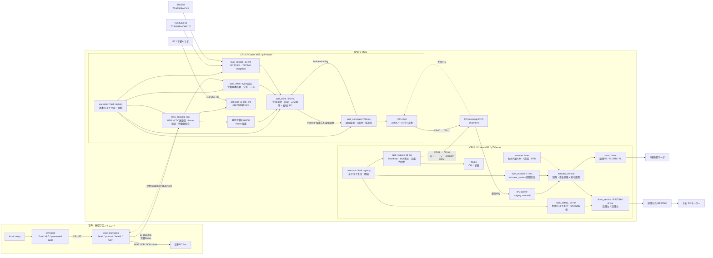
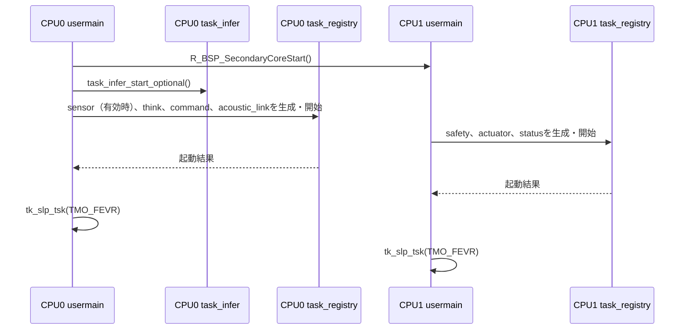
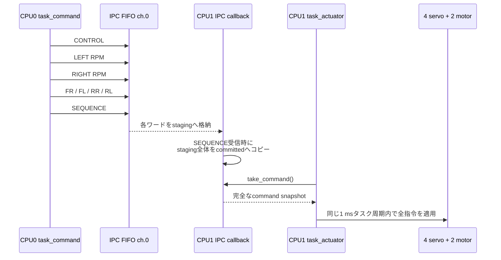
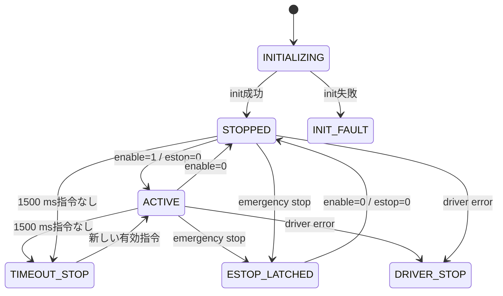
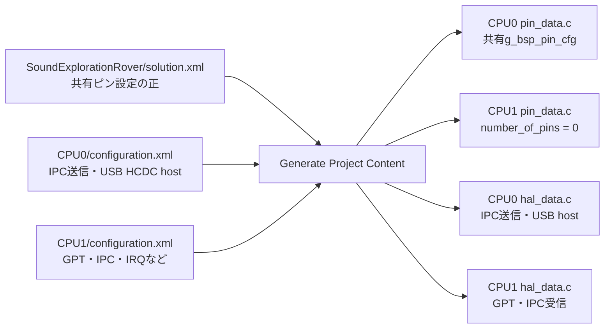

# ローバー ファームウェア設計書

最終確認: 2026-09-29 / 対象: このリポジトリのRA8P1 CPU0/CPU1、ReSpeaker/XIAO、I2Cセンサー実装

参考用のインタラクティブな全体図は、[構造図](archify/SEROV_ARCHITECTURE.html)を参照する。現行のディレクトリ構成、RA8P1ユーザーコードの層構成、および依存方向は本書を正とする。

- [ローバー ファームウェア設計書](#ローバー-ファームウェア設計書)
  - [1. 目的と設計方針](#1-目的と設計方針)
  - [2. システム全体像](#2-システム全体像)
  - [3. ソースコード構成](#3-ソースコード構成)
    - [3.1 RA8P1ユーザーコードのレイヤー構成](#31-ra8p1ユーザーコードのレイヤー構成)
  - [4. 起動シーケンス](#4-起動シーケンス)
    - [4.1 μT-Kernelの両コア構成](#41-μt-kernelの両コア構成)
  - [5. CPU0タスク設計](#5-cpu0タスク設計)
    - [5.1 目標データの流れ](#51-目標データの流れ)
    - [5.2 CPU0 LED表示](#52-cpu0-led表示)
    - [5.3 I2Cセンサーと走行調停](#53-i2cセンサーと走行調停)
  - [6. CPU間IPC設計](#6-cpu間ipc設計)
    - [6.1 通信形式](#61-通信形式)
    - [6.2 6出力の一括commit](#62-6出力の一括commit)
  - [7. CPU1アクチュエータ設計](#7-cpu1アクチュエータ設計)
    - [7.1 タスクと安全状態](#71-タスクと安全状態)
    - [7.2 サーボ制御](#72-サーボ制御)
    - [7.3 DCモーター制御](#73-dcモーター制御)
  - [8. 音源追従と安全調停](#8-音源追従と安全調停)
  - [9. FSP、Solution、ピン設定](#9-fspsolutionピン設定)
    - [9.1 USB High Speed割当](#91-usb-high-speed割当)
    - [9.2 アクチュエータ・センサ割当](#92-アクチュエータセンサ割当)
  - [10. 安全設計](#10-安全設計)
  - [11. ビルド・生成・書き込み](#11-ビルド生成書き込み)
  - [12. デバッグ観測点](#12-デバッグ観測点)
    - [CPU0](#cpu0)
    - [CPU1](#cpu1)
  - [13. 変更時の参照先](#13-変更時の参照先)
  - [14. MRAMを用いたプロトタイプ保存](#14-mramを用いたプロトタイプ保存)


## 1. 目的と設計方針

この文書は、Sound Exploration Roverについて、XVF3800、XIAO ESP32S3、RA8P1 CPU0/CPU1の責務、μT-Kernelタスク、USB音響入力、CPU間通信、アクチュエータ制御、安全動作、FSP生成コードとの境界を現行ソースに対応させて説明する。ReSpeakerの配線、USB protocol、DoA校正、段階試験の詳細は[ReSpeaker統合設計](RESPEAKER_INTEGRATION.md)に分離する。

設計上の要点は次のとおりである。

1. XVF3800はDoA/VADと処理済み音声を生成し、XIAO ESP32S3は音響・無線フロントエンドとして観測値とlog-mel特徴量を整形する。
2. CPU0（Cortex-M85）はUSB hostとして音響観測を検証し、μT-Kernel上で音源追従判断と指令送信を行う。
3. CPU0の`task_sensor`（I2C有効時）、`task_think`、`task_command`、`task_acoustic_link`は`task_registry.c`から生成する。`task_infer`は`usermain()`が別途、失敗を許容して起動する。
4. CPU1（Cortex-M33）はμT-Kernel上の1 msアクチュエータタスクで指令を検証し、4サーボと論理左右DCモーターを駆動する。独立した`task_safety`も制御タスクの進行を監視する。
5. 6個のアクチュエータ指示値は、IPCの`SEQUENCE`をcommit markerとして1つのスナップショットで確定する。
6. USBや音響データが異常・timeoutになってもCPU1の実時間制御を巻き込まず、CPU0停止目標とCPU1ローカルtimeoutを重ねる。
7. CPU0とCPU1は1個のRA8P1内の2コアであり、物理ピンを共有する。ピン多重化設定はSolutionを正として一元管理する。

## 2. システム全体像

| 要素 | 実行方式 | 主責務 |
|---|---|---|
| XVF3800 | 専用audio firmware | 4マイクDSP、DoA、VAD、処理済みI2S音声 |
| XIAO ESP32S3 | ESP-IDF / FreeRTOS | I2S/I2C取得、dBFS・log-mel算出、USB CDC device、frontend health、Wi-Fi UDP診断gateway |
| CPU0 / Cortex-M85 | μT-Kernel 3.0 | USB HCDC host、GPIO I2Cセンサー取得、音響特徴量の照合、音源追従・障害物回避・安全調停、IPC指令送信・状態受信、青/緑LED |
| CPU1 / Cortex-M33 | μT-Kernel 3.0 | IPC指令受信・状態送信、1 msアクチュエータタスク、独立安全監視、PWM/GPIO、encoder、赤LED状態タスク |

CPU0の主周期はcommand 50 ms、think 50 ms、sensor 50 msで、CPU1のアクチュエータ周期はnominal 1 msである。IPC channel 0はCPU0→CPU1の指令とCPU1→CPU0の診断に双方向利用し、両CPUの受信をIRQ/callbackで処理する。USB eventはCPU0の`task_acoustic_link`がtask contextからpollし、USB callbackからμT-Kernel APIを直接呼ばない。


```mermaid
flowchart LR
    subgraph HEAD["音声・無線フロントエンド"]
        MIC["4-mic array"] --> XVF["XVF3800<br/>DoA / VAD / processed audio"]
        XVF -->|"I2S / I2C"| ESP["XIAO ESP32S3<br/>level / protocol / health / UDP"]
        ESP -->|"Wi-Fi UDP JSON Lines"| PC["診断PC / nc"]
    end

    subgraph MCU["RA8P1 MCU"]
        subgraph CPU0["CPU0 / Cortex-M85 / μT-Kernel"]
            INIT["usermain / task registry<br/>基本タスク生成・開始"]
            AUDIO["task_acoustic_link<br/>USB HCDC送受信・frame検証・特徴量組立"]
            SENSOR["task_sensor / 50 ms<br/>GPIO I2C・ToF/IMU snapshot"]
            INFER["task_infer / event起床<br/>音響見本照合・背景モデル"]
            LABLINK["acoustic_ai_lab_link<br/>J11 PC直結CDC"]
            OBS["最新音響snapshot<br/>mutex保護"]
            THINK["task_think / 50 ms<br/>音源追従・回避・安全調停・青/緑LED"]
            COMMAND["task_command / 50 ms<br/>期限監視・6出力一括送信"]
            CLIENT["IPC client<br/>32 bitワード列へ変換"]
            INIT --> AUDIO
            INIT --> SENSOR
            INIT --> INFER
            INIT --> THINK
            INIT --> COMMAND
            AUDIO --> OBS
            AUDIO --> INFER
            AUDIO --> LABLINK
            OBS --> THINK
            INFER --> THINK
            SENSOR --> THINK
            THINK -->|"mutexで保護した最新目標"| COMMAND
            COMMAND --> CLIENT
            COMMAND -->|"fault event flag"| THINK
        end

        FIFO["IPC message FIFO<br/>channel 0"]

        subgraph CPU1["CPU1 / Cortex-M33 / μT-Kernel"]
            C1INIT["usermain / task registry<br/>全タスク生成・開始"]
            SERVER["IPC server<br/>staging・commit"]
            ACTTASK["task_actuator / 1 ms<br/>actuator_service周期実行"]
            SAFETY["task_safety / 20 ms<br/>制御タスク進行・timeout監視"]
            APP["actuator_service<br/>制限・安全状態・指令適用"]
            STATUS["task_status / 10 ms<br/>heartbeat・fault表示・実出力診断"]
            SERVO["servo driver<br/>論理FR / FL / RR / RL"]
            MOTOR["drive_service / BTS7960 driver<br/>論理左 / 論理右"]
            ENC["encoder driver<br/>左右代表A/B・4逓倍・RPM"]
            RED["赤LED<br/>CPU1状態"]
            C1INIT --> ACTTASK
            C1INIT --> SAFETY
            C1INIT --> STATUS
            SERVER --> APP
            ACTTASK --> APP
            SAFETY --> MOTOR
            APP --> SERVO
            APP --> MOTOR
            ENC -.-> APP
            STATUS --> RED
        end

        CLIENT -->|"CPU0 → CPU1"| FIFO
        FIFO -->|"受信IRQ"| SERVER
        STATUS -->|"CPU1 → CPU0<br/>実デューティ・encoder RPM"| FIFO
        FIFO -.->|"受信IRQ"| CLIENT
    end

    ESP -->|"J7 USB HS<br/>音響frame"| AUDIO
    LAB["PC / 音響AIラボ"] -->|"J11 USB FS"| LABLINK
    TOF["VL53L1X x3<br/>TCA9548A CH0/1/2"] --> SENSOR
    IMU["BMI270<br/>TCA9548A CH3"] --> SENSOR
    AUDIO -.->|"診断snapshot / Bulk OUT"| ESP
    SERVO --> WHEELS["4輪操舵サーボ"]
    MOTOR --> BTS["論理左右 BTS7960"]
    BTS --> DCM["左右 DCモーター"]
```

アクチュエータ制御経路はCPU0からCPU1への一方向である。USB CDCだけは音響観測のESP32S3→CPU0と診断snapshotのCPU0→ESP32S3を双方向に使う。UDPは外部診断専用で、PCやESP32S3からCPU1へ制御を迂回させない。将来Wi-Fi手動操作を追加する場合も、CPU0を権限・安全・timeoutの境界として維持する。

## 3. ソースコード構成

現行のユーザーコードは次の場所にある。FSP生成物（`ra_gen/`）とユーザーコードを混同しない。

```text
firmware/
├─ common/acoustic_protocol.h/.c             ESP32S3/CPU0共通USBプロトコル
├─ esp32s3/src/
│  ├─ app_main.c                              FreeRTOSタスク起動
│  ├─ xvf3800_control.c、audio_capture.c     XVF I2CとI2S取得
│  ├─ log_mel_extractor.c、acoustic_frontend.c  特徴量・観測生成
│  └─ usb_link.c、wifi_telemetry.c            USB CDC・Wi-Fi UDP診断
└─ ra8p1/
   ├─ common/ipc_message.h                    両CPUのIPC契約
   ├─ common/mtkernel/config.h                 両CPUのμT-Kernel共通設定
   ├─ common/mtk3_bsp2/                        共通μT-Kernel submodule
   ├─ SoundExplorationRover/solution.xml       デュアルコアSolution・共有ピン設定
   ├─ SoundExplorationRover_CPU0/
   │  ├─ configuration.xml、ra_gen/            FSP設定・生成物
   │  └─ src/
   │     ├─ main.c、hal_entry.c                μT-Kernel入口とCPU1起動
   │     ├─ tasks/                             sensor、think、command、acoustic_link、infer
   │     ├─ control/                           sound_follow、obstacle_avoidance、safety_arbiter、
   │     │                                     control_mlp_plannerなど
   │     ├─ services/                          sensor_hub、odometry、sound_source_localizer、
   │     │                                     acoustic_identifier、prototype_storageなど
   │     ├─ drivers/、platform/                 センサー個別操作・GPIO I2Cバス
   │     ├─ ipc/actuator_ipc_client.c          IPC指令送信・診断受信
   │     ├─ ai/                                TFLMランタイムと音響モデル
   │     └─ config/                            周期、閾値、ピンの役割
   └─ SoundExplorationRover_CPU1/
      ├─ configuration.xml、ra_gen/            FSP設定・生成物
      └─ src/
         ├─ main.c、hal_entry.c                μT-Kernel入口
         ├─ tasks/                             safety、actuator、status
         ├─ services/                          actuator_service、drive_service
         ├─ drivers/                           servo、bts7960、encoder
         ├─ ipc/actuator_ipc_server.c          IPC指令受信・診断送信
         ├─ mtkernel_config/include/           CPU1固有のカーネル設定
         └─ config/                            周期、制限、PWM、校正
```

### 3.1 RA8P1ユーザーコードのレイヤー構成

`tasks/`はμT-Kernelの生成・周期・待機と、制御処理の呼出しを担当する。`control/`は走行判断と安全調停、`services/`はセンサー・駆動・音響識別など複数要素の統合、`drivers/`は個別デバイス操作、`platform/`はFSPに近い共通基盤を担当する。`ipc/`と`config/`はこれらを横断する。CPU1には`control/`ディレクトリがなく、`services/actuator_service.c`が指令適用と安全状態を管理する。

CPU0の`sensor_hub`はTCA9548Aを選択してから個別ドライバを呼ぶ。ToFはCH0/1/2、BMI270はCH3である。CPU1の`drive_service`はRPMからデューティへの変換、左右校正、変化率制限を扱い、`bts7960`はPWM/GPIO出力を操作する。

主な入口は[CPU0 main](../../firmware/ra8p1/SoundExplorationRover_CPU0/src/main.c)、[CPU0 task registry](../../firmware/ra8p1/SoundExplorationRover_CPU0/src/tasks/task_registry.c)、[CPU1 main](../../firmware/ra8p1/SoundExplorationRover_CPU1/src/main.c)、[CPU1 task registry](../../firmware/ra8p1/SoundExplorationRover_CPU1/src/tasks/task_registry.c)である。通信契約は[USB protocol](../../firmware/common/acoustic_protocol.h)と[IPC message](../../firmware/ra8p1/common/ipc_message.h)を参照する。`ra_gen/`は直接編集せず、設定変更後にGenerate Project Contentで再生成する。

## 4. 起動シーケンス

各コアの`hal_entry.c`がμT-Kernelを起動し、カーネルの初期タスクから`usermain()`を呼ぶ。CPU0は`R_BSP_SecondaryCoreStart()`でCPU1を起動した後、`task_infer_start_optional()`を呼び、最後に登録済みの基本タスク群を生成・開始する。推論タスクの生成に失敗しても、この段階では基本タスク群の起動を継続する。


```mermaid
sequenceDiagram
    participant C0 as CPU0 usermain
    participant I as CPU0 task_infer
    participant R0 as CPU0 task_registry
    participant C1 as CPU1 usermain
    participant R1 as CPU1 task_registry
    C0->>C1: R_BSP_SecondaryCoreStart()
    C0->>I: task_infer_start_optional()
    C0->>R0: sensor（有効時）、think、command、acoustic_linkを生成・開始
    C1->>R1: safety、actuator、statusを生成・開始
    R0-->>C0: 起動結果
    R1-->>C1: 起動結果
    C0->>C0: tk_slp_tsk(TMO_FEVR)
    C1->>C1: tk_slp_tsk(TMO_FEVR)
```

両`task_registry.c`は登録配列の全タスクを生成してから登録順に開始し、失敗時は生成済みリソースを逆順で解放する。CPU0起動失敗時は推論タスクも停止する。初期タスクは正常起動後、永久休止する。

両コアのμT-Kernel tickは1 ms。CPU1の`task_actuator`と`task_status`は周期ハンドラ＋イベントフラグで起床し、`tk_get_otm()`から得た実経過時間を処理に渡す。`tk_dly_tsk()`を使うCPU0タスクとCPU1 `task_safety`の周期は公称値であり、実際には処理時間とtick境界の影響を受ける。実機のタイミング検証は[検証記録](validation/README.md)を参照する。

### 4.1 μT-Kernelの両コア構成

CPU0とCPU1は`firmware/ra8p1/common/mtk3_bsp2`の同じμT-Kernel sourceをコンパイルし、`firmware/ra8p1/common/mtkernel/config.h`を共通設定として参照する。両プロジェクトはe² studioのlinked resourceで共通submoduleを参照する。

CPU1では`src/mtkernel_config/include/`からCortex-M33、250 MHz、CPU1 SRAM領域を上書きする。CPU0は`0x22000000`から`0x000EA000` bytes、CPU1は`0x220EA000`から`0x000EA000` bytesを使用する。CPU1のT-Monitorとsystem messageはSCI8競合を避けるため無効にする。RA8P1ユーザーコードの整数・真偽値とリンケージにはμT-Kernelの型・マクロを使い、FSP API型と共通wire protocolの固定幅型は境界契約として維持する。

## 5. CPU0タスク設計

| タスク | 優先度 | スタック | 実行 | 責務 |
|---|---:|---:|---|---|
| `task_command_entry` | 6 | 2048 B | 50 ms | 最新目標、500 ms期限監視、6出力のIPC一括送信 |
| `task_acoustic_link_entry` | 8 | 4096 B | nominal 1 ms poll | HCDC event、stream parser、特徴量組立、診断送信 |
| `task_sensor_entry` | 9 | 2048 B | 50 ms | ToF/IMU取得、sensor snapshot、オドメトリ更新（I2C有効時） |
| `task_think_entry` | 10 | 4096 B | 50 ms | 音源追従、障害物回避、安全調停、LED、学習操作 |
| `task_infer_entry` | 11 | 4096 B | 特徴量完成イベント | 背景モデル更新と保存見本との照合（任意起動） |

μT-Kernelでは数値が小さいほど高優先度である。IPC keep-aliveを行う`task_command`を最優先にし、音響受信、センサー取得、判断、推論の順に続く。`task_infer`は登録配列に含まず、資源不足による起動失敗を基本タスクの起動失敗として扱わない。既定の`CPU0_USE_ACOUSTIC_EMBEDDING_TFLM=0`では音響埋め込みCNNを使わず、保存された要約特徴量による照合を行う。

### 5.1 目標データの流れ

`task_acoustic_link`はCDC byte streamを共有protocol parserへ渡し、CRC、version、length、sequenceを検証して最新観測を優先度継承mutex内へcommitする。受信したFEATURE frameから完成パッチを組み立て、`task_infer`へ通知する。同じUSB CDCリンクでCPU0/CPU1の状態、姿勢、音源ナビゲーション、学習診断をESP32S3へ送信する。USB detach時は古い観測を即座に無効化する。

`task_think`は50 msごとに音響・センサー・推論結果を取得する。`task_acoustic_link`の観測時刻に加え、観測専用sequenceの変化も監視し、いずれかが600 msの期限を満たさない観測はリンク準備完了とみなさない。音源追従出力を回避制御・安全調停へ通し、`rover_motion_target_t`へ展開する。`task_command_set_target()`は左右モーター、FR/FL/RR/RL、enable、emergency stopを含む構造体全体を別の優先度継承mutexで保護する。

`task_command`は50 msごとにmutex内の構造体をコピーし、次のIPC処理をmutex外で行う。目標更新が500 ms途絶した場合は`enable=0`、`emergency_stop=1`へ置き換え、faultを`task_think`のイベントフラグへ通知する。

起動時または緊急停止後は、有効指令の前に`enable=0`かつ`emergency_stop=0`のフレームを1回送る。これはCPU1の緊急停止ラッチ解除手順を満たすためである。

### 5.2 CPU0 LED表示

CPU0の`task_think`が青LED（LED1/P600）と緑LED（LED2/P303）を一括して所有する。CPU1は赤LED（LED3/PA07）だけを使うため、両コアが同じLEDを同時操作しない。

| 表示 | 意味 |
|---|---|
| 青を500 msごとに反転 | USB link待ち・safe stop |
| 青を1秒ごとに100 ms点灯 | 停止して音を聴取中 |
| 青を125 msごとに反転 | 目標方向へservo整定中 |
| 青点灯 | 音源追従の走行・回頭中 |
| 青を250 msごとに反転 | settleまたはcooldown中 |
| 緑消灯 | 有効な学習見本なし。SW1長押しで学習開始 |
| 緑を500 ms点灯・500 ms消灯 | 見本を収集中 |
| 緑を100 ms点灯・100 ms消灯 | 5見本収集済み。SW1長押しで保存 |
| 緑点灯 | 5見本をMRAMへ保存済み |
| 緑が100 msの2回点滅を1秒ごとに繰り返す | MRAM初期化・保存・読出しに失敗 |
| 青をN回点滅 | CPU0 fault。Nがfault番号 |
| 赤を500 msごとに反転 | CPU1正常heartbeat |
| 赤を約50 msごとに反転 | CPU1 driver/FSP error |

CPU0 fault番号は、1がtask create/start、2がIPC初期化、3がIPC送信、4が目標タイムアウト、5がUSB初期化、6が目標共有失敗である。複数faultがある場合は小さい番号を優先表示し、`g_task_think_fault_flags`には全bitを保持する。

### 5.3 I2Cセンサーと走行調停

`CPU0_SENSOR_I2C_ENABLED=1`が既定であり、CPU0のタスク登録はsensor taskを追加する。sensor taskはGPIO I2Cバス上のTCA9548Aを介し、VL53L1X 3台（CH0/1/2）とBMI270（CH3）を50 ms周期で取得し、mutexで保護した最新snapshotを公開する。通信異常はCPU0全体のfaultへ昇格させず、snapshotをinvalidとして走行判断を安全停止に戻し、1秒ごとに再初期化する。

現行の`task_think`は音源追従とセンサールールを組み合わせる。音源追従が走行を要求している間に障害物回避を開始し、開始後は通過まで回避を保持する。回避完了時は停止してDoA履歴を破棄し、再聴取する。`CPU0_USE_CONTROL_MLP=1`の場合は制御MLPの候補も評価し、回避・停止条件を優先して最終目標を決める。近接時は有限回の後退・回頭を試み、後方距離が未計測であることを踏まえて後退に時間上限を設ける。最終指令は必ず`safety_arbiter`でToF・IMU・センサー生存性を確認してからIPCへ渡す。

最新の接続チャネルと取得処理は[センサー設定](../../firmware/ra8p1/SoundExplorationRover_CPU0/src/config/sensor_config.h)と[sensor_hub](../../firmware/ra8p1/SoundExplorationRover_CPU0/src/services/sensor_hub.c)、走行の最終判定は[task_think](../../firmware/ra8p1/SoundExplorationRover_CPU0/src/tasks/task_think.c)を参照する。

## 6. CPU間IPC設計

### 6.1 通信形式

FSPのIPC FIFOは4段、1要素32 bitである。共有C構造体を直接書かず、上位8 bitをID、下位24 bitをpayloadとして送る。

```text
31                    24 23                              0
+-----------------------+--------------------------------+
| message ID (8 bit)    | payload (24 bit)               |
+-----------------------+--------------------------------+
```

| ID | 名前 | payload |
|---:|---|---|
| `0x01` | CONTROL | bit 0: enable、bit 1: emergency stop |
| `0x02` | LEFT_TARGET_RPM | signed 16 bit |
| `0x03` | RIGHT_TARGET_RPM | signed 16 bit |
| `0x04` | FR_TARGET_DEG | signed 16 bit |
| `0x06` | FL_TARGET_DEG | signed 16 bit |
| `0x07` | RR_TARGET_DEG | signed 16 bit |
| `0x08` | RL_TARGET_DEG | signed 16 bit |
| `0x05` | SEQUENCE | 24 bit、1フレームのcommit marker |
| `0x81` | STATUS_FAULT_FLAGS | CPU1 actuator fault flags |
| `0x82` | STATUS_LEFT_DUTY | 左の実適用PWM、signed 16 bit permille |
| `0x83` | STATUS_RIGHT_DUTY | 右の実適用PWM、signed 16 bit permille |
| `0x84` | STATUS_LEFT_ENCODER_RPM_X10 | 左encoder RPM×10、signed 16 bit |
| `0x85` | STATUS_RIGHT_ENCODER_RPM_X10 | 右encoder RPM×10、signed 16 bit |
| `0x86` | STATUS_APPLIED_SEQUENCE | CPU1が最後に処理した指令sequence、24 bit |
| `0x87` | STATUS_SEQUENCE | CPU1状態snapshotのcommit marker、24 bit |
| `0x88` | STATUS_LEFT_ENCODER_COUNT | 左代表encoder累積countの下位24 bit |
| `0x89` | STATUS_RIGHT_ENCODER_COUNT | 右代表encoder累積countの下位24 bit |
| `0x8A` | STATUS_UPTIME_MS | CPU1状態時刻の下位24 bit |

### 6.2 6出力の一括commit


```mermaid
sequenceDiagram
    participant CMD as CPU0 task_command
    participant FIFO as IPC FIFO ch.0
    participant ISR as CPU1 IPC callback
    participant APP as CPU1 task_actuator
    participant OUT as 4 servo + 2 motor

    CMD->>FIFO: CONTROL
    CMD->>FIFO: LEFT RPM
    CMD->>FIFO: RIGHT RPM
    CMD->>FIFO: FR / FL / RR / RL
    CMD->>FIFO: SEQUENCE
    FIFO-->>ISR: 各ワードをstagingへ格納
    ISR->>ISR: SEQUENCE受信時に<br/>staging全体をcommittedへコピー
    APP->>ISR: take_command()
    ISR-->>APP: 完全なcommand snapshot
    APP->>OUT: 同じ1 msタスク周期内で全指令を適用
```

ここで「同時」とは、6値を分割受信中の中途半端な組合せで適用せず、1つのcommit済みスナップショットとしてCPU1の同じ`task_actuator`周期で適用することを意味する。物理PWM波形が完全に同一クロックエッジで変化することを保証するものではない。

CONTROLでemergency stopを受けた場合だけは、残りのワードとSEQUENCEを待たずにcommitする。実際の出力停止はIRQ内ではなくCPU1の次回`task_actuator`周期で行う。CPU0はFIFO overflow時に1 ms待って同じワードを再送する。

CPU1の`task_status`は実デューティ、左右encoder RPM/count、fault、適用済み指令sequence、uptimeを10語のsnapshotにし、10 msごとに最大1語ずつCPU0へ返す。CPU0は`STATUS_SEQUENCE`受信時だけsnapshotを確定する。USBでは96 byte `ROVER_TELEMETRY`と24 byte `ACTUATOR_TELEMETRY`を別frameで送信する。姿勢36 byte `POSE_TELEMETRY`、音源ナビ診断56 byte `NAV_DIAGNOSTICS`も別frameで送る。IPCの戻り値は診断用であり、CPU1の1 ms制御を待たせない。

## 7. CPU1アクチュエータ設計

| タスク | 優先度 | スタック | 実行 | 責務 |
|---|---:|---:|---|---|
| `task_safety_entry` | 3 | 1024 B | nominal 20 ms | 制御タスクの更新停止と指令timeoutを独立監視 |
| `task_actuator_entry` | 4 | 2048 B | 周期通知1 ms・実Δt更新 | IPC確定指令、encoder、PWMランプ、安全停止 |
| `task_status_entry` | 12 | 512 B | 周期通知10 ms・実Δt更新 | 赤LED、driver/FSP fault表示、CPU1実出力診断送信 |

数値が小さいほど高優先度であり、安全監視、アクチュエータ周期処理、状態表示の順に優先する。IPC callbackはFSPのIRQ contextでstaging/commitだけを行い、μT-Kernelのtask APIとPWM driver APIを直接呼ばない。

### 7.1 タスクと安全状態

CPU1の`usermain()`は、登録配列から`task_safety`、`task_actuator`、`task_status`を生成・開始する。優先度4の`task_actuator`は周期ハンドラのイベントフラグ通知で起床し、実経過時間を引数とする`actuator_service_update(elapsed_ms)`でエンコーダ保守、IPC指令取得、期限監視、サーボとモーターへの適用を行う。通知の合流時も実経過時間を使い、期限切れはPWM更新より前に判定する。

優先度3の`task_safety`は起動後100 ms待ってからnominal 20 msごとに制御タスクの更新回数を確認し、100 ms以上進まない場合に`bts7960_stop()`でモーターを直接停止する。指令timeout faultも別途監視する。優先度12の`task_status`は10 ms周期で赤LEDと100 msごとの診断snapshot採取を管理し、1起床につき最大1語を送る。FIFO混雑時は同一snapshotの同じ語を再試行し、最終語成功時だけsequenceを進める。最終IPC指令から1500 ms以上経過するとローカルsafe stopへ移行する。


```mermaid
stateDiagram-v2
    [*] --> INITIALIZING
    INITIALIZING --> STOPPED: init成功
    INITIALIZING --> INIT_FAULT: init失敗
    STOPPED --> ACTIVE: enable=1 / estop=0
    ACTIVE --> STOPPED: enable=0
    ACTIVE --> TIMEOUT_STOP: 1500 ms指令なし
    STOPPED --> TIMEOUT_STOP: 1500 ms指令なし
    TIMEOUT_STOP --> ACTIVE: 新しい有効指令
    ACTIVE --> ESTOP_LATCHED: emergency stop
    STOPPED --> ESTOP_LATCHED: emergency stop
    ESTOP_LATCHED --> STOPPED: enable=0 / estop=0
    ACTIVE --> DRIVER_STOP: driver error
    STOPPED --> DRIVER_STOP: driver error
```

アクチュエータサービスの`safe stop`は左右モーターenableをLow、RPWM/LPWMの4出力を0、GPT10/GPT7を停止し、4本のサーボGPTも停止する。安全監視タスクからの直接停止は`bts7960_stop()`によるモーター停止である。起動時はモーターを止めたまま4サーボを0度に動かし、1000 ms保持した後にPWMを停止する。有効な走行指令が先に来た場合は起動整定より指令を優先する。通常の`safe stop`はサーボを0度へ戻さず、その時点でPWM信号を止める。

### 7.2 サーボ制御

配列順は全レイヤーで`FR=0、FL=1、RR=2、RL=3`に統一する。角度はCPU1で-45～+45度へ制限し、現在は次の線形変換を行う。

```text
-45 deg -> 1200 us
  0 deg -> 1500 us + wheel trim
+45 deg -> 1800 us
```

最終パルス幅は1000～2000 usへ制限する。各輪の`SERVO_CENTER_TRIM_US_*`で機械原点、`SERVO_DIRECTION_*`で取付方向を補正する。起動時の0度整定で4本のPWMを一度開始し、その後は有効なIPC指令を受けたときにPWMを再開する。

### 7.3 DCモーター制御

論理左右各1台のBTS7960へ、RPWM用GPT10A/BとLPWM用GPT7A/Bの20 kHz PWMを出す。ピン配置は論理左RPWM=P811/GPT10B、右RPWM=P810/GPT10A、左LPWM=P602/GPT7B、右LPWM=P603/GPT7Aである。論理正RPM（車体前進）は左LPWM（P602/GPT7B）・右RPWM（P810/GPT10A）、負RPM（車体後進）は左RPWM（P811/GPT10B）・右LPWM（P603/GPT7A）へ出力する。RPM指令を基本PWMへ換算し、左右別の固定比を適用する。

```text
target RPM -> duty permille = target * 1000 / 300 RPM
0～700 permilleに制限
1 msごとに2 permilleずつ目標へランプ
5 msごとにGPT10A/BおよびGPT7A/Bへ反映
```

論理正RPMは車体前進として扱い、エンコーダ値は前進正・後進負とする。論理正RPMは左LPWM（P602/GPT7B）・右RPWM（P810/GPT10A）、負RPMは左RPWM（P811/GPT10B）・右LPWM（P603/GPT7A）へ出す。符号は`DRIVE_CHASSIS_FORWARD_SIGN=-1`、`DRIVE_LEFT_MOUNT_SIGN=+1`、`DRIVE_RIGHT_MOUNT_SIGN=-1`から合成する。同じ側のRPWM/LPWMは相互排他的に更新し、同時Highを避ける。停止時は4出力を0にしてから共通ENをLowにする。

基本PWMは左右別の固定比で算出し、`DRIVE_LEFT_DUTY_SCALE_PERMILLE=800`、`DRIVE_RIGHT_DUTY_SCALE_PERMILLE=800`を適用する。代表エンコーダを使う速度フィードバックは`DRIVE_SPEED_FEEDBACK_ENABLE=0`で無効化している。最終PWMは0～700 permilleに制限する。左右RPMがともに0ならランプダウンを行わず、PWMと共通ENを即時停止する。各側3台のモーターを個別に制御するものではない。

## 8. 音源追従と安全調停

[音源追従コントローラ](../../firmware/ra8p1/SoundExplorationRover_CPU0/src/control/sound_follow_controller.c)は50 msごとに更新する。リンクと観測が500 ms安定した後に`LISTEN`へ入り、-45 dBFS以上、VAD、有効なDoAの観測から音源候補を作る。初回検出から500 ms待ち、直近5サンプルのDoAが20度以内に収まれば走行準備へ進む。2000 ms以内に安定しなければ候補を破棄する。車体相対角は前0度、右正、左負である。

現行ビルドでは`CPU0_SOUND_STOP_AND_LISTEN_ENABLE=0`で、`MOVE_STEP`中も新しい有効DoAに合わせて操舵を更新する。音が1500 ms失われる、見本照合が失効する、または走行中のDoAが後方へ大きく変わると停止・再聴取する。回避が完了した場合も停止して以前のDoA履歴を破棄する。毎1000 ms走行して停止聴取する方式は、この設定では使わない。

後方音源（相対DoAの絶対値が90度超）では、`SPIN_PREP`後に最小並進回頭を行う。設定上の舵角は35度、目標ヨー上限は180度、安全時間上限は12000 msである。IMUのZ軸と新しいDoAを監視し、DoAが正面に入る、目標ヨーに達する、時間上限に達する、または進行不足となったときに停止する。始動時はジャイロの動きを見ながらRPMを段階的に増やす。回頭後は500 ms整定して新しいDoAを測る。IMUの取付変更時は`CPU0_SENSOR_YAW_AXIS`と`CPU0_SENSOR_YAW_RIGHT_SIGN`を確認する。

現場学習見本の一致は既定で必須（`CPU0_SOUND_REQUIRE_IDENTIFIER_MATCH=1`）。ESP32S3から受けたlog-mel特徴量を`task_infer`が照合し、`task_think`が一致状態と有効期限を走行条件へ反映する。音源位置推定はオドメトリと複数方位から計算して診断へ出すが、現行設定の`CPU0_SOUND_USE_LOCALIZATION_FOR_STEERING=0`と`CPU0_SOUND_USE_LOCALIZATION_FOR_ARRIVAL=0`により、推定方位を直接操舵や到着停止には使わない。

`task_think`は音源追従出力、ToF/IMU回避ルール、制御MLP候補を調停する。MLPは`CPU0_USE_CONTROL_MLP=1`で有効だが、回避中・停止条件・推論fallback時は採用しない。最終目標は必ず`safety_arbiter_arbitrate()`でToF、IMU、センサー更新停止を評価してから`task_command`へ渡す。センサー更新が200 ms進まない場合、初回の更新をまだ観測していない場合、またはsnapshotを取得できない場合は走行を許可しない。CPU0 fault bitは原則ラッチし、IPC送信faultのみ安全指令へのCPU1応答が連続確認されると解除する。

動作値、USB protocol、DoA校正は[ReSpeaker統合設計](RESPEAKER_INTEGRATION.md)、回避と安全調停の現行実装は[obstacle_avoidance_controller](../../firmware/ra8p1/SoundExplorationRover_CPU0/src/control/obstacle_avoidance_controller.c)と[safety_arbiter](../../firmware/ra8p1/SoundExplorationRover_CPU0/src/control/safety_arbiter.c)を参照する。

## 9. FSP、Solution、ピン設定


```mermaid
flowchart LR
    SOL["SoundExplorationRover/solution.xml<br/>共有ピン設定の正"]
    C0CFG["CPU0/configuration.xml<br/>IPC送信・USB HCDC host"]
    C1CFG["CPU1/configuration.xml<br/>GPT・IPC・IRQなど"]
    GEN["Generate Project Content"]
    C0PIN["CPU0 pin_data.c<br/>共有g_bsp_pin_cfg"]
    C1PIN["CPU1 pin_data.c<br/>number_of_pins = 0"]
    C0HAL["CPU0 hal_data.c<br/>IPC送信・USB host"]
    C1HAL["CPU1 hal_data.c<br/>GPT・IPC受信"]
    SOL --> GEN
    C0CFG --> GEN
    C1CFG --> GEN
    GEN --> C0PIN
    GEN --> C1PIN
    GEN --> C0HAL
    GEN --> C1HAL
```

同じRA8P1のIOPORTを共有するため、同一ピンをCPU0/CPU1へ独立に設定すると重複警告や上書きが発生する。現行構成ではSolutionを正とし、CPU0の`pin_data.c`に共有ピンを生成し、CPU1の`pin_data.c`は0ピンのままとする。GPT、IPC、USBなどのmodule設定は実際にAPIを使うCPU側へ生成する。

### 9.1 USB High Speed割当

XIAO ESP32S3はJ7へ接続し、CPU0のFSPにHCDC ACM host、High Speed、USB IP1を配置する。上位model名は`g_hcdc0`、USB Basic instanceは`g_basic0`である。DMA、hub、multi CDCは無効、callback/contextは`NULL`とし、USBHS main/D0FIFO/D1FIFOの3 IRQ priorityを12とする。CPU0はUSB hostとIPC指令送信・状態受信を所有し、CPU1はアクチュエータ制御と実出力状態送信を所有する。

| 用途 | FSP / GPIO | MCUピン | 外部コネクタ |
|---|---|---|---|
| USB HS data | USB IP1 | dedicated USBH_P / USBH_N | J7 USB-C |
| USB HS VBUS sense | `USBHS_VBUS` | P408 | J7内部 |
| USB HS VBUS enable | `USBHS_VBUSEN` | PD07 | J7内部、host時High |

J11/USB Full SpeedはReSpeaker経路には使用せず、PC直結の音響AIラボ用CDC deviceとして別途使用する。J11のUSBイベントはJ7と共通キューからmodule番号で振り分ける。host hubとDMAは初期構成で無効とし、J7では1台のCDC ACM deviceをpolling event APIで扱う。接続・給電・FSP設定の詳細は[ReSpeaker統合設計](RESPEAKER_INTEGRATION.md#4-ek-ra8p1-usb接続)を参照する。

### 9.2 アクチュエータ・センサ割当

以下の表の「論理左／論理右」「論理FR／FL／RR／RL」は、CPU0のIPC指令で使用する名称である。物理ピンの割り当ては論理名へ対応付け、FSP生成インスタンス名も論理名に統一している。アクチュエータとエンコーダIRQはCPU1、I2CセンサーはCPU0が所有する。ピン番号とSolutionの共有ピン設定は変更していない。

| 用途 | FSPインスタンス | FSP出力 / GPIO | MCUピン | 外部コネクタ |
|---|---|---|---|---|
| 論理サーボFR | `g_servo_pwm_fr` | GPT12B | P803 | Pmod1 J26-4 / SCK |
| 論理サーボFL | `g_servo_pwm_fl` | GPT9B | P110 | Arduino J24-2 / D9 |
| 論理サーボRR | `g_servo_pwm_rr` | GPT11B | P801 | Pmod1 J26-2 / MOSI |
| 論理サーボRL | `g_servo_pwm_rl` | GPT13B | P808 | Arduino J23-1 / D0 |
| 論理左モーターRPWM | `g_motor_pwm` | GPT10B | P811 | Arduino J23-4 / D3 |
| 論理右モーターRPWM | `g_motor_pwm` | GPT10A | P810 | Arduino J23-5 / D4 |
| 論理左モーターLPWM | `g_motor_pwm_lpwm` | GPT7B | P602 | Pmod2 J25-3 / MISO |
| 論理右モーターLPWM | `g_motor_pwm_lpwm` | GPT7A | P603 | Pmod2 J25-2 / MOSI |
| 左右BTS7960共通EN | `g_ioport` | GPIO出力 | PD01 | Arduino J24-1 / D8、左右ENへ分岐 |
| I2C SCL（センサー用） | `g_ioport` (GPIO I2C) | GPIO出力/プルアップ入力 | P312 | Arduino J23-8 / D7（※J24-10 P512破損回避） |
| I2C SDA（センサー用） | `g_ioport` (GPIO I2C) | GPIO出力/プルアップ入力 | P511 | Arduino J24-9 / SDA |
| 論理左代表エンコーダA | `g_encoder_left_a_irq` | IRQ16入力 | P011 | Arduino J23-3 / D2 |
| 論理左代表エンコーダB | `g_encoder_left_b_irq` | IRQ20入力 | P809 | Arduino J23-2 / D1 |
| 論理右代表エンコーダA | `g_encoder_right_a_irq` | IRQ11入力 | P006 | Pmod1 J26-7 / IRQ |
| 論理右代表エンコーダB | `g_encoder_right_b_irq` | IRQ18入力 | P413 | Pmod1 J26-10 / GPIO2 / IRQ |
| センサー共通電源 | なし | +3.3 V / GND | - | Pmod2 J25-6 / J25-5 |
| TCA9548A I2Cマルチプレクサ | `g_ioport` (GPIO I2C) | 7-bit address `0x70` | P511 / SDA、P312 / SCL | Arduino J24-9 / SDA、J23-8 / D7 (SCL) |
| VL53L1X LEFT | `g_ioport` (GPIO I2C) | TCA9548A CH0、7-bit address `0x29` | P511 / SDA、P312 / SCL | TCA9548A CH0 |
| VL53L1X CENTER | `g_ioport` (GPIO I2C) | TCA9548A CH1、7-bit address `0x29` | P511 / SDA、P312 / SCL | TCA9548A CH1 |
| VL53L1X RIGHT | `g_ioport` (GPIO I2C) | TCA9548A CH2、7-bit address `0x29` | P511 / SDA、P312 / SCL | TCA9548A CH2 |
| BMI270 IMU | `g_ioport` (GPIO I2C) | TCA9548A CH3、7-bit address `0x68` / `0x69` | P511 / SDA、P312 / SCL | TCA9548A CH3 |

GPIO I2Cの主バスにはTCA9548Aを接続し、同一address `0x29`のVL53L1XはCH0/CH1/CH2、BMI270はCH3に分離する。J24-10 (P512) はハードウェア端子破損（GND短絡）のため放棄し、J23-8 (P312 / D7) をGPIO SCLとして使用する。FSPにI2Cインスタンスが生成されていても、現行のセンサー転送は`platform/i2c_bus.c`のGPIO実装が行う。

ToFの光学中心は、車体座標（前方`+y`、右方向`+x`）でLEFT=(-90, +94) mm、CENTER=(0, 0) mm、RIGHT=(+90, +94) mm。現行の回避制御は左右ToFの光軸がそれぞれ外側へ13度傾く前提（`CPU0_SENSOR_SIDE_TOF_ANGLE_DEG`）で距離を解釈する。実際の取付角が異なる場合は、この設定と取付を合わせて確認する。


P801、P803、P808をサーボへ転用しているため、現行構成ではOcto-SPIフラッシュを使用できない。SW4-3をONにしてOcto-SPIを無効、SW4-4をONにしてArduino端子を有効にする。LPWMはPmod2 J25-2/J25-3へ割り当て、OSPI0とは競合させない。BTS7960は左右のVCCを共通化し、R_EN/L_ENをPD01へまとめる。VCCとENは直結せず、P312はセンサー用SCLに使う。電源はJ18-5の+5 VをBTS7960 VCC、J18-4の+3.3 Vを左右代表エンコーダVCC、J18-6/J18-7のGNDを全機器共通GNDとして分岐する。I2CセンサーはPmod2 J25-6の+3.3 VとJ25-5のGNDから別枝で給電する。これらは同じ+3.3 V/GNDネットであり、別電源ではないが、BTS7960のGNDからセンサーを数珠つなぎにしない。BTS7960のモーター電流の帰路はバッテリーとモータードライバの間で直接配線する。ただしBTS7960モジュールの仕様が3.3 V対応でない場合は5 Vを使用し、電流容量が不足する場合は外部安定化電源を使用する。

## 10. 安全設計

| 監視箇所 | 条件 | 動作 |
|---|---|---|
| ESP32S3 frontend | XVF I2C失敗、I2S overrun | observation flag/statusと累積health countで通知 |
| CPU0 `task_acoustic_link` | CRC/version/length/sequence異常 | frame破棄。正常観測が途絶えれば600 ms timeoutへ収束 |
| CPU0 `sound_follow_controller` | USB detach、HELLO未成立、観測時刻または思考側sequence watchdogが600 msの期限超過 | `WAIT_LINK`、enable=0、estop=1 |
| CPU0 `sound_follow_controller` | XVF ready以外、VADなし、I2C error、mute、I2S stale | 新規走行triggerへ使わず、走行中に有効音が途絶えた場合は喪失期限後に停止。単発I2S overrunは診断値として記録 |
| CPU0 `task_think` / `task_infer` | 必須の保存見本との照合が未成立・失効 | 新しい走行を許可せず、走行中は停止・再聴取 |
| CPU0 `task_think` / `safety_arbiter` | sensor snapshot取得失敗、初回更新未確認、200 ms以上更新停止、危険距離・姿勢 | 走行目標を安全側へ制限または停止 |
| CPU0 `task_command` | 思考目標が500 ms更新されない | enable=0、estop=1を送信、CPU0 fault通知 |
| CPU0 IPC client | 通常指令の送信失敗 | 緊急停止送信を追加試行、CPU0 fault通知 |
| CPU1 IPC server | emergency stop受信 | SEQUENCEを待たずcommit |
| CPU1 `actuator_service` | IPC指令が1500 ms届かない | ローカルsafe stop |
| CPU1 `task_safety` | 1 ms制御タスクの更新が100 ms以上止まる、または指令timeout fault | モーターを直接停止 |
| CPU1 driver統合 | driver API error | DRIVER fault、safe stop |

現状の制約は、ハードウェア非常停止入力なし、専用のCPU間ハードウェアwatchdogなし、各側3台の個別速度フィードバックなしである。論理左右代表モーターのA/Bを4逓倍で数え、実機校正値`WHEEL_ENCODER_COUNTS_PER_REV=702`と100 msの差分からRPMを算出する。カウントとRPMは前進正、後進負を契約とする。`DRIVE_SPEED_FEEDBACK_ENABLE=0`のため、実測RPMは診断にのみ使用する。また論理左右各3台を1台のBTS7960へ並列接続しているため、6台の個別制御には対応しない。

## 11. ビルド・生成・書き込み

基準環境はFSP 6.4.0、GNU Arm Embedded 13.2.1、e² studio 2025-12である。CPU0/CPU1のユーザーsourceとμT-Kernel sourceは各プロジェクトのDebug構成へ含め、同じビルド世代のELFを組にして書き込む。XIAO ESP32S3はESP-IDFのproject設定に従ってbuild/flashする。

e² studioではCPU0/CPU1 projectをRefreshし、Generate Project Content、Clean、Buildを順に行う。CPU0/CPU1のELFは`SoundExplorationRover Debug_Multicore Launch Group`で組にして書き込む。

ピンまたはFSPモジュール変更後は次の順で更新する。

1. 物理ピン多重化をSolution側で変更する。
2. GPT、IPC、IRQを実行するCPUプロジェクト側で変更する。
3. CPU0、CPU1のprojectをRefreshする。
4. CPU0、CPU1の順にGenerate Project Contentを実行する。
5. CPU0の`pin_data.c`に共有ピン、CPU1側に0ピンが生成されたことを確認する。
6. CPU0とCPU1を両方Clean/Buildする。
7. `SoundExplorationRover Debug_Multicore Launch Group`で同じビルド世代のELFを組にして書き込む。

古いSRECを個別に混在させると、IPC契約、ピン設定、制御ロジックの世代が一致しない。デュアルコア試験ではCPU0/CPU1を必ず一組で更新する。

## 12. デバッグ観測点

### CPU0

| 変数 | 確認できること |
|---|---|
| `g_task_think_state` | 音源追従、回避、停止、FAULTなどの現在状態 |
| `g_task_think_cycle_count` | 思考タスクの周期実行回数 |
| `g_task_think_observation_sequence` | 思考で最後に使用した音響観測sequence |
| `g_task_think_observation_watchdog_ms` | `task_think`で同じ観測sequenceが続いた時間。600 msでlink無効、未成立時は`UINT32_MAX` |
| `g_task_think_sensor_watchdog_ms` / `g_task_think_sensor_fresh` | センサー更新進行の200 ms監視と走行可否 |
| `g_task_think_source_position_valid` / `g_task_think_source_bearing_deg` | 複数DoAとオドメトリによる音源位置推定 |
| `g_task_infer_available` / `g_task_infer_feature_generation` | 任意起動した音響推論タスクの状態と処理済み特徴量 |
| `g_task_think_fault_flags` | CPU0でラッチした全fault bit |
| `g_task_command_sequence` | 最終IPC sequence |
| `g_task_command_send_count` | 正常にcommitした指令数 |
| `g_task_command_last_error` | 最後のIPC FSP error |
| `g_task_acoustic_link_usb_configured` | HCDC deviceの列挙状態 |
| `g_task_acoustic_link_hello_received` | 必須capabilityを持つHELLOの成立 |
| `g_task_acoustic_link_frame_count` | CRC/format検証を通過したframe数 |
| `g_task_acoustic_link_crc_error_count` | CRC不一致frame数 |
| `g_task_acoustic_link_format_error_count` | length/version/format異常数 |
| `g_task_acoustic_link_sequence_drop_count` | 同値または逆行sequenceの破棄数 |
| `g_task_acoustic_link_observation_age_ms` | 最新音響観測からの経過時間 |
| `g_task_acoustic_link_observation` | 最新DoA、level、peak、VAD、status、flags |
| `g_task_acoustic_link_last_error` | 最後のFSP USB error |

### CPU1

| 変数 | 確認できること |
|---|---|
| `g_servo_pulse_us[0..3]` | FR/FL/RR/RLへ計算したパルス幅 |
| `g_servo_center_trim_us[0..3]` | 各輪の原点補正 |
| `g_drive_left_duty_permille` | 左モーターの現在ランプ値 |
| `g_drive_right_duty_permille` | 右モーターの現在ランプ値 |
| `g_actuator_service_fault_flags` | timeout、estop、制限、driver異常 |
| `g_actuator_service_last_error` | 最後のFSP error |
| `g_encoder_left_count` / `g_encoder_right_count` | 左右代表モーターの4逓倍累積値 |
| `g_encoder_left_rpm_x10` / `g_encoder_right_rpm_x10` | 左右代表モーター推定RPMの10倍（100 ms更新） |
| `g_task_safety_actuator_hang_detected` / `g_task_safety_timeout_detected` | 独立安全監視による停止理由 |

## 13. 変更時の参照先

| 変更内容 | 主に変更する場所 | 併せて確認する場所 |
|---|---|---|
| 音量閾値・DoA校正・走行時間 | CPU0 `src/config/control_config.h` | `src/control/sound_follow_controller.c`、実機ログ |
| 音源追従・回避・安全調停 | CPU0 `src/control/` | `src/tasks/task_think.c`、`rover_motion_target_t` |
| 音響特徴量・識別 | ESP32S3 `src/log_mel_extractor.c`、CPU0 `src/tasks/task_infer.c` | `src/services/acoustic_feature_assembler.c`、保存形式 |
| USB音響protocol | `firmware/common/acoustic_protocol.h/.c` | ESP32S3とCPU0のparser、versionとpayload長 |
| XVF I2C/I2S取得 | ESP32S3 `src/xvf3800_control.c`、`src/audio_capture.c` | XVF firmware、DoA/VAD実測 |
| USB J7/J11設定 | CPU0 FSP、Solution Pins | J7 HCDC/IP1/HS、J11 PCDC/IP0/FS、共通event queue |
| 指令周期・期限監視 | CPU0 `src/tasks/task_command.c`、`src/config/task_config.h` | CPU1の1500 ms timeout |
| IPC項目追加 | `firmware/ra8p1/common/ipc_message.h` | client/server、両CPUを同時更新 |
| センサー配線・取得 | CPU0 `src/platform/i2c_bus.c`、`src/config/sensor_config.h` | TCAチャネル、BMI270 CH3、Solution Pins |
| サーボ原点・方向 | CPU1 `src/config/servo_config.h` | `g_servo_pulse_us`を実測 |
| モーターPWM・enable | Solution Pins、CPU1 GPT/GPIO | `src/services/drive_service.c`、`src/drivers/bts7960.c`、配線 |
| encoder確認・RPM換算 | CPU1 IRQ・Solution Pins・`src/config/drive_config.h` | 4入力の配線、信号電圧、実測counts/rev |
| MRAM保存形式 | CPU0 `src/services/prototype_storage.c`、`script/fsp.ld` | format version、予約領域、CPU1停止処理 |

## 14. MRAMを用いたプロトタイプ保存

RA8P1のCode MRAMは全体で1 MiB（`0x02000000`〜`0x020FFFFF`）で、CPU0とCPU1へ512 KiBずつ割り当てる。CPU0は自身の割当末尾32 KiB（`0x02078000`〜`0x0207FFFF`）をリンカで予約し、192次元int8音響見本5件、背景モデル、任意の64次元埋め込み見本5件を保存形式v6で永続化する。埋め込みCNNは現行ビルドでは無効（`CPU0_USE_ACOUSTIC_EMBEDDING_TFLM=0`）。リンカASSERTにより、CPU0イメージが予約領域へ達した場合はビルドを失敗させる。

書込みはFSP `r_mram`を使用し、直接ポインタへ代入しない。16 KiBずつのA/Bスロットへ、世代番号、形式バージョン、CRC-32、commit markerを付けて交互に保存する。通常の保存では更新対象を`0xFF`へ上書きしてから新レコードを書き、読戻しとCRCを検証する。学習開始時は先に停止指令を出し、旧見本が再起動で復活しないようA/B両スロットを`0xFF`へ初期化して読戻しを検証する。初期化が失敗した場合は学習を開始しない。

Code MRAMのプログラム中はCPU0割込みを禁止し、`CPU1WAITCR`でCPU1をquiescent状態へ移して、両コアからの命令フェッチを止める。保存処理の結果、有効データ有無、学習中状態は既存テレメトリの`sensor_reserved`へ格納し、rover-monitorには`learning.storage_result`、`learning.storage_valid`、`learning.active`として記録する。
