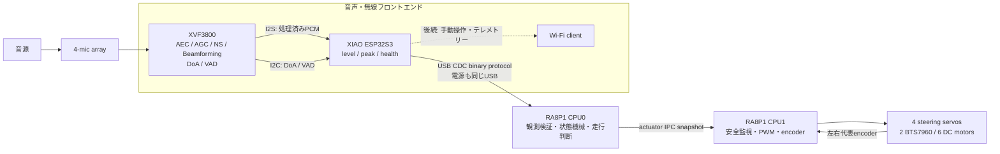
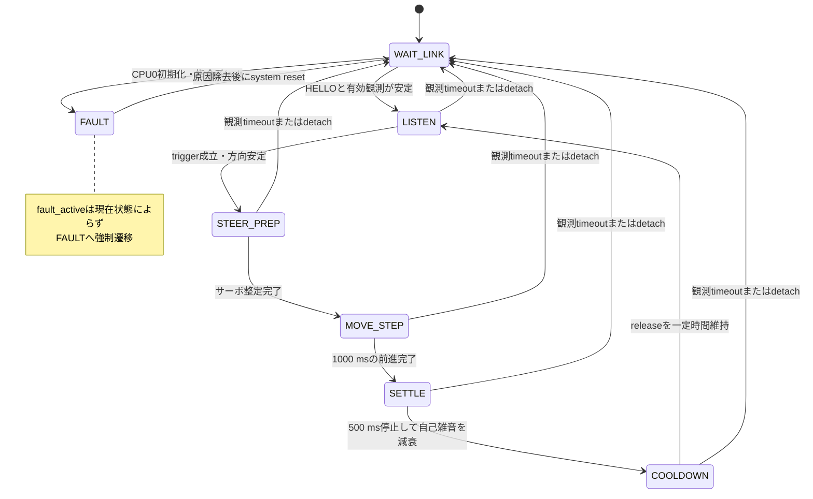

# ReSpeaker XVF3800・XIAO ESP32S3統合設計

最終更新: 2026-09-08 / 対象: 音源追従機能とEK-RA8P1間USB接続

## 1. 結論

`reSpeaker XVF3800 USB 4-Mic Array with XIAO ESP32S3`は、EK-RA8P1と1系統のUSB接続だけで通信と給電を共用できる。実行時の接続先はXVF3800側のUSB-Cではなく、XIAO ESP32S3側のUSB-Cとする。

```text
EK-RA8P1 J7 / USB High Speed host
  └─ USB-Cオス－USB-Aメス ホストアダプター
       └─ USB-A－USB-C データケーブル
            └─ XIAO ESP32S3側 USB-C（USB CDC device）
                 ├─ I2C: XVF3800のDoA/VAD・状態
                 ├─ I2S: XVF3800の処理済み音声
                 └─ Wi-Fi: 手動操作・テレメトリー・将来の音響データ送信
```

ここで「USB 1系統」とは、XIAO ESP32S3とEK-RA8P1の間に独立した給電線やUART線を追加しないという意味である。EK-RA8P1のマニュアルがJ7のhost接続に指定するホストアダプターとデータケーブルは必要になる。USB-C同士の直結はJ7のhost roleが確実になると検証できるまでは採用しない。

XVF3800はI2S firmwareで動作させる。このモードではXVF3800自体はUSB deviceとして列挙されず、XIAO ESP32S3がI2S/I2CでXVF3800と連携する。XVF3800側USB-C（3.5 mmジャックに近い側）は、XVF3800 firmwareの書き換えやsafe mode/DFU時だけPCへ接続し、ローバ実行時には接続しない。

## 2. 4プロセッサの責務

CPU0、XVF3800、ESP32S3を「耳を含む頭部」、CPU1を「手足へつながる神経・反射系」とみなすイメージは妥当である。ただし設計上は、認識と通信を前処理、意味判断をCPU0、安全を伴う実時間出力をCPU1へ分離する。

| 要素 | 層 | 所有する責務 | 所有しない責務 |
|---|---|---|---|
| XVF3800 | 音響信号処理 | 4マイク入力、AEC、AGC、ノイズ抑制、ビームフォーミング、DoA、VAD、処理済み音声 | 走行判断、USB CDC、Wi-Fi、モーター制御 |
| XIAO ESP32S3 | 音声・無線フロントエンド | XVF3800のI2S/I2C取得、dBFSレベル算出、観測パケット生成、USB CDC device、frontend health、将来のWi-Fi通信 | 最終的な進行方向判断、安全停止の最終責任、PWM生成 |
| RA8P1 CPU0 / Cortex-M85 | 判断・統合 | USB host、観測検証、DoA座標変換、音源追従状態機械、走行目標生成、CPU1へのIPC、上位fault管理 | 音響DSP、PWM/encoder割り込み処理 |
| RA8P1 CPU1 / Cortex-M33 | 実時間アクチュエータ | IPC指令検証、4サーボ、左右DCモーター、encoder、安全制限、指令timeout、safe stop | USB/Wi-Fi、音源判断、探索戦略 |

この分割により、Wi-Fiの再接続や音響処理の負荷がCPU1の1 msアクチュエータタスクへ入り込まない。また、ESP32S3が誤った方向を送っても、CPU0が値・時刻・連続性を検証し、CPU1が最終的な角度・出力・timeoutを制限する。ネットワークからCPU1へ直接PWMを指示する経路は作らない。



現行実装の制御経路は`XVF3800 → ESP32S3 → USB CDC → CPU0 → IPC → CPU1`である。診断経路はCPU0が同じCDCのBulk OUTで診断snapshotをESP32S3へ返し、ESP32S3がWi-Fi UDP JSON LinesとしてPCへ送信する。Wi-Fiの再接続やUDP送信は低優先度の独立taskで行い、音響観測とCPU1の実時間制御へ直接入れない。

音源識別の学習・推論品質を調べるときだけは、J11のUSB Full-SpeedをCPU0のCDC **device**として使い、PC上の[`Acoustic AI Lab`](../../software/acoustic-ai-lab/README.md)へ直結する。この経路は既存のUDP/Rover Monitorを代替しない。J7/IP1の音響入力を変更せず、`task_acoustic_link`がUSBイベントqueueを一元的にpollし、IP0/J11イベントだけを低優先度の診断serviceへ振り分ける。AI Labから許可する操作は学習開始・保存・取消・保存済み見本の読出しだけであり、走行指令は受け付けない。

主な実装位置は次のとおりである。

- 共有protocol: [`acoustic_protocol.h`](../../firmware/common/acoustic_protocol.h)、[`acoustic_protocol.c`](../../firmware/common/acoustic_protocol.c)
- ESP32S3 frontend: [`acoustic_frontend.c`](../../firmware/esp32s3/src/acoustic_frontend.c)、[`xvf3800_control.c`](../../firmware/esp32s3/src/xvf3800_control.c)、[`audio_capture.c`](../../firmware/esp32s3/src/audio_capture.c)、[`usb_link.c`](../../firmware/esp32s3/src/usb_link.c)、[`wifi_telemetry.c`](../../firmware/esp32s3/src/wifi_telemetry.c)
- CPU0 USB CDCリンク: [`task_acoustic_link.c`](../../firmware/ra8p1/SoundExplorationRover_CPU0/src/tasks/task_acoustic_link.c)
- CPU0 J11 AI Lab link: [`acoustic_ai_lab_link.c`](../../firmware/ra8p1/SoundExplorationRover_CPU0/src/services/acoustic_ai_lab_link.c)
- CPU0判断: [`task_think.c`](../../firmware/ra8p1/SoundExplorationRover_CPU0/src/tasks/task_think.c)
- CPU0→CPU1指令: [`task_command.c`](../../firmware/ra8p1/SoundExplorationRover_CPU0/src/tasks/task_command.c)

## 3. ReSpeaker内部インターフェース

SeeedのI2S/DoAサンプルを基準に、XIAO ESP32S3とXVF3800の内部接続を次のように扱う。

| 機能 | XIAO ESP32S3 | 設定 |
|---|---:|---|
| I2C SDA | GPIO5 | XVF3800制御・DoA/VAD取得 |
| I2C SCL | GPIO6 | XVF3800制御・DoA/VAD取得 |
| XVF3800 I2C address | - | 7 bit `0x2C` |
| I2S WS | GPIO7 | 16 kHz、stereo、32 bitの初期構成 |
| I2S BCLK | GPIO8 | XIAOをI2S masterとする初期構成 |
| I2S RX | GPIO43 | XVF3800からXIAOへの処理済み音声 |
| I2S TX | GPIO44 | XIAOからXVF3800への音声経路。初期の音源追従では未使用 |

DoA/VADはXVF3800が内部計算した結果をI2C resource commandで取得する。現行frontendはGPO servicer（resource ID 20）のDoA command 18をread command `(18 | 0x80)`として読み、5 byte応答を先頭のraw status、DoAのlittle-endian `uint16_t`、speech検出値のlittle-endian `uint16_t`として扱う。搭載XVF firmwareでこの応答がstatus `65`となる場合は、Audio Manager resource（ID 35）の`SELECTED_AZIMUTHS`に含まれるprocessed DoAを代替値として優先し、値が無効な場合だけAEC resource（ID 33）の`AZIMUTH_VALUES`のauto-selected beamへ退避する。この代替値は`doa_fallback:1`としてUDPに明示する。公式例がraw statusの成功値やbit意味を定義していないため、その値を推測して走行許可に使わず、I2C transactionの成否と有効DoAの取得実績から`STARTING/READY/ERROR`へ正規化する。

音響レベルとpeakはI2S PCMからXIAO ESP32S3が計算する。レベル値の単位は`dBFS x 100`であり、校正済みの音圧レベル`dB SPL`ではない。マイク感度、XVF3800のAGC、設置、反射、環境騒音で変わるため、固定値を物理音圧と解釈しない。

初期実装ではUSB CDCへraw PCMを常時送らない。RA8P1に必要な情報は、音の有無、方向、相対レベル、データ鮮度、frontend状態である。録音や解析用PCMはESP32S3のWi-Fi経路へ分離し、走行判断用CDCを大量データで詰まらせない。

## 4. EK-RA8P1 USB接続

### 4.1 物理接続

EK-RA8P1側はJ7をUSB High Speed hostとして使う。J7のhost modeではPD07をHighにするとU18からVBUSが供給される。現行Solutionの共有ピン設定では、P408を`USBHS_VBUS`、PD07を`USBHS_VBUSEN`としてCPU0側の共有`g_bsp_pin_cfg`へ生成する。

| 項目 | 設定 |
|---|---|
| EK-RA8P1 connector | J7 / USB High Speed |
| RA8P1 role | USB host |
| XIAO ESP32S3 role | USB CDC ACM device |
| FSP USB IP | USB IP1 / High Speed |
| FSP class | HCDC ACM |
| FSP model / basic instance | `g_hcdc0` / `g_basic0` |
| transfer / hub / multi CDC | DMAなし / hubなし / 無効 |
| callback / context | `NULL` / `NULL`。`task_acoustic_link`が`eventGet()`をpoll |
| USBHS IRQ priority | main、D0FIFO、D1FIFOとも12 |
| VBUS control | PD07 / `USBHS_VBUSEN`、host時High |
| VBUS sense | P408 / `USBHS_VBUS` |
| runtime接続先 | XIAO ESP32S3側USB-C |

J11のUSB Full SpeedはXIAOとの接続には使わない。音源識別品質の評価時だけ、J11をPC側hostへ接続するCDC deviceとして使う。CPU0ではUSB IP0 / Full Speed / PCDC ACM、P500をdevice用Low、USBFSのmain/resume/D0FIFO/D1FIFO IRQ priorityを12に設定する。J7/IP1のHCDC hostとJ11/IP0のPCDC deviceは別USB IPであり、CPU1へUSB moduleやpinを重複生成しない。物理ピンはSolutionを正として一元管理し、Generate Project Content後もCPU1の`pin_data.c`は0ピンを維持する。

FSPの`BSP_CFG_RTOS`は0のままHCDC ACM hostを使用し、FSPとは独立にμT-Kernelを起動する。`task_acoustic_link`はμT-Kernel task contextからUSB eventをpollし、USB callback/IRQ contextから`tk_loc_mtx()`などのtask APIを直接呼ばない。FSP 6.4で生成したUSB source、config、`hal_data`、`vector_data`はCPU0 projectへ反映し、CPU1とSolutionのpin ownershipは変更しない。

### 4.2 J11 AI Lab直結

| 項目 | 設定 |
|---|---|
| EK-RA8P1 connector | J11 / USB Full Speed |
| RA8P1 role | USB CDC ACM device |
| PC role | USB host、`software/acoustic-ai-lab`を実行 |
| FSP USB IP | USB IP0 / Full Speed |
| FSP class / instance | PCDC ACM / `g_acoustic_ai_lab_usb` |
| 送受信内容 | 推論snapshot、192次元特徴量要約、保存済み見本、学習操作 |
| 非対象 | Rover Monitor、UDP、走行・操舵・モーター操作 |

J11はPCとデータ通信可能なケーブルで直結する。J10のJ-Linkデバッグ端子を常用の診断通信へ流用しない。PCのUSB給電と既存のローバ給電が重なる場合は、実機の電源投入前に逆流しない電源構成を確認する。

### 4.3 電源条件

RenesasのマニュアルではJ7 host時のUSB High Speed portに供給可能な合計電流は2 Aである。ただし、これはEK-RA8P1へ入力する電源が基板本体とUSB deviceの両方を賄える場合の上限であり、XIAO ESP32S3、XVF3800、Wi-Fi動作へ常に十分であることを無条件には保証しない。

次の条件を満たすこと。

1. EK-RA8P1はマニュアル記載の対応入力経路から給電し、基板本体とJ7負荷の合計に余裕を持たせる。
2. 3S LiPoをJ7 VBUS、5 V端子、XIAOへ直接接続しない。必要なら適切な5 Vレギュレーターを介す。
3. XIAO ESP32S3/ReSpeakerはJ7からだけ給電し、同時に別のPCや外部5 Vから給電して逆流経路を作らない。
4. USBケーブルは充電専用ではなくデータ対応品を使う。
5. サーボとDCモーターは従来の独立した大電流電源を使う。モーター電源の突入・逆起電力をUSB 5 Vへ流さない。
6. Wi-Fi送信やモーター始動時にUSB detachやESP32S3 resetが起きる場合は、電源電圧、レギュレーター容量、配線、デカップリング、GND経路を先に調べる。

USB接続によりXIAOとEK-RA8P1の信号GNDは共通になる。モーター・サーボ系も制御基準のため共通GNDが必要だが、大電流の戻り線をUSBケーブルへ流さないスター配線を採用する。

## 5. USB CDC共有プロトコル

### 5.1 目的

CDC上では、人が読むログと制御用バイナリを混在させない。フレーム境界、version、length、sequence、CRCを持つバイナリプロトコルにより、途中接続、byte落ち、再起動、旧firmwareの組み合わせを検出する。複数byte値はlittle-endianで明示的にserializeし、C構造体のpaddingをそのまま送らない。

```text
offset  size  field
0       2     magic = 0x53, 0x52  ('S', 'R')
2       1     protocol version
3       1     message type
4       2     payload length [byte], little-endian
6       4     sequence, little-endian
10      4     ESP32S3 uptime_ms, little-endian
14      N     payload
14+N    2     CRC-16/CCITT-FALSE, little-endian
```

CRCの多項式は`0x1021`、初期値は`0xFFFF`、refin/refoutはfalse、xoroutは`0x0000`とし、magicを除く`version`からpayload末尾までを対象にする。

| type | message | 方向 | 実装状態・用途 |
|---:|---|---|---|
| `0x01` | `HELLO` | ESP32S3 → CPU0 | 実装済み。USB mount時と1 s周期でversion/capability/boot IDを通知 |
| `0x02` | `ACOUSTIC_OBSERVATION` | ESP32S3 → CPU0 | 実装済み。50 msごとのDoA、VAD、level、peak、状態、audio frame count |
| `0x03` | `HEALTH` | ESP32S3 → CPU0 | 実装済み。1 sごとのI2C/I2S/USB/Wi-Fi状態とerror count |
| `0x10` | `SET_CONFIG` | CPU0 → ESP32S3 | type予約。初期実装では未使用 |
| `0x11` | `ACK` | 双方向 | type予約。初期実装では未使用 |
| `0x20` | `ROVER_TELEMETRY` | CPU0 → ESP32S3 | 実装済み。250 ms周期の音響・思考・指令診断snapshot |
| `0x30` | `AI_LAB_SNAPSHOT` | CPU0 → PC / J11、CPU0 → ESP32S3 / J7 | 学習・推論固定小数点snapshot。schema v2の一致保持欄はbaseline制御では`UNKNOWN`、経過時間は無効値 |
| `0x31` | `AI_LAB_SUMMARY_CHUNK` | CPU0 → PC / J11、CPU0 → ESP32S3 / J7 | 特徴量generationごとの192次元要約を3 chunkで送信。J7はsnapshotと要約を有限queueで扱う |
| `0x32` | `AI_LAB_COMMAND` | PC → CPU0 / J11 | 実装済み。学習開始・保存・取消・profile読出しのみ |
| `0x33` | `AI_LAB_COMMAND_RESULT` | CPU0 → PC / J11 | 実装済み。操作の受付結果と学習見本数 |
| `0x34` | `AI_LAB_PROFILE_CHUNK` | CPU0 → PC / J11、CPU0 → ESP32S3 / J7 | MRAM保存済み見本を3 chunkずつ送信。J7 relayは起動時と再学習後に自動記録 |
| `0x7F` | `LOG` | ESP32S3 → CPU0 | type予約。制御用CDCへ通常ログは送らない |

`MANUAL_DRIVE`はまだ割り当てない。手動操作を追加する場合も、ESP32S3からCPU1へ直接送らずCPU0の権限、sequence、timeout、安全状態を通す。

`HELLO` payloadは12 byteである。

| field | 型 | 意味 |
|---|---|---|
| `firmware_major` / `firmware_minor` / `firmware_patch` | `uint8_t` x 3 | ESP32S3 frontend firmware version |
| `reserved` | `uint8_t` | 0固定 |
| `capabilities` | `uint32_t` | bit 0 DoA、bit 1 VAD、bit 2 level、bit 3 Wi-Fi |
| `boot_id` | `uint32_t` | frontend再起動を識別する起動ごとのID |

frontend firmwareはDoA、VAD、level、Wi-Fi telemetry capabilityを通知する。実際の接続状態は`HEALTH.wifi_connected`で別に通知する。

`ACOUSTIC_OBSERVATION`の基本payloadは次の意味を持つ。

| field | 型 | 意味 |
|---|---|---|
| `doa_deg` | `uint16_t` | XVF3800由来の0～359度。無効時は`0xFFFF` |
| `level_dbfs_x100` | `int16_t` | 短時間音響レベル。`-3525`は-35.25 dBFS |
| `peak_dbfs_x100` | `int16_t` | 同じ観測区間のpeak dBFS |
| `vad` | `uint8_t` | XVF3800がspeechを検出したとき1 |
| `xvf_status` | `uint8_t` | frontendで正規化したXVF状態。0 starting、1 ready、2 error |
| `audio_flags` | `uint8_t` | I2S overrun、I2C error、mute、I2S staleのbit flags |
| `xvf_raw_status` | `uint8_t` | XVF3800のDoA/VAD resource応答に含まれる生status byte。診断専用 |
| `audio_frame_count` | `uint32_t` | I2S処理量の単調増加カウンター |

`audio_flags`のbit 0は現在の観測区間でのI2S overrun、bit 1は現在のI2C error、bit 2はmute、bit 3はI2S stale、bit 4はAEC DoA fallbackの使用を表す。I2S captureが未成立または100 msを超えて更新されない場合はstaleを立て、level/peakを`INT16_MIN`にする。overrun/error/staleは次の正常観測で解除でき、累積数は`HEALTH`で別に通知する。初期frontendにはmute入力がないためbit 2は立てないが、protocol上は将来のmute制御用に予約する。`xvf_status`はXVF3800のopaqueなI2C応答byteではなく、frontendが`STARTING=0`、`READY=1`、`ERROR=2`へ正規化した状態である。初回の有効DoA取得前はstarting、I2C成功かつ有効DoAを一度取得した後はready、I2C失敗時はerrorとし、次の成功時に復帰する。`xvf_raw_status`はDoA固定やVAD不動を切り分けるために転送するが、意味を推測して安全判断には使わない。

DoAのresource commandは公式host-control定義に従い`GPO_SERVICER`のcommand 18を使う。command 19は`LED_RING_COLOR`であり、DoAとして解釈しない。I2S firmwareがcommand 18へnonzero statusを返す場合は、`AUDIO_MGR_SELECTED_AZIMUTHS`の先頭であるprocessed DoAを車体制御用DoAへ使う。これはspeech energyで固定beamのDoAを選択した値である。値がNaNなどで無効な場合だけ、`AEC_AZIMUTH_VALUES`の4番目であるauto-selected beamへ退避し、`AEC_SPENERGY_VALUES`の同beamから診断用VAD相当値を作る。この場合は`audio_flags` bit 4とUDPの`audio.doa_fallback=1`を立て、元のcommand 18 statusを`xvf_raw_status`へ残す。

`HEALTH` payloadも12 byteである。

| field | 型 | 意味 |
|---|---|---|
| `xvf_status` | `uint8_t` | 最新のfrontend正規化XVF状態 |
| `audio_flags` | `uint8_t` | observationと同じerror/mute flags |
| `usb_connected` | `uint8_t` | CDC mounted時1 |
| `wifi_connected` | `uint8_t` | Wi-Fi stationがIPアドレス取得済みなら1 |
| `i2c_error_count` | `uint32_t` | 起動後のI2C取得error累積数 |
| `i2s_overrun_count` | `uint32_t` | 起動後のI2S overrun累積数 |

CPU0 parserは次を満たさないframeを走行判断へ渡さない。

- magic、対応version、message type、payload length、CRCが正しい。
- 走行判断へcommitする`doa_deg`が0～359であり、無効値を古いDoAの更新として扱わない。
- sequenceが単調に進む。ESP32S3の`boot_id`変更は新しい起動としてsequence判定を初期化し、再起動前のobservation/healthを即座に無効化して新しい観測を待つ。`uptime_ms`は診断情報として保持する。
- 最新の有効な`ACOUSTIC_OBSERVATION`から600 ms以内で、`task_think`側でも観測専用sequenceが600 ms未満に更新されている。
- byte列が壊れたときはmagicを再探索し、壊れたpayloadを部分利用しない。

### 5.2 CPU0診断返送

基本の`ROVER_TELEMETRY`は従来互換の64 byte payloadを維持し、CPU0が判断・送信した状態を返す。内容はUSB/HELLO/観測の有効状態、DoA・level・peak・VAD・XVF/audio flags、観測sequenceとage、`task_think`状態・link判定・fault・操舵角、左右目標RPM、FR/FL/RR/RL角度、enable/非常停止、指令age/sequence/IPC結果である。

CPU1から返された実出力は、24 byteの`ACTUATOR_TELEMETRY`追加フレームで送る。内容はCPU1状態のvalid/age/fault/sequence、適用済み指令sequence、左右実デューティ、左右encoder RPM×10である。旧ESP32S3 firmwareは未知の追加フレームだけを無視して基本診断を継続でき、新ESP32S3 firmwareは両フレームを統合してschema 2のUDP JSONを生成する。CPU0の送信はいずれも非同期Bulk OUTとし、Bulk INの音響受信を停止して完了待ちしない。

### 5.3 Wi-Fi UDP診断

接続情報は[`app_config.h`](../../firmware/esp32s3/src/app_config.h)の次のmacroへ設定する。`APP_UDP_DESTINATION_IPV4`はXIAOのIPではなく、UDPを待ち受けるPCの無線LAN側IPv4アドレスである。実際のSSID/passwordをGitへcommitしないこと。

```c
#define APP_WIFI_SSID                        "your-ssid"
#define APP_WIFI_PASSWORD                    "your-password"
#define APP_UDP_DESTINATION_IPV4             "192.168.1.100"
#define APP_UDP_DESTINATION_PORT             (5005U)
```

空文字のままではWi-Fi taskを開始せず、従来のUSB音響機能だけを継続する。設定後にESP32S3 firmwareをbuild/uploadし、PCとXIAOを同じLANへ接続する。Windows Defender Firewallで受信を求められた場合は、使用中のprivate networkに限ってUDP 5005を許可する。

PCでは先に待受を開始する。Nmap付属Ncatなら次を使う。

```powershell
ncat -u -l 5005
```

OpenBSD系netcatなら次を使う。

```powershell
nc -u -l 5005
```

WSL2の既定NATモードで`nc`を実行しても、PCの無線LAN側IPv4へ届いたUDPはWSLへ自動転送されない。まずWindows側で直接待ち受ける。WSL上で受信する場合は、WSLをmirrored networkingに変更し、Windows Defender FirewallとHyper-V firewallで使用中のprivate networkからUDP 5005を許可する。

250 msごとに1行1 JSONを送る。`cpu_valid:false`ならESP32S3のWi-Fi/UDPは動作しているがCPU0から診断frameが戻っていない。`cpu_valid:true`なら`audio`、`think`、`command`を順に見る。特に音源方向固定は`audio.doa_deg`・`audio.xvf_raw_status`・`audio.doa_fallback`、反応抜けは`audio.level_dbfs_x100`・`vad`・`think.link_ready`・`think.new_observation`・`think.state`で切り分ける。`cpu_age_ms`が増え続ける場合は古いCPU0 snapshotを再送しているため、USB Bulk OUTまたはCPU0停止を疑う。

鳴子追従の走行診断は通常の250 ms状態JSONと別datagramで送り、Rover MonitorのJSONLにだけ保存する。`record_type=acoustic_diagnostic`はgeneration別の192次元要約と推論結果・距離を、`record_type=acoustic_sample`は保存見本を表す。baseline制御では`match_state=UNKNOWN`、`reason=baseline_policy`と記録する。J7送信は通常状態・CPU1状態・ナビ診断を優先し、診断混雑時は有限queueから破棄して欠落数を後続イベントへ載せる。PCM連続送信は行わない。

現場学習で5件目を収集した際、互いに近い4件から明確に孤立する見本が1件あればその見本を捨て、`learning_samples`を4へ戻して次の特徴量を待つ。旧MRAMの同様の孤立見本は照合から除外するが、保存データ自体は書き換えない。見本を置き換えるには新しいファームウェアで学習し直す。見本の数値形式とMRAMレイアウトは変更しない。

審査員向けのSW1は2秒長押しで学習開始、収集完了後の2秒長押しで保存する。5件未満で再度長押しすると取消になる。学習開始時にMRAMのA/B両スロットとRAM上の旧見本を初期化するため、取消後は旧見本へ戻らない。緑LEDは未学習時消灯、収集中はゆっくり点滅、5件収集済みは速く点滅、保存済みは点灯、MRAMエラーは短い2回点滅とする。青LEDは走行状態とCPU0異常を表示する。MRAM初期化が失敗した場合は収集へ進まない。

## 6. 音源追従状態機械

モーター音をマイクが拾うため、連続走行しながら追尾しない。「停止して聴く → 短く動く → 停止して再観測」を繰り返す。障害物センサーがない現段階では、短い移動であっても管理された試験領域専用である。



| 状態 | 出力 | 遷移判断 |
|---|---|---|
| `WAIT_LINK` | emergency stop、PWM停止 | USB列挙、`HELLO`、観測の連続受信を待つ |
| `LISTEN` | motor停止、servo直進 | VADとlevelで音イベントを開始し、DoA更新待ち後の方向安定性を評価 |
| `STEER_PREP` | motor停止、4輪を目標操舵角へ | サーボ整定時間を確保し、急な同時始動を避ける |
| `MOVE_STEP` | 全方位で前進、側方・後方は操舵角を付ける | 側方は内輪を減速して1000 msだけ回頭・移動する |
| `SETTLE` | motor停止、servo直進 | 500 ms待ってモーター音と車体振動を減らす |
| `COOLDOWN` | motor停止、servo直進 | release以下を200 ms確認してから次の独立した音源イベントを受け付ける |
| `FAULT` | emergency stop | CPU0のtask/IPC/USB初期化/目標共有errorをラッチ表示 |

初期値は次のとおりである。実環境の無音時と目的音を記録してから調整する。

| 設定 | 初期値 | 意味 |
|---|---:|---|
| trigger level | -45.00 dBFS | この値以上を反応候補とする |
| release level | -48.00 dBFS | triggerより3 dB低いhysteresis |
| VAD | イベント開始時に必須 | 取得開始後は連続VADを要求しない |
| DoA update wait | 500 ms | イベント開始前から保持されたselected azimuthを捨て、XVF3800の更新を待つ |
| DoA stability | 5 sample、相互差20度以内 | 瞬間的な方向変動を除外 |
| DoA acquisition timeout | 2000 ms | 安定した5 sampleが得られなければイベントを破棄 |
| link stable | 500 ms | 列挙直後の走行開始を禁止 |
| observation timeout | 600 ms | 超過時は即座に走行目標を停止へ更新 |
| motor command | +120 RPM | 全方位で前進。現在は左右別の固定デューティ比で駆動 |
| inner-wheel command | +90 RPM相当 | 操舵時の内輪を減速し、回頭量を増やす |
| steering | 20～45度 | 正面範囲外の方向を符号付きで制限 |
| move step | 1000 ms | 1回の短距離前進 |
| settle | 500 ms | 停止後にモーター音と車体振動を減らす時間 |
| front tolerance | ±15度 | 直進とみなす車体相対角 |
| cooldown release | 200 ms | -48 dBFS以下のrelease条件を維持して次の音源イベントを再arm |

1回のloudかつVAD有効な観測で音イベントを開始する。開始直後の500 msはDoAを採用せず、その後の最新5 sampleが相互差20度以内になった時点でDoAと操舵角を固定する。短い拍手ではVADが先に0へ戻るため、取得開始後はVADの継続を要求しない。開始から2000 ms以内に安定しなければイベントを破棄する。servo整定と1000 msの1 stepを完了した後は必ず`COOLDOWN`へ入り、走行後に混ざるモーター音・反射音のDoAを次の移動指令として使わない。

DoAは車体正面を0度、右を正、左を負として変換する。2026-09-24の四方向実測に基づき、前方は`CPU0_SOUND_DOA_CLOCKWISE_POSITIVE=0`で符号反転し、後方は`CPU0_SOUND_DOA_REAR_LR_SWAP=1`で左右対応を入れ替える。前方は最大45度の操舵で追従し、後方はX字操舵・左右逆回転で向き直る。真後ろ±180度近辺だけは左右の旋回経路がほぼ等価なので、左右ToFに十分な差がある場合は空き側を選ぶ。`CPU0_SOUND_DOA_ZERO_OFFSET_DEG=0`、正のサーボ指令は物理的な左操舵のため`CPU0_STEERING_SERVO_OUTPUT_SIGN=-1`でサーボ出力だけを反転している。

USB detach、観測timeout、CRC/version異常、XVF3800 I2C error、mute、I2S staleでは新しい移動を開始しない。CRC/version/format異常frameは破棄し、正常観測が600 ms途絶えると`WAIT_LINK`へ戻す。bit 0のI2S overrunは当該観測区間の一時的な欠落を示す診断値であり、単発ではlinkを切らない。移動中にtimeoutへ到達した場合もCPU0は停止目標をIPC送信する。さらにCPU0自体が停止してIPCが途絶えた場合は、CPU1の既存ローカルtimeoutがsafe stopを行う。

## 7. DoA座標の校正

XVF3800のraw角度と、車体の前・左・右は機械的な取付方向で変わる。rawの0度方向や増加方向を決め打ちせず、車体座標を次のように統一する。

```text
車体前方 =   0 deg
車体左側 =  -90 deg
車体後方 = ±180 deg
車体右側 =  +90 deg
```

変換は概念的に次式とする。

```text
vehicle_doa_deg = wrap_to_minus180_plus179(
    raw_doa_deg - doa_zero_offset_deg)

if raw DoA is not clockwise-positive:
    vehicle_doa_deg = wrap_to_minus180_plus179(-vehicle_doa_deg)
```

この選択を`CPU0_SOUND_DOA_CLOCKWISE_POSITIVE`へ設定する。359度と1度を通常の算術平均で平均すると180度になるため、安定性判定と平均には円周角の差分を使う。

校正手順:

1. ReSpeakerを最終取付姿勢で固定し、マイク開口を筐体や配線で塞がない。取付方向の基準印を車体に記録する。
2. 車輪を浮かせ、motor出力を無効にし、静かな場所でUSB観測だけを起動する。
3. 車体正面の一定距離から声または一定の試験音を出し、VAD有効かつlevelが十分なraw DoAを20～50 sample記録する。
4. 正面sampleの円周平均を`CPU0_SOUND_DOA_ZERO_OFFSET_DEG`へ設定する。
5. 車体右側から同じ音を出す。変換後が正にならなければ`CPU0_SOUND_DOA_CLOCKWISE_POSITIVE`を反転する。左側は負になることも確認する。
6. 正面、左90度、右90度、後方で確認し、平均誤差とばらつきを記録する。
7. motor停止時、servo保持時、motor回転後のsettle中を比較し、500 msで自己雑音が十分下がるか確認する。Wi-Fi実装後は、送信中も同じ測定を追加する。
8. 校正値をCPU0設定へ固定し、ReSpeakerの取付角を変えた場合だけ再校正する。

### 7.1 オドメトリ世界座標系と車体相対座標系の変換

オドメトリ世界座標系（`odometry.c`）と車体相対座標系（DoA・操舵角・音源方位）では、角度の回転極性が異なる点に注意する。

- **オドメトリ世界座標系**: 初期進行方向を $+X$、左方を $+Y$ とし、反時計回り（CCW: 左旋回）を正とする極座標系（$\theta = 0$ が $+X$、$\theta = +\pi/2$ が $+Y$）。
- **車体相対座標系**: 車体正面を $0^\circ$、**右方を正（CW）**、**左方を負（CCW）** とする。

このため、音源位置推定器（`sound_source_localizer.c`）における座標変換は以下の関係を満たす。

1. **車体相対DoAから世界座標観測線（bearing ray）への変換**:
   車体姿勢角 $\theta_{\text{rover}}$（CCW正）に対して、右方にある音源（$\text{relative\_doa} > 0$）は時計回りに回転するため、世界方位角 $\phi_{\text{world}}$ は引算となる。
   $$\phi_{\text{world}} = \theta_{\text{rover}} - \text{relative\_doa}$$
2. **推定音源位置 $(x_s, y_s)$ から車体相対音源方位（`source_bearing_deg`）への変換**:
   車体位置 $(x_r, y_r)$ から音源への世界ベクトル方位 $\text{atan2}(y_s - y_r, x_s - x_r)$（CCW正）から、車体正面からの時計回り角度（右正）を算出する。
   $$\text{source\_bearing} = \theta_{\text{rover}} - \text{atan2}(y_s - y_r, x_s - x_r)$$
3. **Rover Monitor（`index.html`）での表示**:
   - レーダー表示の `drawArrow(sourceBearing)` は右正（$0^\circ$ が上、$+90^\circ$ が右、$-90^\circ$ が左）として直接描画される。
   - 地図表示（`trajectoryCanvas`）では、世界座標系 $+X$（前）を地図上方向（$+Y_{\text{map}}$）、$+Y$（左）を地図左方向（$-X_{\text{map}}$、すなわち $X_{\text{map}} = -y$）として投影される。

VADは音声活動検出であり、任意の衝撃音、機械音、警報音を必ず検出する保証はない。さらに、現在使用しているXVF3800 I2S firmwareでは公式GPO ServicerのDoA取得がstatus `0x41`で失敗するため、ESP32S3はselected azimuthへfallbackしている。この値は新しい音へ切り替わるまで直前の方向を保持し、fallback時のVADもAEC speech energyから生成した近似値である。そこで現行制御はVADをイベント開始条件にだけ使い、開始後500 msは保持値を捨て、その後の最新5 sampleで方向を確定する。目的音とモーター自己雑音の実測値を採り、trigger/release閾値、更新待ち時間、安定幅は実機ごとに調整する。

## 8. 安全な導入・検証順

### 8.1 firmwareとビルド

1. サーボ電源とmotor電源を外す。
2. 必要な場合だけXVF3800側USB-CをPCへ接続し、Seeedが案内するI2S firmwareへ更新する。更新後はPCを外す。
3. XIAO ESP32S3側USB-CをPCへ接続し、ESP32S3 firmwareを書き込む。
4. CPU0のFSPにUSB HCDC host / High Speed / IP1を設定する。USB moduleとピンをCPU1へ追加しない。
5. SolutionのJ7関連ピンを確認し、CPU0/CPU1 projectをRefreshしてから、CPU0、CPU1の順にGenerate Project Contentを実行する。
6. CPU0/CPU1をClean/Buildし、同じbuild世代の2個のELFをmulticore launch groupで書き込む。

CPU0/CPU1のビルドではprojectをRefreshし、CPU0、CPU1の順にGenerate Project Contentを実行してから両プロジェクトをClean/Buildする。同じビルド世代のELFをmulticore launch groupで書き込む。ESP-IDF projectの設定・build・flash手順は[`firmware/esp32s3/README.md`](../../firmware/esp32s3/README.md)を参照する。

### 8.2 USBだけの試験

1. motor・servo電源を切ったまま、J7からXIAO ESP32S3側USB-Cへ接続する。
2. J7 VBUS、XIAO起動、USB enumerationを確認する。
3. CPU0でCDC初期化が`SET_LINE_CODING → SET_CONTROL_LINE_STATE → GET_LINE_CODING → READY`と進み、`HELLO`受信、protocol version、sequence、CRC error countを確認する。
4. 50 ms周期の`ACOUSTIC_OBSERVATION`と1 s周期の`HEALTH`が継続し、`g_task_think_observation_sequence`が更新されるたびに`g_task_think_observation_watchdog_ms`が0へ戻ることを確認する。
5. USBを抜くか観測更新を止め、独立watchdogが600 msへ達するまでにCPU0の状態が`WAIT_LINK`へ戻り、停止目標になることを確認する。

### 8.3 静止音響試験

1. motor・servo電源を切ったまま、無音時のlevel/peak、DoA valid率、VADを30秒以上記録する。
2. 正面、左、右、後方から試験音を出し、DoA座標を校正する。
3. trigger付近の音量を上下させ、-45/-48 dBFSのhysteresisでchatteringしないことを確認する。
4. UDP待受を開始し、Wi-Fi接続・切断や送信中にもUSB観測sequenceが継続し、CRC errorや`usb.rx_drops`が増えないことを確認する。

### 8.4 アクチュエータ試験

1. 車輪を浮かせ、サーボリンクの干渉がない状態でservo電源だけを入れる。
2. 正面、左、右の音に対する4輪角度と、FR/FL/RR/RLの名称対応を確認する。
3. current limitを設定したmotor電源を入れ、各方向の音で`+120/+120 RPM`の前進、右・左音で内輪90 RPM相当の旋回になることを確認する。
4. `MOVE_STEP`中にUSBを抜き、停止することを確認する。
5. 車輪を接地する前に、USB/frontend timeout、CPU0 IPC timeout、CPU1 local timeoutの3段を個別に確認する。

### 8.5 接地試験

障害物のない限定区域で、物理的に電源を切れる担当者を配置して行う。最初は1回の音に対する1 stepだけとし、移動距離、回頭量、左右実測RPM、settle後の自己雑音を記録する。障害物・段差・人を認識するセンサーを統合するまでは、無人・屋外・見通し外で音源追従させない。

## 9. faultと観測点

| 観測 | 正常条件 | 異常時の扱い |
|---|---|---|
| USB mounted/configured | XIAOをHCDC deviceとして列挙 | motor停止、`WAIT_LINK` |
| protocol version | CPU0とESP32S3が一致 | frame破棄、走行禁止 |
| sequence | HELLO/観測/healthを含む送信frameごとに単調増加 | 重複・逆行を破棄してcountする。欠落は観測鮮度timeoutで検出 |
| observation freshness | 受信時刻と`task_think`のsequence watchdogがともに600 msの期限内 | motor停止、`WAIT_LINK` |
| CRC error | 通常0 | frame破棄。正常観測が600 ms途絶れれば`WAIT_LINK` |
| frontend XVF status | `READY` | starting/errorでは走行開始禁止 |
| audio flags | bit 1 I2C error、bit 2 mute、bit 3 I2S staleが0 | これらは走行開始禁止。bit 0の一時的overrunは記録し、累積値と頻度を点検 |
| I2S frame count | 継続増加 | 100 ms以上staleならlevel無効、走行開始禁止 |
| VAD/level/DoA | triggerと安定条件を満たす | `LISTEN`を継続 |
| CPU1 encoder | 左右とも前進正 | 方向誤り、停止、配線・符号を点検 |

USBの接続だけ、CDCの列挙、protocolの成立、音響観測の成立、走行許可を別々の状態として観測する。単にJ7から5 Vが出ていることを「通信正常」と扱わない。

Live Watchでは次の順序で確認する。

| 変数 | 正常値・変化 |
|---|---|
| `g_task_acoustic_link_usb_state` | 1 `WAIT_DEVICE` → 2 → 3 → 4 → 5 `READY` |
| `g_task_acoustic_link_usb_configured` | J7で列挙後に`true` |
| `g_task_acoustic_link_device_address` | 列挙後に1以上 |
| `g_task_acoustic_link_event_count` | USB eventごとに増加 |
| `g_task_acoustic_link_transfer_busy_count` | 通常は低頻度。増え続ける場合はcontrol/Bulk転送停滞 |
| `g_task_acoustic_link_hello_received` | 周期HELLO受信後に`true` |
| `g_task_acoustic_link_frame_count` | 約20 Hz以上で増加 |
| `g_task_acoustic_link_observation.level_dbfs_x100` | 音を大きくすると0に近づく |
| `g_task_acoustic_link_observation.doa_deg` | 有効時0～359 |
| `g_task_think_state` | `WAIT_LINK` → `LISTEN` → `STEER_PREP` → `MOVE_STEP` |

## 10. 参照資料

- Seeed Studio: [reSpeaker XVF3800 USB 4-Mic Array with XIAO ESP32S3 入門ガイド](https://wiki.seeedstudio.com/ja/respeaker_xvf3800_xiao_getting_started/)
- Seeed Studio: [XVF3800 with XIAO ESP32S3 DoA and VAD](https://wiki.seeedstudio.com/respeaker_xvf3800_xiao_doa_vad/)
- reSpeaker GitHub: [I2S firmwareで`DOA_VALUE`が0x41/0x42を返す問題とAEC fallback](https://github.com/respeaker/reSpeaker_XVF3800_USB_4MIC_ARRAY/issues/28)
- Seeed Studio: [XVF3800 with XIAO ESP32S3 UDP Audio Streaming](https://wiki.seeedstudio.com/respeaker_xvf3800_xiao_udp_audio_stream/)
- Seeed Studio: [XIAO ESP32S3 Getting Started](https://wiki.seeedstudio.com/xiao_esp32s3_getting_started/)
- Microsoft: [WSLを使用したネットワークアプリケーションへのアクセス](https://learn.microsoft.com/ja-jp/windows/wsl/networking)
- Renesas: [EK-RA8P1 v1 User's Manual](https://www.renesas.com/en/document/mat/ek-ra8p1-v1-users-manual)
- Renesas: [FSP USB `r_usb_basic` documentation](https://renesas.github.io/fsp/group___u_s_b.html)

RA8P1内部のタスク、IPC、アクチュエータ、ピン設定については[RA8P1ソフトウェア設計書](ARCHITECTURE.md)を参照する。
