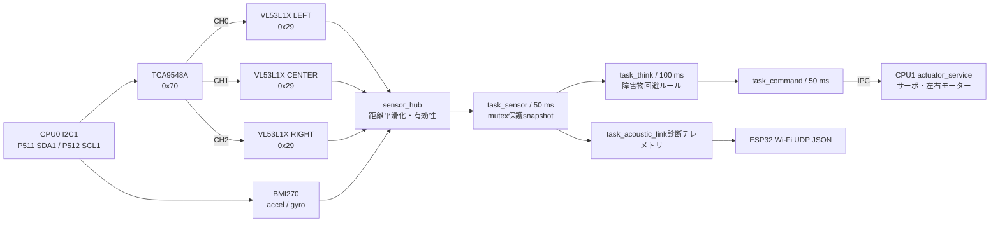

# I2Cセンサー・ルールベース走行

最終更新: 2026-09-14

EK-RA8P1 CPU0で、TCA9548A配下のVL53L1X 3台と、直接接続したBMI270を取得し、既存のCPU0→CPU1 IPC指令で安全側のルールベース走行を行うための設計・導入手順です。

## 1. 責務とデータの流れ



CPU0がI2C、状態管理、走行判断を担当します。CPU1の1 ms PWM・エンコーダ処理は変更せず、CPU0が既存のIPCスナップショットへ操舵角と左右RPMを入れて渡します。したがって、センサーI2Cが遅延・失敗してもCPU1の実時間アクチュエータ制御を直接ブロックしません。

## 2. 配線・給電・取付

### 2.1 EK-RA8P1側の接続先

このプロジェクトではArduinoヘッダからI2Cを、Pmod2からセンサー用の電源を取り出す。J18-4の+3.3 Vは左右代表エンコーダ、J18-6/J18-7のGNDはエンコーダとBTS7960で既に使うため、センサー共通ハーネスは次の4本とする。

| 用途 | EK-RA8P1コネクタ | MCUピン | 接続先 |
|---|---|---|---|
| センサー共通+3.3 V | Pmod2 J25-6 | +3.3 V電源 | TCA9548A、BMI270、VL53L1X×3のVCCへ分岐 |
| センサー共通GND | Pmod2 J25-5 | GND | 全センサーのGNDへ分岐 |
| I2C SDA | Arduino J24-9 | P511 (GPIO) | TCA9548Aの入力SDAとBMI270 SDAへ並列接続 |
| I2C SCL | Arduino J23-8 | P312 / D7 (GPIO) | TCA9548Aの入力SCLとBMI270 SCLへ並列接続（※J24-10破損回避） |

J25-6とJ25-5はJ18の+3.3 V/GNDと電気的には同じ電源ネットであり、別の電源レギュレータではない。センサーは低消費電力のため、ここからTCA9548A、BMI270、VL53L1X×3へ分岐してよい。ただしBTS7960のモーター電流の帰路をEK-RA8P1のGNDピン経由にせず、バッテリーとモータードライバ間で直接配線する。センサーGNDはBTS7960のGNDから数珠つなぎにせず、J25-5から独立して配線する。J18-5の+5 Vはこのセンサー回路へ使わない。I2C信号と各モジュールの電源は3.3 V系に統一し、ローバーのモーター電源とGNDだけを共通にする。
なお、J24-10 (P512) はハードウェア端子破損（内部173 Ω短絡）が確認されたため、SCLは健全な予備端子 **Arduino J23-8 (P312 / D7)** へ移設し、高信頼性GPIO I2Cドライバによって駆動している。

```text
J25-6 (+3.3 V) ----+--> TCA9548A VCC (およびRSTピン直結)
                   +--> BMI270 VCC
                   +--> VL53L1X LEFT / CENTER / RIGHT VCC

J25-5 (GND) -------+--> TCA9548A GND (およびA0/A1/A2), BMI270 GND, 全VL53L1X GND

J24-9  (SDA/P511)-+--> TCA9548A SDA
                   +--> BMI270 SDA
J23-8  (SCL/P312)-+--> TCA9548A SCL (※D7端子へ移設)
                   +--> BMI270 SCL

TCA CH0 SDA/SCL ------> VL53L1X LEFT  SDA/SCL
TCA CH1 SDA/SCL ------> VL53L1X CENTER SDA/SCL
TCA CH2 SDA/SCL ------> VL53L1X RIGHT SDA/SCL
```

Arduinoヘッダ、mikroBUS、Grove 1、QwiicはSW4-5がOFFのときP511/P512のI2Cバスを共有する。この構成ではArduino J24-9/J24-10だけをセンサー主バスへ使用し、他のI2Cコネクタへ同じセンサーを重複接続しない。[EK-RA8P1 User's Manual](https://www.renesas.com/en/document/mat/ek-ra8p1-v1-users-manual)のI2C/I3C切替とArduino端子表を正とする。

### 2.2 各モジュールの接続

| モジュール | モジュール側端子 | 接続先 | 設定・注意 |
|---|---|---|---|
| TCA9548A | VCC / GND | J25-6 / J25-5 | 3.3 Vで給電する |
| TCA9548A | SDA / SCL | J24-9 / J24-10 | CPU0の`g_i2c_sensor`主バス |
| TCA9548A | A0 / A1 / A2 | GND | addressを`0x70`にする |
| TCA9548A | RESET / RST（搭載時） | +3.3 V | Lowのままにしない |
| VL53L1X LEFT | VCC / GND | センサー共通+3.3 V / GND | 光学窓を正面へ向ける |
| VL53L1X LEFT | SDA / SCL | TCA9548A CH0のSDA / SCL | addressは既定の`0x29`のまま |
| VL53L1X CENTER | VCC / GND | センサー共通+3.3 V / GND | 光学窓を車体正面へ向ける |
| VL53L1X CENTER | SDA / SCL | TCA9548A CH1のSDA / SCL | addressは既定の`0x29`のまま |
| VL53L1X RIGHT | VCC / GND | センサー共通+3.3 V / GND | 光学窓を正面へ向ける |
| VL53L1X RIGHT | SDA / SCL | TCA9548A CH2のSDA / SCL | addressは既定の`0x29`のまま |
| BMI270 | VCC / GND | センサー共通+3.3 V / GND | 3.3 V対応のI2Cモードで使用する |
| BMI270 | SDA / SCL | J24-9 / J24-10 | TCAを通さず主バスへ直結する |
| BMI270 | CS / CSB（露出時） | +3.3 V | I2Cモードを選択する。モジュールの回路が既定設定なら接続不要 |
| BMI270 | SDO / ADR（露出時） | GNDまたは+3.3 V | `0x68`または`0x69`。ソフトウェアは両方を探索する |

VL53L1XのINT/GPIOとXSHUT、BMI270のINT1/INT2は現行ソフトで使わないため、モジュールが通常起動する既定状態のままにする。3台のVL53L1XのSDA/SCLをTCAの手前へ直接並列接続してはいけない。同じ`0x29`を持つため、必ずCH0/CH1/CH2へ1台ずつ接続する。

I2C信号は3.3 V系である。モジュールのプルアップ抵抗を重ねすぎると立上り・Low電流が悪化するため、複数モジュールのプルアップ実装を確認し、必要なら主バス側のプルアップを1組だけ残す。5 Vへ直接プルアップしない。モジュールにVIN端子しかない場合も、I2Cの論理レベルが3.3 Vで使えることをモジュールの回路図で確認する。

### 2.3 車体への取付

実機確認（2026-09-15）では、LEFT / CENTER / RIGHTは**3台ともほぼ正面**を向く。
中央ToFを原点に、LEFT=(-90, +94) mm、RIGHT=(+90, +94) mmに配置する（右が+x、前が+y）。
左右ToFは前方の左右位置を見るセンサーであり、側方通路の空きや車体側面の距離を直接測らない。
従来の±45°という説明を訂正し、`rover-monitor`も平行な光軸と各センサー位置で描画する。
光学窓の前にタイヤ、サスペンション、配線、ねじ頭が入らない位置へ固定する。

BMI270は車体の重心に近い剛性の高い平面へ固定する。静止時にZ軸が概ね+1000 mgまたは-1000 mg、X/Yが概ね0となる向きにする。現行の安全判定はX/Yの重力成分を傾きとして扱うため、別の向きで搭載した場合は軸変換を追加してから走行モードを有効にする。

I2CハーネスはSDA/SCLそれぞれをGNDと近接させ、モーターPWM・モーター電源線から離して配線する。通信エラーが出る場合は、まず配線とプルアップ抵抗を見直し、それでも改善しなければI2Cの400 kbit/s設定を下げて再確認する。

## 3. FSP設定と生成

SoundExplorationRover_CPU0/configuration.xmlには次のFSPスタック定義を追加済みです。

| 項目 | 値 |
|---|---|
| Stack | Connectivity > g_i2c_sensor I2C Master (r_iic_master) |
| Channel | 1 |
| Rate | Fast-mode / 400 kbit/s |
| Default slave address | 0x70 |
| Address mode | 7-bit |
| DTC | 無効 |
| IRQ priority | 12 |
| Callback | NULL（実行時にsensor_i2c_callbackを登録） |

P511/P512は既にSolutionとCPU0のPin ConfigurationでIIC1として選択されています。CPU1のpin設定を追加・変更しません。

1. e² studioでSoundExplorationRover_CPU0/configuration.xmlを開く。
2. FSP Stacksでg_i2c_sensor、channel 1、P511/P512を確認する。
3. Generate Project Contentを実行する。ra_gen/hal_data、ra/fsp/src/r_iic_master、割込み設定はFSPに生成させる。生成コードを直接編集しない。
4. I2C単体確認中はCPU0_AUTONOMY_MODE_SOUND_FOLLOWのままにし、CPU0をClean Buildする。

CPU0_SENSOR_I2C_ENABLEDの初期値は1Uです。センサー未接続・I2C通信失敗時は、`task_sensor`が無効状態を公開して1秒ごとに再初期化を試みます。SENSOR_RULEモードではこの状態を安全停止として扱うため、未接続のまま走り出しません。

`hal_data.h`に`r_iic_master.h`が追加されたのに`ra/fsp/src/r_iic_master/`が存在しない場合は、CPU0プロジェクトをRefreshし、`configuration.xml`を一度閉じて開き直してから再度Generate Project Contentを実行します。`raComponentSelection`に`r_iic_master`を登録済みなので、正常ならsupport filesも展開されます。support filesが現れた後も、CPU0をRefreshしてClean Buildを行い、`Debug`のビルド対象へ`ra/fsp/src/r_iic_master/r_iic_master.c`が追加されたことを確認します。`ra_gen`や`Debug`のmakefileを手編集しません。

## 4. 取得状態と安全条件

task_sensorは50 ms周期で全3距離と6軸raw値を更新します。VL53L1XはGPIO statusのData Readyを最大100 ms待ってから読出すため、準備前の値を通信異常として再初期化しません。ToF値は直近値へ3:1で平滑化し、BMI270は4 g / 500 dps / 100 Hz設定のraw値をmg、0.1 dpsへ換算します。

| valid_flags bit | 意味 |
|---:|---|
| 0x01 | LEFT ToF有効 |
| 0x02 | CENTER ToF有効 |
| 0x04 | RIGHT ToF有効 |
| 0x08 | BMI270有効 |
| 0x0F | 走行判断に必要な全センサー有効 |

I2C open失敗、TCA応答なし、ToFモデルID不一致、範囲status異常、BMI270応答なし、または200 ms以上更新されない場合、task_thinkはSENSOR_SAFE_STOPを選択してモーター出力を止めます。センサータスクは1秒ごとに初期化を再試行するため、配線修正や再接続後はCPU0全体をリセットせず回復できます。

IMUでは次を超えるとSENSOR_IMU_STOPにします。値は[config/{task,control,sensor,ipc,pin}_config.h](../../firmware/ra8p1/SoundExplorationRover_CPU0/src/config/)へ集約しています。

- X/Y accelerationの絶対値: 700 mg（大きな傾き）
- 3軸acceleration絶対値和: 2400 mg（衝撃）
- 任意gyro軸: 200.0 dps

## 5. 方向を保持する回避と有限回の最小並進回頭

通常走行ではToF距離から減速・操舵し、接近中は選んだ回避方向を保持します。
2026-09-15の実機ログでは、後退でCENTERが500 mmを超えるだけで旋回を終え、
左右ToFの数mmの差で逆方向へ操舵し直す周期動作が発生していました。
後方センサーがない通常自律走行ではblind reverseを行わず、現在は
**停止、X字操舵整定、IMUで確認するheading-changing turn**を順に実行します。

`PIVOT_LEFT / RIGHT`は既存のテレメトリ名です。現在の指令は4隅をX字へ向け、
左右を±150 RPMで逆回転する**低速の最小並進回頭**です。6輪の中央輪は固定で、
片側3モーターが共通速度のため、無滑りのzero-radius turnとはみなしません。
motor HALの負RPM機能はmanual/calibration/diagnostic用に維持し、禁止対象は通常自律回避の両輪後退です。

| 条件・フェーズ | 動作 | 遷移・上限 |
|---|---|---|
| 通常走行 | 通常120 RPM、接近時100〜85 RPMを基準に距離比例で減速・操舵 | 脱出開始時だけ回避方向を選択。初回だけ遠い側を選び、同距離なら左。以後の微小差で反転させない |
| 脱出開始 | CENTER ≤ 500 mm、または左右とも ≤ 380 mmかつCENTER ≤ 550 mm | 停止してPIVOT準備へ。150 mmの前端突出と旋回掃引を見込む初期設定 |
| PIVOT準備 | X字操舵、左右0 RPM、サーボ有効 | 400 ms整定してから回頭する |
| PIVOT走行 | X字操舵、左右±150 RPM | 指定方向への累積回頭45°以上、回頭600 ms以上で通常走行へ。前方・側面のクリアランス確認は行わない |
| 旋回中の再接近 | 前方ToFを継続監視 | blind reverseへ遷移せず回頭を継続。CENTER ≤ 150 mmを新規観測3回連続で確認した場合だけBLOCKED_STOP |
| 旋回進捗なし・時間切れ | 1200 msごとの正味回頭が5°未満、または旋回4500 ms | 回避方向を変更し、停止・整定から再試行 |
| 脱出後の方向保持 | 回避開始から正味100°に達するまでは、通常走行でも同じ向きへ最低30°操舵 | 前向き光軸が壁と平行に近づいて距離が伸びても、側面を壁へ寄せ続けない。1200 msごとの回頭進捗と通常操舵の10000 ms上限を監視 |
| 再試行 | 旋回進捗なし・時間切れ | 回避方向を変更し、停止・整定から再試行。距離クリアランス不足だけでは停止しない |
| 正面衝突候補 | CENTER ≤ 150 mm | 新規観測3回連続でBLOCKED_STOPをラッチ。側面ToFだけの近接では停止しない |
| ToF/IMU異常・stale・傾斜・衝撃・CPU0 fault・学習中 | SAFE_STOP / IMU_STOP | 脱出状態も初期化。学習中は既存の非常停止指令を優先 |

通常走行中の回避方向は、回避開始から正味100°以上回頭すると次の障害物に対して選び直します。クリアランス保持時間や再試行回数を停止条件にはしません。距離だけで停止させず、真正面の極近接を3回連続で観測した場合だけBLOCKED_STOPをラッチします。

正の操舵角は車体として右、負は左です。TURN_LEFTの実際の左回頭は実機確認済みです。サーボ出力への符号変換は
`CPU0_STEERING_SERVO_OUTPUT_SIGN`とCPU1の校正値に従います。
IMU回頭量は通常回避とPIVOT中のZ軸を右正として短時間積分し、3 dps未満を無視します。
逆方向への回頭は差し引き、同じ`update_count`を二重に積分しません。
取付方向の変更時は`CPU0_SENSOR_YAW_AXIS / YAW_RIGHT_SIGN`を再確認します。

判断周期は100 ms、指令送信は50 msです。脱出時間はステップ数でなく、
`task_think`のセンサー生存性監視と同じ単調増加時計から計算します。
呼出間隔が500 msを超えた場合も安全停止します。正常な更新が止まった場合は、
従来の独立した200 ms生存性監視が先に駆動を禁止します。

閾値は`config/control_config.h`へ集約しています。現在の値は実機で調整する初期値であり、
前端形状・ToF取付角・床面・始動トルクに対する保証値ではありません。
[ログ分析・回帰検証・実機確認項目](validation/sensor-avoidance-20260915.md)を参照してください。

## 6. デバッグと段階確認

既存のCPU0→ESP32→Wi-Fi UDP診断テレメトリをschema 2へ拡張しています。CPU0とESP32S3の両方を書き込んだ後、PCでUDPを待ち受けるとセンサー状態が得られます。

```powershell
nc -u -l 5005
```

sensorsに以下が出ます。

- mode / mode_name: SOUND_FOLLOWまたはSENSOR_RULE
- rule / rule_name: 現在選択した障害物回避ルール
- valid_flags、error_flags、last_error、age_ms
- tof_mm: LEFT、CENTER、RIGHT
- accel_mg、gyro_dps_x10

ESP32を更新していない場合、旧ファームウェアは96 byteのschema 2診断frameを解釈できません。センサー確認時はCPU0とESP32S3を必ず組で書き込みます。

Live Watchでは、次を追加します。

| 変数 | 確認内容 |
|---|---|
| g_cpu0_sensor_tof_distance_mm[0..2] | LEFT/CENTER/RIGHT距離[mm] |
| g_cpu0_sensor_accel_mg[0..2] | BMI270 acceleration[mg] |
| g_cpu0_sensor_gyro_dps_x10[0..2] | BMI270 gyro[0.1 dps] |
| g_cpu0_sensor_valid_flags | 正常時0x0F |
| g_cpu0_sensor_error_flags / g_cpu0_sensor_last_error | I2C・デバイス異常の切り分け |
| g_cpu0_sensor_age_ms / g_cpu0_sensor_update_count | 50 ms更新とstale判定 |
| g_cpu0_sensor_rule | 現在のルール |
| g_task_think_left_rpm / g_task_think_right_rpm | IPCへ渡す左右RPM |

確認順序は以下です。

1. 車輪を浮かせ、CPU0_SENSOR_I2C_ENABLED=1、音源追従モードのまま起動する。
2. valid_flags=0x0F、error_flags=0、update_count増加、3距離の変化を確認する。
3. BMI270を静止・傾斜・軽い衝撃で動かし、値とSENSOR_IMU_STOPの閾値を確認する。
4. CPU0_AUTONOMY_MODEをCPU0_AUTONOMY_MODE_SENSOR_RULEへ変更する。
5. 車輪を浮かせ、正面・左右の障害物に対するrule_name、操舵角、左右RPMを確認する。
6. 低速のまま接地し、距離閾値と左右速度差を実機に合わせて調整する。

VL53L1Xの初期化にはSTのUltra Lite Driverの既定設定を使用しています。[ST UM2510](https://www.st.com/resource/en/user_manual/um2510-a-guide-to-using-the-vl53l1x-ultra-lite-driver-stmicroelectronics.pdf)を参照してください。BMI270のraw accel/gyro初期化は[Bosch BMI270 Sensor API](https://github.com/boschsensortec/BMI270_SensorAPI)のI2C初期化・sensor enableの手順に対応しています。

## 7. TFLM 制御 MLP（Policy Distillation）による滑らかな連続回避

従来のポテンシャル場＋反発ベクトル法によるルールベース回避に加え、RA8P1 CPU0 上の TFLM（TensorFlow Lite for Microcontrollers）と 96 KiB 静的テンソルアリーナを活用した **完全 int8 量子化 障害物回避制御 MLP** が統合されています。

### 7.1 特徴と動作
- **切替設定**: [`config/control_config.h`](file:///Users/hino/.gemini/antigravity/worktrees/sound-exploration-rover/tflm_obstacle_avoidance_mlp/firmware/ra8p1/SoundExplorationRover_CPU0/src/config/control_config.h) の `#define CPU0_USE_CONTROL_MLP (1U)` で有効化（0: 従来ルールベース, 1: MLP制御）。
- **推論仕様**: 10入力（ToF 3ch距離・有効フラグ、目標方位sin/cos、前回速度、IMUヨーレート）→ int8 MLP → 2出力（目標舵角、前進速度倍率）。
- **多層防御安全機構**:
  1. **Level 1**: [`safety_arbiter.c`](file:///Users/hino/.gemini/antigravity/worktrees/sound-exploration-rover/tflm_obstacle_avoidance_mlp/firmware/ra8p1/SoundExplorationRover_CPU0/src/control/safety_arbiter.c) による物理停止（ToF $\le 250\,\text{mm}$ またはセンサー異常で即時ハードウェア遮断）。
  2. **Level 2**: 至近袋小路時のルールベース脱出動作（バック・ピボット旋回）の最優先実行。
  3. **Level 3**: MLP による通常領域（$250 < \text{ToF} \le 4000\,\text{mm}$）での連続障害物回避および音源追従。
  4. **Level 4**: 最大 $90^\circ/\text{s}$ のスルーレート制限。
- **実機駆動保証**:
  - `CPU0_SENSOR_MIN_FORWARD_RPM (85 RPM)` を下限とする始動トルク保証により、低速時・旋回時のモーター静止摩擦によるスタックを防止。
  - 舵角に応じた左右差動配分（内輪減速・外輪増速）を適用。

詳細設計・学習ワークフロー・ホスト検証記録は [TFLM 障害物回避制御 MLP 設計書](edgeai/control_mlp_avoidance.md) を参照してください。
