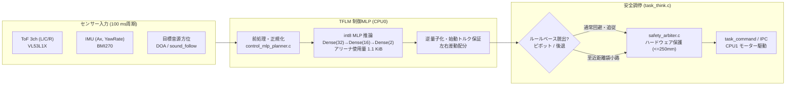

# TFLM 障害物回避制御 MLP（Policy Distillation）設計書

最終更新: 2026-09-20

## 1. 概要と目的

本設計は、Renesas RA8P1 CPU0 上に既に配備されている **TFLM（TensorFlow Lite for Microcontrollers）** と **96 KiB 静的テンソルアリーナ** を活用し、従来のルールベース障害物回避制御（ポテンシャル場 + 反発ベクトル法）を模倣学習（**Policy Distillation: 方策蒸留**）した **完全 int8 量子化 制御 MLP** を実装・統合したものです。

音響エッジ AI（Log-Mel スペクトログラム CNN）に続く第2のエッジ AI 機能として、センサー・オドメトリ・目標音源方位を統合した滑らかな連続軌道計画をマイコン内で完結して実行します。



---

## 2. 制御MLP アーキテクチャ

### 2.1 入力特徴量（10次元）

| Index | 特徴量名 | 物理範囲 | 正規化仕様 | 備考 |
|---|---|---|---|---|
| `0` | `left_tof_norm` | $0 \sim 4000\,\text{mm}$ | $[0.0, 1.0]$ | 距離 / 4000.0（無効時は 1.0） |
| `1` | `center_tof_norm` | $0 \sim 4000\,\text{mm}$ | $[0.0, 1.0]$ | 距離 / 4000.0（無効時は 1.0） |
| `2` | `right_tof_norm` | $0 \sim 4000\,\text{mm}$ | $[0.0, 1.0]$ | 距離 / 4000.0（無効時は 1.0） |
| `3` | `left_valid` | $0 \text{ or } 1$ | $\{0.0, 1.0\}$ | 有効フラグ |
| `4` | `center_valid` | $0 \text{ or } 1$ | $\{0.0, 1.0\}$ | 有効フラグ |
| `5` | `right_valid` | $0 \text{ or } 1$ | $\{0.0, 1.0\}$ | 有効フラグ |
| `6` | `heading_sin` | $-1.0 \sim +1.0$ | $[-1.0, 1.0]$ | $\sin(\theta_{\text{goal}})$ |
| `7` | `heading_cos` | $-1.0 \sim +1.0$ | $[-1.0, 1.0]$ | $\cos(\theta_{\text{goal}})$ |
| `8` | `speed_scale_norm` | $0.0 \sim 1.0$ | $[0.0, 1.0]$ | 直前ステップの速度スケール |
| `9` | `yaw_rate_norm` | $-50 \sim +50\,\text{dps}$ | $[-1.0, 1.0]$ | IMU ヨーレート / 50.0 |

### 2.2 ネットワーク構造と量子化

- **構造**: `Dense(32, ReLU) -> Dense(16, ReLU) -> Dense(2)`
- **出力 (2次元)**:
  1. `steer_norm`: $[-1.0, 1.0]$ （操舵角 $[-45^\circ, +45^\circ]$ へスケーリング）
  2. `speed_scale`: $[0.0, 1.0]$ （前進速度スケーリング）
- **量子化形式**: 完全 `int8` 量子化（入力・中間活性化・重み・バイアス・出力すべて int8）
- **モデルサイズ**: **2,304 バイト**（フラットバッファ形式、4 バイトアライメント）
- **テンソルアリーナ消費量**: **1,120 バイト**（静的確保済みの 96 KiB アリーナのわずか **1.16%**）
- **格納場所**: [`firmware/ra8p1/SoundExplorationRover_CPU0/src/control/control_mlp_model.h`](file:///Users/hino/.gemini/antigravity/worktrees/sound-exploration-rover/tflm_obstacle_avoidance_mlp/firmware/ra8p1/SoundExplorationRover_CPU0/src/control/control_mlp_model.h)

---

## 3. 実機統合と制御ロジック

### 3.1 コンパイルスイッチ

[`firmware/ra8p1/SoundExplorationRover_CPU0/src/config/control_config.h`](file:///Users/hino/.gemini/antigravity/worktrees/sound-exploration-rover/tflm_obstacle_avoidance_mlp/firmware/ra8p1/SoundExplorationRover_CPU0/src/config/control_config.h) にて切替可能です。

```c
#ifndef CPU0_USE_CONTROL_MLP
#define CPU0_USE_CONTROL_MLP (1U) /**< 0: 従来ルールベース, 1: TFLM制御MLP */
#endif
```

### 3.2 始動トルク保証と左右差動配分（`task_think.c`）

実機の DC モーター・ギアボックス・床面摩擦の特性上、PWM Duty が 16%（約 60 RPM）以下になると静止摩擦に負けて車輪が始動できないモーター不感帯が存在します。また、4輪操舵サーボを大舵角（$45^\circ$）に切った状態ではタイヤのスクラブ抵抗が大きくなります。

これを防ぐため、MLP 出力を次のように実機アクチュエータへマッピングしています：

```c
/* 始動トルク下限（85 RPM / 22.6% Duty）を確保 */
W const rpm_range = (W) CPU0_SENSOR_FORWARD_RPM - CPU0_SENSOR_MIN_FORWARD_RPM;
H const base_rpm = (H) (CPU0_SENSOR_MIN_FORWARD_RPM +
                        (H) roundf(mlp_output.speed_scale * (float) rpm_range));

/* 旋回舵角に応じた左右差動配分（外輪増速・内輪下限ガード） */
W const steer_mag = (mlp_output.steering_deg < 0.0f) ?
                    (W) (-mlp_output.steering_deg) : (W) (mlp_output.steering_deg);
W const inner_slowdown = (steer_mag * 25) / CPU0_SENSOR_STEERING_MAX_DEG;
H inner_rpm = (H) (((W) base_rpm * (100 - inner_slowdown)) / 100);
if (inner_rpm < CPU0_SENSOR_MIN_FORWARD_RPM) {
    inner_rpm = (H) CPU0_SENSOR_MIN_FORWARD_RPM;
}
W const outer_boost = (steer_mag * 10) / CPU0_SENSOR_STEERING_MAX_DEG;
H outer_rpm = (H) (((W) base_rpm * (100 + outer_boost)) / 100);
if (outer_rpm > 130) {
    outer_rpm = 130;
}
```

- **直進時**: 85 〜 120 RPM（Duty 22.6% 〜 32.0%）
- **旋回時**: 内輪 85 RPM（下限ガード）、外輪 最大 130 RPM

### 3.3 オープンスペース不感帯（Open-space Deadband）

int8 量子化の丸め誤差（1〜2 LSB）に起因して、障害物のない開けた直進空間で車体が微小旋回ドリフト（半径約 1 m の旋回運動）を起こすのを防止するため、以下の不感帯を [`control_mlp_planner.c`](file:///Users/hino/.gemini/antigravity/worktrees/sound-exploration-rover/tflm_obstacle_avoidance_mlp/firmware/ra8p1/SoundExplorationRover_CPU0/src/control/control_mlp_planner.c) に設けています：

```c
if ((min_tof_mm >= 850.0f) && (fabsf(target_heading_deg) < 1.0f) && (fabsf(raw_steer_deg) < 4.0f)) {
    raw_steer_deg = 0.0f;
}
```

---

## 4. 多層防御安全アーキテクチャ

ニューラルネットワーク制御下においても、ロボットの物理的衝突や暴走を数学的・構造的に防止するため、4層の保護レイヤーを構築しています。

| レベル | 担当コンポーネント | 動作と保護内容 |
|---|---|---|
| **Level 1 (最上位)** | [`safety_arbiter.c`](file:///Users/hino/.gemini/antigravity/worktrees/sound-exploration-rover/tflm_obstacle_avoidance_mlp/firmware/ra8p1/SoundExplorationRover_CPU0/src/control/safety_arbiter.c) | いずれかの有効 ToF $\le 250\,\text{mm}$、センサー途絶（タイムアウト）、または異常検知時にモーター出力を物理遮断・即時緊急停止（Hardware Veto） |
| **Level 2** | ルールベース・エスケープ | 車両が袋小路や至近障害物に遭遇し、反転・ピボット・バック操作が必要と判定された場合（`rule >= 3`）、MLP をバイパスして確定的な脱出動作を実行 |
| **Level 3** | TFLM 制御 MLP | 通常走行域（$250\,\text{mm} < \text{ToF} \le 4000\,\text{mm}$）における連続ポテンシャル場回避・音源目標方位へのスムーズな追従 |
| **Level 4** | スルーレートリミッタ | 1 制御周期（100 ms）あたりの最大舵角変化量を $9.0^\circ$（最大 $90^\circ/\text{s}$）に制限し、急旋回による車輪スリップや転倒を防止 |

---

## 5. 学習・コード生成ワークフロー

モデルの学習データ生成から量子化・Cヘッダ化までの全工程は、以下の単一スクリプトで完全に自動化されています。

```bash
cd software/control-sim
uv run python -m controlsim.train_control_mlp
```

### パイプライン構成
1. **シミュレータロールアウト収集**: 閉ループシミュレータ環境における壁面アプローチ走行データの収集
2. **エキスパート方策走査**: 左右距離・進入角・速度を網羅した包括的シナリオデータ生成（対称アプローチ時の決定論的タイブレーカー適用）
3. **実機ログ混合**: 実機走行フィクスチャ（`wall_loop_20260915.jsonl`）のブレンド
4. **Keras 学習**: MSE 損失による学習（Adam, 60 epochs）
5. **int8 代表データセット量子化**: TFLite Converter による完全 int8 変換
6. **Cヘッダ出力**: `firmware/ra8p1/SoundExplorationRover_CPU0/src/control/control_mlp_model.h` を直接出力

---

## 6. 自動テストと検証

### 6.1 ホスト自動テスト (`pytest`)

```bash
cd software/control-sim
uv run pytest tests/test_control_mlp.py
```

- **ASan / UBSan スモーク**: メモリリーク 0、未定義動作 0 の検証（`sanitized_smoke.c`）
- **TFLM C ABI 契約**: 静的 96 KiB アリーナ境界、初期化・リセット・エラー戻り値契約の検証
- **数値パリティ**: Python TFLite リファレンスと C 実行時の出力一致度（誤差 $\le 1\,\text{LSB}$、一致率 96% 以上）
- **閉ループ壁面接近 (54条件)**:
  - 車速 100 / 200 RPM
  - 進入角度 $-45^\circ \sim +45^\circ$
  - 初期オフセット $-150 \sim +150\,\text{mm}$
  - **全 54 条件で衝突ゼロ（クリアランス $> 300\,\text{mm}$）を達成**

### 6.2 RA8P1 CPU0 ファームウェアビルド

```bash
bash .vscode/scripts/Invoke-RaBuild.sh --target CPU0
```

- **ビルド成果物**: `firmware/ra8p1/SoundExplorationRover_CPU0/Debug/SoundExplorationRover_CPU0.elf`
- **フットプリント**:
  - `text`: 129,656 bytes (ROM)
  - `data`: 0 bytes
  - `bss`: 211,400 bytes (SRAM, 96 KiB TFLM テンソルアリーナを含む)
