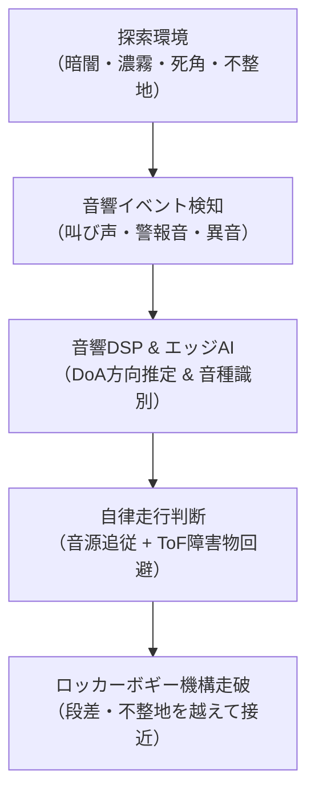

# 第1章: プロジェクト概要とミッション

Sound Exploration ROVer（SEROV: セロブ）は、**TRONプログラミングコンテスト2026** に向けて開発されている自律移動型音源探査ローバーです。
本章では、プロジェクトの背景、コンテストにおける狙い、モノレポ構成、および開発全体を貫く設計哲学を解説します。

---

## 1.1 プロジェクトの背景と目的

### TRONプログラミングコンテスト2026
TRONプログラミングコンテストは、オープンアーキテクチャのリアルタイムOS「**μT-Kernel 3.0**」やルネサス エレクトロニクス製最新マイクロコントローラ（本プロジェクトではArm Cortex-M85 / Cortex-M33 デュアルコア搭載の **RA8P1**）を活用し、高度なリアルタイム組込みシステムの設計・実装技術を競うコンテストです。

### 音源探査ローバー（SEROV）の挑戦
従来の自律移動ロボットは、カメラ（可視光）やLiDAR（光測距）などの光学系センサに強く依存しています。しかし、次のような極限環境では光学センサは能力を大きく喪失します。
- **濃霧、煙、粉塵が充満した災害現場・トンネル崩落事故現場**
- **照明のない完全な暗闇、配管内部、密閉空間**
- **障害物の死角（壁の裏など、見通しが効かない場所）**

**SEROV** は、このような環境下において「**音（Sound）**」を手がかりに自律探査を行うことを目的としています。
- 被災者の呼気・叫び声、警報音、漏水音、機械の異音などを検知。
- マイクアレイと専用音響DSPによる「音の到来方向（DoA: Direction of Arrival）」の推定。
- エッジAI（深層学習モデル）による目的音と環境雑音（ローバー自身の走行音やモータノイズ）の識別。
- ロッカーボギー式高走破性シャシーによる不整地の走破と、音源位置への自律接近・追従。



---

## 1.2 リポジトリ構成（モノレポの全体像）

本リポジトリは、ハードウェアの3Dモデルからマイコンファームウェア、PC用監視ツール、AI学習パイプラインまでを一元管理するモノレポ構成を採用しています。

```text
sound-exploration-rover/
├── docs/                       # プロジェクト公式ドキュメント群
│   ├── firmware/               # ファームウェア詳細設計書、規約、検証記録
│   ├── hardware/               # 車体・駆動系の実機測定記録
│   ├── textbook/               # 【本教科書】総合解説教材群
│   └── program-plan-2026_ja.pdf# コンテスト計画書
├── firmware/                   # 組み込みファームウェア群
│   ├── common/                 # ESP32-S3とRA8P1で共有する通信プロトコル
│   ├── esp32s3/                # XIAO ESP32S3用 ESP-IDF プロジェクト
│   └── ra8p1/                  # EK-RA8P1用 e² studio ワークスペース
│       ├── common/             # CPU0/CPU1共有IPC定義、共通μT-Kernel設定
│       ├── SoundExplorationRover/      # デュアルコア統合Solution
│       ├── SoundExplorationRover_CPU0/ # Cortex-M85 主制御・音響AIプロジェクト
│       └── SoundExplorationRover_CPU1/ # Cortex-M33 リアルタイム駆動プロジェクト
├── hardware/                   # ハードウェア関連データ
│   ├── actuator/               # 使用アクチュエータ（モータ・サーボ）仕様書
│   ├── papaya-addon/           # 独自設計の3Dプリント機構部品（STEP / STL）
│   └── papaya-pathfinder/      # ベース車体（Gitサブモジュール）
└── software/                   # ホストPC側ソフトウェア群
    ├── acoustic-trainer/       # 音響特徴量・エッジAI学習・変換環境
    ├── control-sim/            # Cファームウェア制御ロジックのホスト検証環境
    └── rover-monitor/          # リアルタイムWebテレメトリ可視化モニタ
```

### なぜモノレポなのか？
組み込みAIロボットの開発では、「通信パケットの1バイトのずれ」や「エンコーダ校正値の食い違い」が致命的な不具合を招きます。
通信契約（`acoustic_protocol.h`, `ipc_message.h`）や寸法・校正値（車輪半径54mm、トレッド260mm、702 counts/rev）を同一リポジトリで厳密にバージョン管理することで、プロセッサ間やPCツール間の不整合を完全に防止しています。

---

## 1.3 システムを貫く4つの設計哲学

本プロジェクトのアーキテクチャおよびソースコードには、一貫した4つの設計哲学が適用されています。

### ① 安全第一とハードリアルタイムの分離
- **原則**: 高度な判断（思考・AI・通信）がどれだけ重くなろうとも、モータやサーボの駆動制御（ミリ秒オーダーの安全停止・リミット監視）を絶対に巻き込まない。
- **具現化**: 高機能なCortex-M85（CPU0）にUSBやAI、走行判断を担わせる一方、Cortex-M33（CPU1）を1ms固定周期の駆動専用コアとして完全分離。通信断やCPU0フリーズが発生した場合も、CPU1が自律的に1500msで安全停止（Safe Stop）へ移行します。

### ② 固定契約（Explicit Contracts）と境界の明示
- **原則**: プロセッサ間やタスク間の通信において、パディング依存のC構造体をそのまま送出しない。
- **具現化**: 
  - CPU0-CPU1間: 4段32-bit IPC FIFO（上位8bit ID＋下位24bit Payload）。
  - ESP32S3-CPU0間: Magic番号、Version、Type、Length、Sequence、CRC-16を備えた明示的なリトルエンディアンバイナリプロトコル。
  - レイヤー間: 呼び出し依存方向を一方向（L4 Tasks → L3 Control → L2 Services → L1 Drivers → L0 Platform）に厳密制限。

### ③ ホスト上での早期・継続的検証（Shift-Left Testing）
- **原則**: 実機に書き込まなければ動かないコードを極力減らし、PCホスト上で網羅的かつ高速に自動テストを行う。
- **具現化**:
  - `software/control-sim`: 実ファームウェアのCコード（制御アルゴリズム）をPCのClangで直接ビルドし、ASan（AddressSanitizer）/ UBSan（UndefinedBehaviorSanitizer）下で回帰テスト。
  - `software/acoustic-trainer`: 浮動小数点演算順序までESP32-S3の単精度DSPと厳密に揃えたPython参照実装により、音響特徴量のビット完全一致をテスト。

### ④ 実機計測に基づくパラメータ校正（No Guesswork）
- **原則**: カタログ値や理論計算値を過信せず、実機による計測データを正としてパラメータを固定する。
- **具現化**:
  - モータエンコーダ分解能: カタログ値の900ではなく、2000mm手押し10区間の実測統計から **702 counts/rev** を導出・採用。
  - トレッド幅: 旋回実測と車輪幾何から **260 mm** を確定。
  - レベル閾値: 実環境の暗騒音・マイク感度に基づきdBFS値を校正。

---

## 1.4 まとめ

SEROVは、最新のマイコンハードウェア（RA8P1）、リアルタイムOS（μT-Kernel 3.0）、音響DSP、エッジ深層学習、そして火星ローバー直系のメカニクスを融合させた高度な組み込みシステムです。
次章では、このローバーを支える物理的な骨格「ハードウェア機構とメカニカル設計」について掘り下げていきます。
