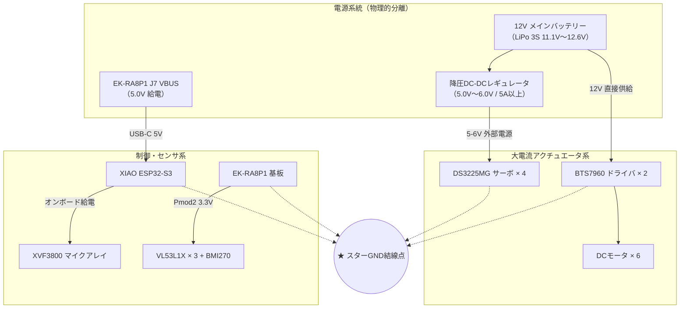

# 第2章: ハードウェア機構とメカニカル設計

本章では、SEROVの物理的な骨格である「ロッカーボギー機構」、独自設計の3Dプリント追加パーツ、アクチュエータ（モータ・サーボ）、および電気配線・電源・GND設計について詳しく解説します。

---

## 2.1 ロッカーボギー機構の動作原理

SEROVのベース車体には、NASAの火星探査ローバー（CuriosityやPerseverance）にも採用されている「**ロッカーボギー（Rocker-Bogie）サスペンション機構**」を採用しています。

```text
               [ 差動ディファレンシャル・バー ]
                     /              \
            [ 主ロッカー ]      [ 主ロッカー ]
              /        \          /        \
          前輪       [副ボギー]  前輪     [副ボギー]
                     /      \             /      \
                   中輪    後輪         中輪    後輪
```

### なぜバネを使わないのか？
一般的な自動車のようなコイルスプリング式サスペンションは、片輪が段差に乗り上げた際に車体が大きく傾き、段差側の車輪に過大な荷重がかかる一方で反対側の車輪が浮き上がります。
これに対し、ロッカーボギー機構はリンク機構のみで構成され、**バネを使用しません**。
- **6輪常時接地**: 左右のロッカー（主アーム）とボギー（副アーム）がピボット軸で連結され、車体上部のディファレンシャル機構によって左右逆位相に連動します。
- **車体傾斜の半減**: 片側の車輪が高さ $h$ の障害物に乗り上げたとき、車体中央の傾斜・上下変位はリンク比によって約 $h/2$ に緩和されます。
- **車輪径を超える段差の走破**: 各車輪が独立して地面を捉え続けるため、車輪の半径（本機では直径108mm、半径54mm）を超える障害物や急斜面を安定して踏破できます。

---

## 2.2 車体構造と3Dプリント追加機構（Papaya Add-on）

ベースとなるオープンソース車体「**Papaya Pathfinder**」に対し、大型マイコン基板（EK-RA8P1）や音響センサ（ReSpeaker XVF3800）を車載するため、リポジトリ内の `hardware/papaya-addon/` に独自拡張パーツを設計・配置しています。

```text
hardware/papaya-addon/
├── step/                          # CAD編集・干渉確認用STEPデータ
│   ├── body_ekra8p1.step         # EK-RA8P1搭載用メインデッキ
│   ├── bridge_ekra8p.step        # 左右ロッカー連結ブリッジ
│   ├── tower_mic_array_.step     # マイクアレイ支持タワー
│   └── crown_mic_array.step      # マイクアレイ保護クラウン（王冠型マウント）
└── stl/                           # 3Dプリント用メッシュデータ（Git LFS対象）
    ├── body_ekra8p1.stl
    ├── bridge_ekra8p.stl
    ├── tower_mic_array_.stl
    └── crown_mic_array.stl
```

### 拡張パーツの機能と設計配慮
1. **メインデッキ (`body_ekra8p1`)**:
   - EK-RA8P1の固定用ボス、BTS7960モータドライバ2台、およびTCA9548Aセンサハブの配置スペースを一体化。
   - 配線取り回し用のケーブルホールを備え、モータ電源線と信号線の交差を最小限に抑制。
2. **支持タワー (`tower_mic_array_`) & クラウン (`crown_mic_array`)**:
   - マイクアレイを車体最上部（地上高約200mm）に配置。車体自身のモータ回転音や地面からの反射音を低減。
   - 4基のマイク開口部を塞がないオープンクラウン構造とし、全周360°の音響特性（DoA精度）を確保。
3. **六角ハブアダプタ (`rim_hexagonal.stl`)**:
   - モータ軸（Dカット軸）への直接樹脂取り付けではなく、**12mm真鍮六角ハブアダプタ**を介してホイールを固定。
   - 高トルク走行時における樹脂スプラインの舐め（摩耗空転）を防止。

---

## 2.3 アクチュエータ構成と仕様

SEROVは、**6輪独立駆動 ＋ 4輪（前2輪・後2輪）独立ステアリング** という強力な足回りを持ちます。

```text
       [FL 操舵サーボ] ── (左前輪 モータ)     (右前輪 モータ) ── [FR 操舵サーボ]
                             │                     │
                       (左中輪 モータ)     (右中輪 モータ)
                             │                     │
       [RL 操舵サーボ] ── (左後輪 モータ)     (右後輪 モータ) ── [RR 操舵サーボ]
```

### 1. 駆動系: JGA25-370 DCギヤードモータ × 6台
- **定格電圧**: 12 V DC
- **無負荷回転数**: 300 RPM（※初期検討の100 RPMから登坂力・追従速度向上のため300 RPMへ変更）
- **磁気式直交エンコーダ内蔵**: ホール素子によるA/B相パルス出力（代表輪左右各1台を計測）。
- **駆動方式**: 論理左側3台を並列接続、論理右側3台を並列接続。

### 2. 操舵系: DS3225MG デジタルサーボ × 4台
- **作動角**: 180°（実効使用範囲: -45° 〜 +45°）
- **トルク**: 25 kgf·cm（6.0 V時）
- **制御信号**: 50 Hz PWM（周期20 ms、パルス幅 1000 μs 〜 2000 μs、中央値 1500 μs）
- **4輪逆相操舵**: 前輪（FR/FL）と後輪（RR/RL）を逆位相に操舵することで、ホイールベースの長さを克服し、狭い空間での小回り旋回を実現。

### 3. モータドライバ: BTS7960 Hブリッジモジュール × 2台
- **定格電流**: 最大43 A（大容量MOSFET内蔵）
- **制御入力**:
  - `RPWM` / `LPWM`: 20 kHz PWM入力（正転／逆転）
  - `R_EN` / `L_EN`: チップイネーブル入力（左右共通化してGPIO制御）

---

## 2.4 電気配線・電源・GND設計

大電流を消費するモータ・サーボと、ノイズに極めて敏感なマイコン・音響センサを混載するため、厳格な電源分離と配線分離を行っています。



### 3大電源設計ルール

#### ① モータ電流のマイコン還流禁止
- DCモータの突入電流（最大数アンペア）および逆起電力がEK-RA8P1のグラウンドパターンを通過すると、マイコンがリセットしたりADC/I2Cがハングアップします。
- バッテリー、BTS7960のB+/B-、およびモータ端子は最短・太線で直接配線し、マイコン基板とは信号基準となる「**スターGND（一点アース）**」でのみ接続します。

#### ② サーボ電源の独立給電
- DS3225MGサーボは急加速時や拘束時に1台あたり2〜3 Aのピーク電流を消費します。4台で最大10 A近くに達し得ます。
- サーボの赤線（VCC）を**EK-RA8P1の5V端子に絶対に接続してはなりません**。必ず大容量（5A以上）の外部降圧レギュレータから給電します。

#### ③ センサ専用給電ライン
- I2Cセンサ群（VL53L1X 3台、TCA9548A、BMI270）は、エンコーダ用電源（J18-4）とは別系統の **Pmod2 J25-6（+3.3V）および J25-5（GND）** から給電し、電源ノイズの回り込みを防ぎます。

---

## 2.5 EK-RA8P1 ボード設定（DIPスイッチ SW4）

EK-RA8P1評価ボードのArduinoピンヘッダおよびI2Cコネクタを使用するため、基板上のDIPスイッチ `SW4` を以下のように設定する必要があります（※電源OFF時に切り替え）。

| スイッチ | 設定 | 理由と影響 |
|:---:|:---:|---|
| **SW4-3** | **ON** | **Octo-SPIフラッシュ無効化**。P801/P803/P808端子をサーボPWM出力へ転用するため。 |
| **SW4-4** | **ON** | **Arduino端子有効化**。工場出荷時の切り離し状態から接続状態へ変更。 |
| **SW4-5** | **OFF** | **IIC1（P511/P512）選択**。I3C排他スイッチをI2C側へ倒し、Arduino J24-9/10のI2Cバスを有効化。 |

> [!WARNING]
> SW4-4がOFFのままだと、Arduinoヘッダの端子が電気的にオープンとなり、サーボやモータへの制御信号が届きません。実機デバッグ時に信号が出力されない場合は、まずSW4の設定を確認してください。

---

## 2.6 まとめ

- ロッカーボギー機構は、バネを使わずにリンクの幾何学的連動によって6輪接地と走破性を実現する。
- 独自設計の3Dプリントパーツにより、重い制御基板とデリケートな音響アレイを理想的な位置にレイアウト。
- 電源系は12V（モータ）、5V（サーボ）、3.3V（センサ・マイコン）を完全に分離し、スターGNDで結合することで電気的ノイズを徹底排除。
次章では、このハードウェアを意のままに操る「4プロセッサ協調アーキテクチャ」の論理構造を学びます。
