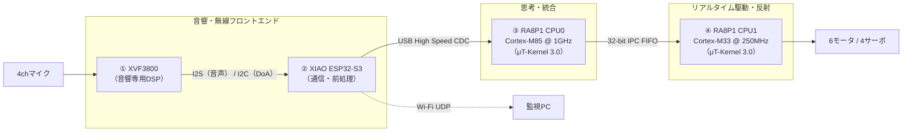
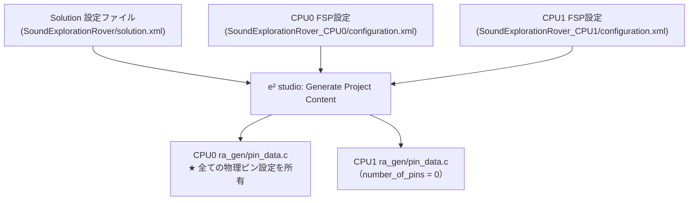

# 第3章: 4プロセッサ協調アーキテクチャとレイヤー設計

本章では、SEROVを構成する4つのプロセッサの責務分離、RA8P1内部の5層ソフトウェアレイヤー構造、およびFSP（Flexible Software Package）におけるピン所有権モデルについて詳しく解説します。

---

## 3.1 4プロセッサの責務分担

SEROVは、適材適所の4つのプロセッサが連携するヘテロジニアス・マルチプロセッサ構成を採用しています。



| プロセッサ / コア | 実行基盤 | 所有する主責務 | 所有しない責務（隔離） |
|---|---|---|---|
| **① XVF3800** | 専用音響ファームウェア | 4chマイクDSP、音響エコーキャンセル（AEC）、ノイズ抑制、ビームフォーミング、DoA（到来方向）、VAD（音声区間検出） | 走行判断、通信制御、モータ制御 |
| **② XIAO ESP32-S3** | ESP-IDF / FreeRTOS | I2S音声取込、Log-Mel特徴量抽出（32bin/100fps）、int8量子化、USB CDCデバイス、Wi-Fi UDP診断ゲートウェイ | 最終的な走行判断、安全停止の最終判定 |
| **③ RA8P1 CPU0**<br/>(Cortex-M85 @ 1GHz) | μT-Kernel 3.0 | USB HCDC Host、I2Cセンサ統合、音源追従・障害物回避思考、TFLMエッジAI、IPC送信、LED表示 | モータ・サーボのPWM生成、エンコーダ高速割込 |
| **④ RA8P1 CPU1**<br/>(Cortex-M33 @ 250MHz) | μT-Kernel 3.0 | 1ms固定周期アクチュエータ制御、PWMランプ・リミット制限、4輪逆相操舵、エンコーダ積算、ハード安全停止 | USB通信、Wi-Fi、AI推論、自律走行判断 |

### なぜプロセッサを分けるのか？（責務分離の必然性）
1. **音響DSPの専門化**: 4chマイクからの16kHz/32bit PCM信号をリアルタイムに空間フィルタリングし、ビームフォーミングとDoAを計算する処理は極めて重く、専用DSP（XVF3800）に任せるのが最も確実かつ低レイテンシです。
2. **通信ジッタの隔離**: Wi-Fi接続処理やUSB列挙・再接続処理は突発的な遅延（数百ミリ秒〜数秒）を伴います。これらをCPU1の駆動制御ループから完全に切り離すことで、モータが暴走したり制御ループが破綻するリスクをゼロにします。
3. **安全停止の独立性**: CPU0のOSやAIタスクが何らかの理由でフリーズした場合でも、CPU1が1500msの指令途絶を自律検知して直ちにPWMを停止（Safe Stop）できます。

---

## 3.2 RA8P1 ユーザーコードの5層レイヤー設計

RA8P1のCPU0およびCPU1のユーザーコードは、変更容易性と単体テスト性を最大化するため、明確な5つのレイヤーに分離されています。

```text
  [L4 Tasks]     : μT-Kernelタスクの生成・周期実行・状態待機
      ↓
  [L3 Control]   : センサ状態から走行目標（RPM・操舵角）を算出（アルゴリズム）
      ↓
  [L2 Services]  : 複数デバイスの統合・調停・安全状態管理・単位換算
      ↓
  [L1 Drivers]   : 個別ペリフェラル・外部チップの直接制御（レジスタ・FSP呼び出し）
      ↓
  [L0 Platform]  : マイコンハードウェアに近い共通基盤機能（I2Cバス抽象化等）
      ↓
  [Renesas FSP]  : ルネサス純正 HALドライバ / ハードウェア
```

### レイヤーごとの責務と代表モジュール

| 層 | ディレクトリ | 責務 | CPU0での代表例 | CPU1での代表例 |
|:---:|---|---|---|---|
| **L4** | `tasks/` | μT-Kernel API呼び出し、タスクスケジューリング、優先度制御 | `task_think`, `task_command`, `task_sensor`, `task_acoustic_link` | `task_actuator`, `task_status` |
| **L3** | `control/` | RTOS非依存の純粋な制御ロジック・ステートマシン | `sound_follow_controller`, `obstacle_avoidance_controller` | （CPU1は指令追従のためL3は持たない） |
| **L2** | `services/` | 複数ドライバの統合、安全フィルタ、目標値ランプ | `sensor_hub`, `acoustic_identifier` | `actuator_service`, `drive_service` |
| **L1** | `drivers/` | 特定ハードウェアチップ・モジュールの制御 | `vl53l1x`, `bmi270`, `tca9548a` | `bts7960`, `servo`, `encoder` |
| **L0** | `platform/` | マイコン抽象化、バスアクセスの排他・同期 | `i2c_bus` | — |

### レイヤー化がもたらす決定的なメリット
- **単体テスト容易性**: L3（`control/`）やL2のロジックは、μT-KernelのタスクAPIやFSPのハードウェアレジスタに直接依存しません。そのため、ホストPC（macOSやLinux）上のClangでそのままコンパイルし、高速にシミュレーションや回帰テスト（`software/control-sim`）を実行できます。
- **依存の一方向性**: 上位層が下位層を呼ぶことのみが許可され、下位層から上位層への逆方向の関数呼び出しは禁止されています。

---

## 3.3 横断的コンポーネント

5層構造を横断して利用される共通機能として、以下の2つの独立ディレクトリが存在します。

1. **`ipc/` (Inter-Processor Communication)**:
   - CPU0とCPU1の境界を橋渡しするモジュール。
   - CPU0側: `actuator_ipc_client.c`（指示構造体を32-bit FIFOワード列にシリアライズして送信）。
   - CPU1側: `actuator_ipc_server.c`（受信割り込み内でステージングし、アトミックに確定）。
2. **`config/` (設定ヘッダ群)**:
   - マジックナンバーをコード中に散乱させず、用途ごとに独立したヘッダファイルで一元管理。
   - `task_config.h`（周期、優先度、スタックサイズ）
   - `control_config.h` / `sensor_config.h`（探索閾値、タイムアウト時間、距離リミット）
   - `actuator_config.h` / `drive_config.h` / `servo_config.h`（PWM最大Duty、RPMスケール、サーボトリム値）
   - `pin_config.h`（アプリケーション側から見た論理ピンの対応関係）

---

## 3.4 FSP設定とピン所有権モデル（Pin Ownership）

EK-RA8P1は、1つのシリコンチップ上にCortex-M85（CPU0）とCortex-M33（CPU1）を内蔵するデュアルコアマイコンです。I/Oポート（IOPORT）の物理レジスタは両コアで共有されています。



### ピン競合を防ぐための運用ルール
1. **Solutionを「唯一の正」とする**:
   - ピン設定（Pin Configuration）は、各CPUプロジェクトの画面ではなく、親となる **Solutionレベル（`solution.xml`）** で一括設定します。
2. **CPU0が一括初期化**:
   - 生成されるピン初期化テーブル（`g_bsp_pin_cfg`）は、**CPU0側の `ra_gen/pin_data.c` にのみ出力**されます。
   - CPU0が起動時に `R_BSP_PinCfg()` を呼び出してマイコン全体のピン多重化（GPT, IIC, USB, GPIO等）を一括構成します。
3. **CPU1はピン定義を持たない（0ピン）**:
   - CPU1側の `ra_gen/pin_data.c` は、意図的に `number_of_pins = 0` の空のテーブルが生成されます。
   - これにより、CPU1起動時にCPU0の設定が上書きされたり、競合警告（Duplicate Pin Allocation）が発生することを完全に防止しています。

---

## 3.5 制御フローと診断フローの完全分離

本アーキテクチャでは、**「ローバーを動かす制御経路」** と **「状態を監視する診断経路」** が厳格に分離されています。

```text
【制御経路（下り一方向）】
  XVF3800 ──> ESP32-S3 ──> [USB CDC] ──> CPU0 (思考) ──> [IPC FIFO] ──> CPU1 (駆動) ──> モータ

【診断経路（上り・外部通知）】
  CPU1 (実績値) ──> [IPC FIFO] ──> CPU0 ──> [USB CDC] ──> ESP32-S3 ──> [Wi-Fi UDP] ──> 監視PC
```

- **外部バイパスの禁止**: PCやESP32-S3から、CPU0の判断や安全機構を迂回してCPU1のモータ出力を直接叩く経路は一切存在しません。将来Wi-Fiによる手動遠隔操縦を実装する場合でも、指令は必ずCPU0に入力され、タイムアウト・障害物回避ルール・安全停止の監視を通過した上でCPU1に渡されます。

---

## 3.6 まとめ

- 4つのプロセッサを役割に応じて分離し、重い音響DSP、ネットワーク通信、自律思考、1msリアルタイム駆動が互いの足を引っ張らない構成を実現。
- RA8P1内はL0〜L4の5層アーキテクチャに整理され、高い保守性とホスト単体テスト性を獲得。
- 物理ピンの所有権はSolution経由でCPU0に集約し、デュアルコア特有のハードウェア設定衝突を回避。
次章では、このアーキテクチャを動的に統括する「μT-Kernel 3.0とデュアルコア制御」の神髄に迫ります。
