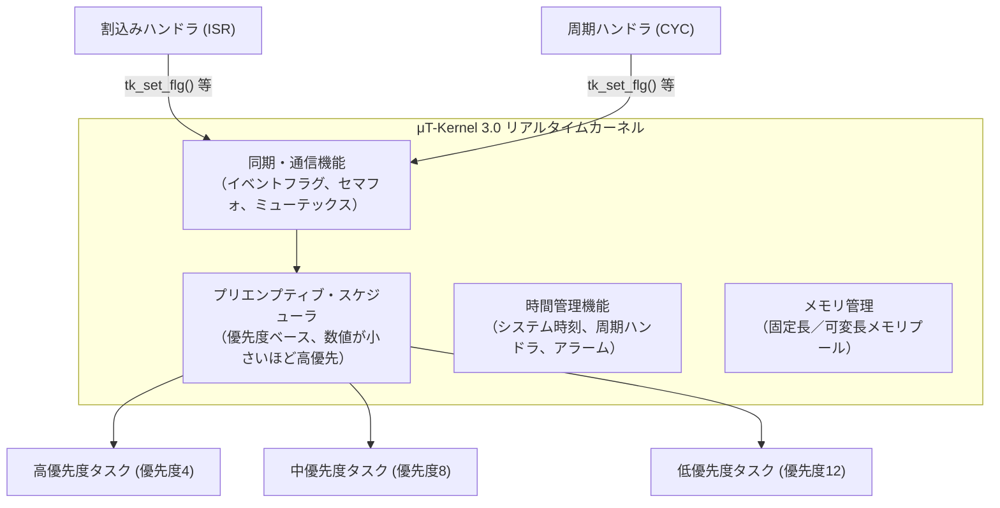
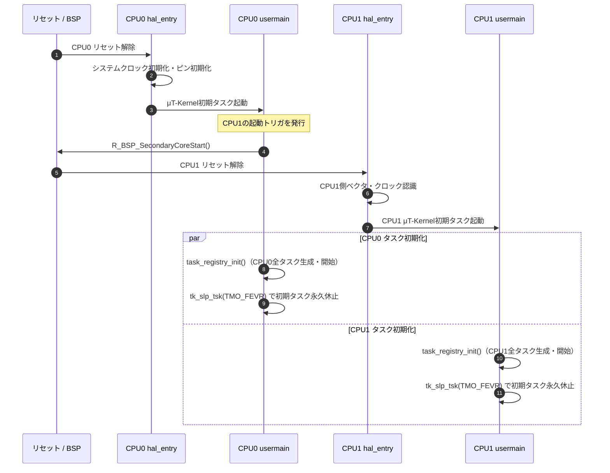
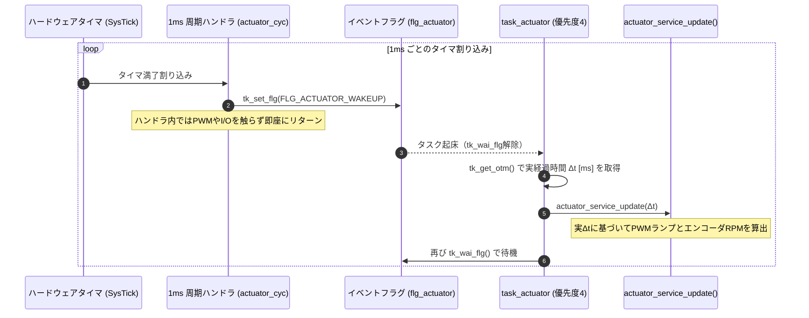

# 第4章: μT-Kernel 3.0とデュアルコアリアルタイム制御

本章では、SEROVの制御中枢である「**μT-Kernel 3.0**」の基本概念、RA8P1の非対称デュアルコア（AMP: Asymmetric Multiprocessing）構成、メモリマップ、タスク優先度・周期設計、および周期ハンドラを用いた実時間化技術について解説します。

---

## 4.1 μT-Kernel 3.0 の基本概念

μT-Kernel 3.0 は、トロンフォーラムが策定したIoTエッジノード・小型組込み機器向けのリアルタイムOS（RTOS）の国際標準仕様です。



### 主要なカーネルオブジェクトと本プロジェクトでの用途
1. **タスク（Task）**: 独立した実行コンテキスト（スタックとプログラムカウンタ）。本機では全タスクを静的定義し、起動時に `tk_cre_tsk()` で生成。
2. **イベントフラグ（Event Flag）**: 複数ビットの論理和（OR）や論理積（AND）でタスクを起床させる同期プリミティブ。周期通知や障害発生の即時通知に使用。
3. **ミューテックス（Mutex）**: 共有リソース（最新センサ値、音響スナップショット）の排他制御。**優先度逆転現象（Priority Inversion）を防止するため、優先度継承プロトコル（`TA_INHERIT`）** を適用。
4. **周期ハンドラ（Cyclic Handler）**: タイマ割り込みコンテキストで厳密に定周期実行されるハンドラ。タスクの起床トリガとして活用。

---

## 4.2 RA8P1の非対称デュアルコア構成

RA8P1マイコンは、アーキテクチャの異なる2つのArmプロセッサコアを搭載しています。

```text
               +-------------------------------------------+
               |             ルネサス RA8P1 MCU            |
               |                                           |
               |  [CPU0] Cortex-M85 (Helium MVE搭載)       |
               |         動作クロック: 1 GHz (最大)        |
               |         主用途: 高速演算、AI、通信        |
               |                                           |
               |  [CPU1] Cortex-M33 (TrustZone対応)        |
               |         動作クロック: 250 MHz             |
               |         主用途: リアルタイム制御、駆動    |
               +-------------------------------------------+
```

### デュアルコア起動シーケンス
ハードウェアリセット時、CPU0のみが自動的に起動します。CPU1はCPU0から明示的に起動指令を受け取るまで待機（Reset状態）しています。



---

## 4.3 メモリマップ設計（SRAMの完全分離）

RA8P1の内蔵SRAM領域（計1872 KiB）は、CPU0とCPU1が互いのメモリ空間を破壊しないよう、FSPのリンカスクリプトによって厳密に2分割されています。

```text
0x2200_0000 ┌─────────────────────────────────────────┐
            │ CPU0 専有領域 (936 KiB)                 │
            │ ・CPU0 μT-Kernel システム領域           │
            │ ・CPU0 タスクスタック群                 │
            │ ・TFLM 静的テンソルアリーナ (96 KiB)    │
            │ ・USB HCDC 受信バッファ                 │
0x220E_9FFF ├─────────────────────────────────────────┤
0x220E_A000 │ CPU1 専有領域 (936 KiB)                 │
            │ ・CPU1 μT-Kernel システム領域           │
            │ ・CPU1 タスクスタック群                 │
            │ ・駆動制御パラメータ・エンコーダ累積値 │
0x221D_3FFF └─────────────────────────────────────────┘
```

- **動的メモリ（カーネルプール）の非重複**: CPU0は下位936 KiB、CPU1は上位936 KiBのみを参照します。
- **共有メモリは不使用**: コア間の情報伝達には共有SRAMアドレスへの直接アクセスを用いず、ハードウェアの **IPC FIFO** を排他的に使用することで、キャッシュコヒーレンシ問題やメモリアクセス競合を完全に排除しています。

---

## 4.4 μT-Kernel BSPの上書き構造（Include Override）

本プロジェクトでは、`firmware/ra8p1/common/mtk3_bsp2/` にあるμT-Kernel BSPの公式コードを直接編集しません（Clean Upstream維持）。
代わりに、e² studioのコンパイラ検索パス（Include Search Path）の優先順位を利用して、プロジェクト固有の設定を上書きしています。

```text
【CPU0 プロジェクトのInclude順】
  1. common/mtkernel/          <-- config.h (CPU0/CPU1共通設定)
  2. common/mtk3_bsp2/config/  <-- BSP標準
  3. common/mtk3_bsp2/include/ <-- BSP標準

【CPU1 プロジェクトのInclude順】
  1. common/mtkernel/          <-- config.h (共通設定)
  2. src/mtkernel_config/include/ <-- ★CPU1固有の上書き（Cortex-M33, 250MHz, SRAM上位）
  3. common/mtk3_bsp2/config/  <-- BSP標準
  4. common/mtk3_bsp2/include/ <-- BSP標準
```

### CPU1固有上書きの内容
- `machine.h`: コア種別をCortex-M85から **Cortex-M33（Armv8-M Baseline/Mainline）** へ切り替え。
- `cpu/ra8p1/sysdef.h`: RAM開始アドレスを `0x220EA000` にシフトし、初期スタック位置を補正。
- `ek_ra8p1/sysdef.h`: システムクロック（SYSCLK）をCPU0の1 GHzではなく **250 MHz** として定義。カーネルの1ms Tickタイマ（SysTick）が正確な時間を刻むように補正。
- `_RA_ORDINAL` 分岐: CPU0はT-Monitor（SCI8シリアル出力）を有効化し、CPU1ではポート衝突を防ぐためT-Monitorを無効化。

---

## 4.5 CPU0 タスク設計（思考・統合）

CPU0は、USB音響取得、I2Cセンサ統合、走行思考、およびIPC送信を担います。

| タスク名 | エントリ関数 | 優先度 | スタック | 実行形態 | 主な責務 |
|---|---|:---:|:---:|---|---|
| `task_command` | `task_command_entry` | **6** | 1024 B | 50 ms 周期 | 思考結果の期限監視（500ms）、6出力の一括IPC送信 |
| `task_sensor` | `task_sensor_entry` | **7** | 1024 B | 50 ms 周期 | TCA9548A/VL53L1X×3/BMI270のI2C取得、平滑化 |
| `task_acoustic_link` | `task_acoustic_link_entry` | **8** | 2048 B | 1 ms ポーリング | USB HCDC受信、CRC検証、音響スナップショット更新 |
| `task_think` | `task_think_entry` | **10** | 1024 B | 100 ms 周期 | 音源追従／障害物回避判断、LED状態表示、faultラッチ |

> [!NOTE]
> μT-Kernelの優先度は **「数値が小さいほど高優先」** です。
> 最も優先度が高い周期タスクは `task_command`（優先度6）です。これにより、通信処理（USB）や思考処理（AI）が一時的に重くなった場合でも、CPU1に対する50msキープアライブ指令の送信が遅延しないように保護されています。

---

## 4.6 CPU1 タスク設計（リアルタイムアクチュエータ）

CPU1は、モータ駆動、サーボ操舵、およびエンコーダ積算を担うハードリアルタイム環境です。

| タスク名 | エントリ関数 | 優先度 | スタック | 実行形態 | 主な責務 |
|---|---|:---:|:---:|---|---|
| `task_actuator` | `task_actuator_entry` | **4** | 2048 B | **1 ms 周期ハンドラ起床** | IPC確定指令の取得、エンコーダ保守、PWMランプ、安全監視 |
| `task_status` | `task_status_entry` | **12** | 512 B | **10 ms 周期ハンドラ起床** | 赤LED点滅制御、診断スナップショット採取、IPC状態語送信 |

---

## 4.7 周期ハンドラ＋イベントフラグによる実時間化（Timing Improvement）

### 従来の `tk_dly_tsk()` が抱えていた課題
以前の実装では、周期実行に `tk_dly_tsk(1)`（1ミリ秒スリープ）を使用していました。しかし、この方式には以下の致命的な欠点がありました。
1. **処理時間の累積遅延**: タスク自身の処理時間（例: 0.3ms）に 1ms の遅延が加わるため、実際の周期は $1.3\text{ ms}$ となり、時間経過とともに大きなドリフトが発生。
2. **tick境界の丸め**: スリープ開始時刻とカーネルTickのタイミングにより、遅延時間が 1〜2ms の間で変動。

### 是正後の「周期ハンドラ ＋ イベントフラグ」方式
CPU1の実時間ループ（`task_actuator` および `task_status`）は、**ハードウェアタイマに直結した周期ハンドラ（CYC）** を起点とする設計に全面改修されました。



### 実Δt（経過時間）駆動のメリット
- **ジッタ耐性**: 万が一他の高優先度割り込み等によってタスク起床が 2ms 遅れた場合でも、`tk_get_otm()`（64-bitシステム時刻）から得られる「正確な経過時間 $\Delta t = 2\text{ ms}$」を計算関数に渡すため、オドメトリ積算やランプ計算に誤差が蓄積しません。
- **実機検証済みの精度**: 実機測定において、10秒間の更新回数が **10,144回 / 10,144 ms（平均周期 1.000 ms、誤差0.26%以内）** であることが確認されています。

---

## 4.8 まとめ

- μT-Kernel 3.0のプリエンプティブ・スケジューリングにより、優先度に基づいた厳密なリアルタイム実行を保証。
- RA8P1のCortex-M85（1GHz）とCortex-M33（250MHz）を非対称に使い分け、SRAM領域を完全に分離。
- BSPソースを変更せず、Includeパスの探索順序でCPU1の依存定義をオーバーライド。
- CPU1の駆動ループは「周期ハンドラ＋イベントフラグ＋実$\Delta t$」方式により、累積誤差ゼロの1ms制御を実現。
次章では、この2つのコア、そして外部ESP32-S3をつなぐ「プロセッサ間通信プロトコル（IPC & USB CDC）」を学びます。
