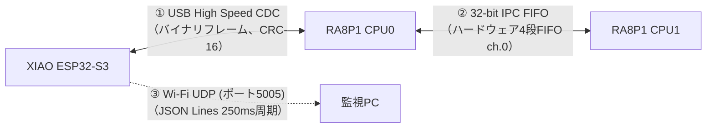
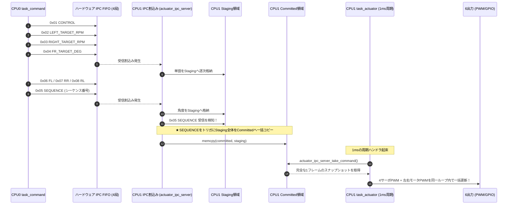
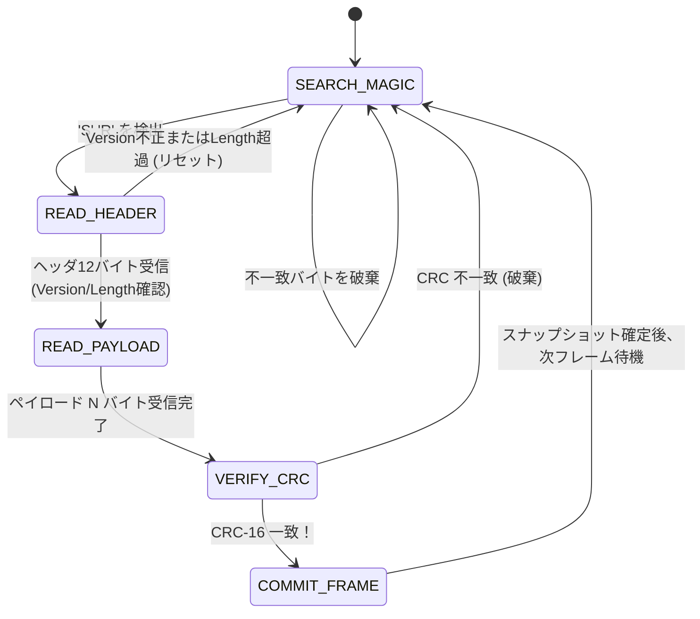

# 第5章: プロセッサ間通信プロトコル（IPC & USB CDC）

本章では、SEROVの神経系である「**CPU0–CPU1間 IPC FIFO**」、および「**ESP32-S3–CPU0間 USB CDCバイナリプロトコル**」の通信仕様、パケット構造、アトミックコミット機構、およびエラー処理について詳細に解説します。

---

## 5.1 プロセッサ間通信の全体像

SEROV内部には、物理的・論理的に異なる3系統の通信路が存在します。



1. **① USB CDC**: ESP32-S3（Device）とCPU0（Host）間のバルク転送。音響観測値および診断テレメトリの伝送。
2. **② IPC FIFO**: RA8P1の同一シリコン内部コア間通信。制御指令（CPU0→CPU1）および実機状態（CPU1→CPU0）。
3. **③ Wi-Fi UDP**: ESP32-S3から外部監視PCへの非同期テレメトリ送信（制御ループから隔離）。

---

## 5.2 CPU0–CPU1間 IPC設計

### ハードウェア仕様（FSP IPC FIFO）
- **チャネル**: Channel 0（CPU0→CPU1、CPU1→CPU0の双方向で使用）。
- **ハードウェアFIFO長**: 各方向 **4段**（32-bit/ワード）。
- **割り込み**: 送信可能割り込みおよび受信データ到着割り込み（IRQ）。

### 32-bit ワードフォーマット
パディングやアライメントによるバイト列の食い違いを防ぐため、共有構造体メモリを直接参照せず、1ワード（32-bit）ごとに **「上位8bit: メッセージID」＋「下位24bit: ペイロード」** という厳格な固定フォーマットを採用しています。

```text
 31                    24 23                                          0
+------------------------+---------------------------------------------+
|    Message ID (8 bit)  |               Payload (24 bit)              |
+------------------------+---------------------------------------------+
```

### IPCメッセージID一覧（`firmware/ra8p1/common/ipc_message.h`）

| ID (16進) | メッセージ名 | 方向 | ペイロード仕様 | 説明 |
|:---:|---|:---:|---|---|
| `0x01` | `CONTROL` | C0 → C1 | bit 0: enable (1=有効), bit 1: estop (1=緊急停止) | アクチュエータ主制御フラグ |
| `0x02` | `LEFT_TARGET_RPM` | C0 → C1 | signed 16-bit (下位16bit) | 左モータ目標回転数 [RPM] |
| `0x03` | `RIGHT_TARGET_RPM`| C0 → C1 | signed 16-bit (下位16bit) | 右モータ目標回転数 [RPM] |
| `0x04` | `FR_TARGET_DEG`   | C0 → C1 | signed 16-bit [-45 〜 +45] | 右前輪サーボ目標角度 [deg] |
| `0x06` | `FL_TARGET_DEG`   | C0 → C1 | signed 16-bit [-45 〜 +45] | 左前輪サーボ目標角度 [deg] |
| `0x07` | `RR_TARGET_DEG`   | C0 → C1 | signed 16-bit [-45 〜 +45] | 右後輪サーボ目標角度 [deg] |
| `0x08` | `RL_TARGET_DEG`   | C0 → C1 | signed 16-bit [-45 〜 +45] | 左後輪サーボ目標角度 [deg] |
| `0x05` | `SEQUENCE`        | C0 → C1 | 24-bit 単調増加カウンタ | **★ 6出力一括確定のコミットマーカー** |
| `0x81` | `STATUS_FAULT_FLAGS` | C1 → C0 | 24-bit フォールトフラグ | CPU1アクチュエータ異常状態 |
| `0x82` | `STATUS_LEFT_DUTY`   | C1 → C0 | signed 16-bit permille [-700 〜 +700] | 左モータ実出力Duty [‰] |
| `0x83` | `STATUS_RIGHT_DUTY`  | C1 → C0 | signed 16-bit permille [-700 〜 +700] | 右モータ実出力Duty [‰] |
| `0x84` | `STATUS_LEFT_RPM_X10`| C1 → C0 | signed 16-bit [0.1 RPM単位] | 左エンコーダ実測RPM×10 |
| `0x85` | `STATUS_RIGHT_RPM_X10`| C1 → C0 | signed 16-bit [0.1 RPM単位] | 右エンコーダ実測RPM×10 |
| `0x86` | `STATUS_APPLIED_SEQ` | C1 → C0 | 24-bit シーケンス番号 | CPU1が最後に適用した指令SEQ |
| `0x87` | `STATUS_SEQUENCE`    | C1 → C0 | 24-bit 単調増加カウンタ | **★ 診断スナップショットの確定マーカー** |

---

## 5.3 6出力アトミックコミット（Atomic Commit）

### なぜコミットマーカーが必要なのか？
ロボットの車輪制御において、「左モータだけ前進し、右モータの指令が届いていない」「前輪サーボだけ曲がり、後輪サーボが前回の角度のまま」といった中途半端な過渡状態でモータが出力されると、車体が不意にスピンしたり機構部に過大な負荷がかかります。

これを防ぐため、CPU1側では **「Staging（準備バッファ）」** と **「Committed（確定バッファ）」** のダブルバッファ構造を採用しています。



### 緊急停止（Emergency Stop）の例外処理
`CONTROL` メッセージで `estop = 1`（緊急停止）を受信した瞬間に限り、**残りの角度ワードや `SEQUENCE` マーカーの到着を待たずに即座にコミット** します。これにより、通信途絶や異常時における停止遅延を最小限に抑えています。

### 診断ステータスの10ms分散返送
CPU1からCPU0への状態返送も重要ですが、一度に7〜10ワードを一気にFIFOへ書き込むと、4段しかないハードウェアFIFOがあふれ（Overflow）、割り込みが滞留します。
そのため、CPU1の `task_status`（10ms周期）は、**「1回の起床につき最大1ワード」** ずつ送信します。全7語が送りきられた最後の `0x87 STATUS_SEQUENCE` をCPU0が受信した時点で、CPU0側の診断スナップショットが更新されます。

---

## 5.4 ESP32-S3–CPU0間 USB CDCバイナリプロトコル

### なぜテキスト（JSON/文字列）をUSBに流さないのか？
マイコン間の高速リンクにおいて、`printf()` 形式のテキストログやJSONを混在させると、文字列パース負荷、メモリ断片化、および改行抜けによる同期崩れが発生します。
本機では、**バイト境界が厳格に定義された固定長バイナリフレーム** を使用します。

### フレームフォーマット（`firmware/common/acoustic_protocol.h`）

```text
 0      1  2      3      4        5  6        9  10      13  14          14+N  15+N
+--------+------+------+----------+----------+-----------+------------+----------+
| Magic  | Ver  | Type | Length N | Sequence | Uptime ms | Payload    | CRC-16   |
| 'S''R' | 0x01 | 1byte| 2byte LE | 4byte LE | 4byte LE  | N bytes    | 2byte LE |
+--------+------+------+----------+----------+-----------+------------+----------+
```

| フィールド | バイト数 | 型 | 内容 |
|---|:---:|---|---|
| **Magic** | 2 | `uint8_t[2]` | 固定マジックコード `0x53, 0x52`（ASCIIの `'S'`, `'R'` = Sound Rover） |
| **Version** | 1 | `uint8_t` | プロトコルバージョン（現行: `0x01`） |
| **Type** | 1 | `uint8_t` | メッセージ種別（HELLO, OBSERVATION, HEALTH等） |
| **Length** | 2 | `uint16_t` | ペイロード長 $N$（リトルエンディアン、最大96バイト） |
| **Sequence** | 4 | `uint32_t` | 送信フレームごとにインクリメントされる通し番号 |
| **Uptime ms** | 4 | `uint32_t` | 送信側マイコンの起動後ミリ秒 |
| **Payload** | $N$ | `uint8_t[N]` | 各メッセージ固有のバイナリデータ |
| **CRC-16** | 2 | `uint16_t` | CRC-16/CCITT-FALSE（Magicを除くVersion〜Payload末尾までを計算） |

### CRC仕様
- **アルゴリズム**: CRC-16/CCITT-FALSE
- **多項式**: $x^{16} + x^{12} + x^5 + 1$ (`0x1021`)
- **初期値**: `0xFFFF`、Refin: `false`、Refout: `false`、Xorout: `0x0000`

### 主要メッセージタイプ

```text
0x01: HELLO                (ESP32-S3 -> CPU0, 起動時および1秒周期、バージョン/機能通知)
0x02: ACOUSTIC_OBSERVATION (ESP32-S3 -> CPU0, 50ms周期、DoA, VAD, 音響レベルdBFS)
0x03: HEALTH               (ESP32-S3 -> CPU0, 1秒周期、I2C/I2S/USBエラー統計)
0x04: ACOUSTIC_FEATURE     (ESP32-S3 -> CPU0, 音響イベント検知時、Log-Mel特徴量パケット)
0x20: ROVER_TELEMETRY      (CPU0 -> ESP32-S3, 250ms周期、CPU0/CPU1診断スナップショット)
```

---

## 5.5 USBストリームパーサのステートマシン

USB CDCのデータ受信では、1回のバルク転送でパケット全体が届くとは限らず、断片化（Fragment）や複数パケットの連結（Concatenation）が発生します。
CPU0の `task_acoustic_link.c` は、堅牢なストリームパーサを実装しています。



- **シーケンス番号の監視**: 過去の番号や重複番号を受信した場合は破棄し、通信の巻き戻りを防止。
- **ケーブル抜去（Detach）検知**: USBホストコントローラから切断イベント（Detach）を受けた場合、即座に保持していた音響スナップショットを「無効（Invalid）」にクリアし、ローバーを安全停止へ誘導。

---

## 5.6 まとめ

- コア間IPCはハードウェア4段FIFOを用い、固定長32-bitワードと `SEQUENCE` コミットマーカーによる6出力アトミック反映を実現。
- 緊急停止はシーケンス番号を待たずに即時コミットされるフェイルセーフ設計。
- USB通信はテキストログを排除したCRC-16付きバイナリフレームを採用し、ノイズやパケット断片化に対する高い耐性を確保。
次章では、この通信路を通じて送られる「音響信号処理・Log-Mel特徴量・エッジAI」の深層に踏み込みます。
