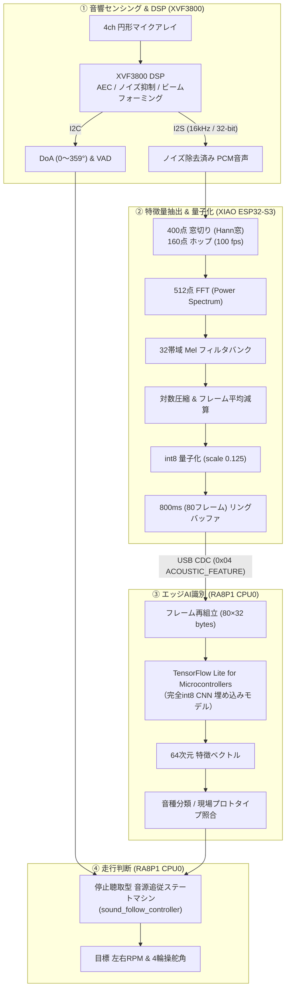
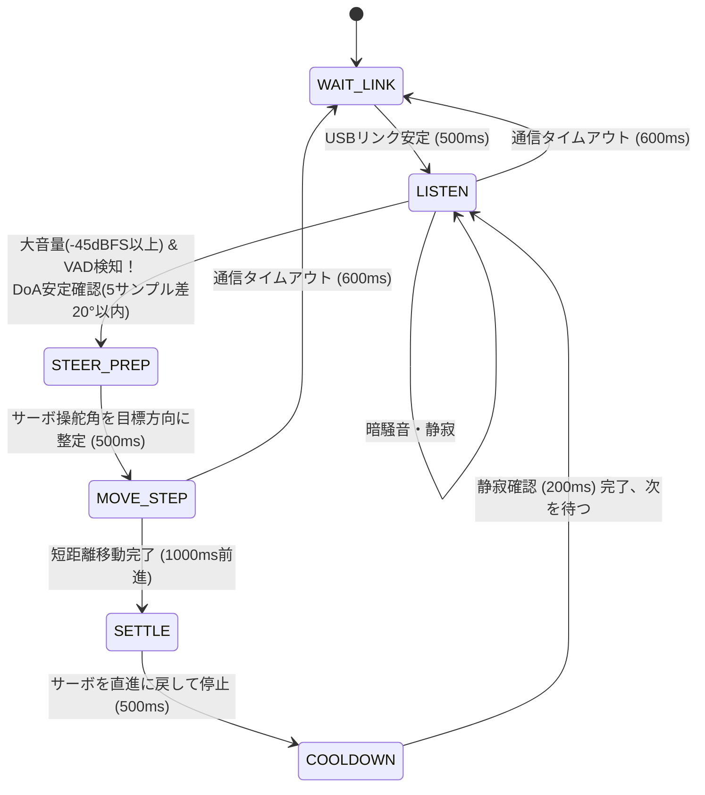

# 第6章: 音響信号処理・Log-Mel特徴量・エッジAI

本章では、SEROVの中核機能である「**音響信号処理**」と「**エッジAI（深層学習推論）**」の全パイプラインを解説します。
XVF3800によるビームフォーミング・DoA推定、ESP32-S3におけるLog-Melフィルタバンク抽出とint8量子化、CPU0のTFLM（TensorFlow Lite for Microcontrollers）ランタイム、および「停止聴取型」音源追従ステートマシンについて詳解します。

> [!TIP]
> **より優しく・深く学びたい方へ: [エッジAI特化サブ教科書（全7章）](edgeai/README.md) を新設しました！**
> 音響DSPの物理・数学、Log-Melやint8量子化の直感的例え話、TFLMの仕組み、現場学習プロトタイプ照合、および [**対話型Webシミュレータ**](edgeai/interactive_audio_pipeline.html) をステップバイステップで学べます。ぜひ併せてご活用ください。

---

## 6.1 音響パイプラインの全体アーキテクチャ

SEROVの音響探査は、物理音の集音から走行目標の生成まで、以下の多段パイプラインで処理されます。



---

## 6.2 XVF3800によるフロントエンドDSP

### マイクアレイとハードウェア機能
- **マイク構成**: 直径約60mmの円周上に配置された4基の全指向性MEMSマイク。
- **XVF3800（XMOS製）の役割**:
  - **AEC（Acoustic Echo Cancellation）**: 反射音や残響を除去。
  - **ビームフォーミング（Beamforming）**: 音が到来する特定方向の感度を上げ、周囲ノイズを空間的に抑圧。
  - **DoA（Direction of Arrival）**: 音の到達時間差（TDOA: Time Difference of Arrival）に基づき、音源の水平方位角（0°〜359°）を推定。
  - **VAD（Voice Activity Detection）**: 音声区間の有無を判定。

### I2C Resource Command によるDoA/VADの取得（`xvf3800_control.c`）
XVF3800は一般的なレジスタマップではなく、XMOS独自の「**Resource-based Command**」を用いてI2C通信を行います。
- **I2Cアドレス**: 7-bit `0x2C`
- **Resource ID 20（GPO Servicer）**: Command 18 を読出しコマンド `(18 | 0x80) = 0x92` として送信し、5バイトの応答を受信。

```text
XVF3800 応答パケット (5バイト):
[Byte 0: raw_status] [Byte 1-2: DoA uint16_t (LE)] [Byte 3-4: Speech uint16_t (LE)]
```

> [!TIP]
> **AEC Fallback機構**: 一部のXVF3800ファームウェアでは、Command 18がステータス `65` を返す場合があります。このとき `xvf3800_control.c` は、Resource ID 35（Audio Manager）の `SELECTED_AZIMUTHS`、さらにResource ID 33（AEC）の `AZIMUTH_VALUES` へ自動的にフォールバックし、常に有効なDoAを取得し続けるように設計されています。

---

## 6.3 ESP32-S3でのLog-Mel特徴量抽出（固定契約）

エッジAIモデルが音源を識別するため、ESP32-S3上でPCM波形から「**Log-Melスペクトログラム**」をリアルタイム生成します。
この処理パラメータは、AI学習環境（Python）と組み込みCファームウェアで1ビットの狂いもなく厳密に一致させる必要があります（`docs/firmware/edgeai/README.md` の固定契約）。

### 音響特徴量の固定パラメータ仕様

| 項目 | 固定契約値 | 理由・技術的背景 |
|---|---|---|
| **サンプリング周波数** | **16,000 Hz / Mono** | 人間の声や警報音の主帯域（8kHz以下）をカバーする標準周波数。 |
| **フレーム長（窓幅）** | **400 samples (25 ms)** | 音響信号の短時間定常性を保つ標準幅。 |
| **ホップサイズ（周期）**| **160 samples (10 ms)** | 毎秒100フレーム（100 fps）のストリーミング出力を実現。 |
| **窓関数** | **Periodic Hann窓** | $w[n] = 0.5 - 0.5 \cos\left(\frac{2\pi n}{400}\right)$ （周波数漏れを抑制）。 |
| **FFT点数** | **512 points (ゼロパディング)** | 400サンプルの末尾に112サンプルの0を付加し、257 bins（$31.25\text{ Hz/bin}$）を算出。 |
| **Melフィルタバンク** | **32帯域 (125 Hz 〜 8000 Hz)** | 人間の聴覚特性（メル尺度）に近似した三角フィルタバンク。 |
| **対数変換** | **自然対数 $\ln(\max(E, 10^{-12}))$** | 動的レンジの圧縮。アンダーフロー防止の下限クリップ。 |
| **レベル正規化** | **フレーム内平均減算** | 各フレームの32帯域平均対数エネルギーを引くことで、音量変動（距離減衰）を吸収。 |
| **int8量子化** | **scale = 0.125, zero_point = 0** | $[-128, 127]$ へ飽和クリップ。1フレームあたりちょうど **32 bytes**。 |
| **イベント保持窓** | **800 ms (80 frames)** | イベント検知前の300ms＋後の500ms（合計 $80 \times 32 = 2560\text{ bytes}$）。 |

### 256サンプルI2S読出しと160サンプルホップの境界処理
I2S DMAの標準バッファサイズは256サンプルですが、Log-Mel抽出のホップは160サンプルです。
`log_mel_extractor.c` は内部にリングバッファを持ち、ブロック境界をまたいでサンプルを正確に繰り越すことで、切れ目のない正確な100fpsフレーム生成を実現しています。

---

## 6.4 CPU0でのTensorFlow Lite for Microcontrollers (TFLM)

### TFLMランタイムの組込みアーキテクチャ
CPU0（Cortex-M85）側には、Googleの組込み用推論エンジン **TensorFlow Lite for Microcontrollers (TFLM)** が組み込まれています。

- **静的テンソルアリーナ (Tensor Arena)**:
  - 96 KiB の静的配列をBSSセクションに確保。ヒープ（`malloc`）を一切使わず、メモリ断片化による異常終了を防止。
- **C++17とC言語の薄い境界ラッパー (`tflm_runtime.h/.cc`)**:
  - TFLMのC++クラスインスタンスを隠蔽し、μT-KernelのCソースから呼び出せるシンプルなAPI（`tflm_runtime_init`, `tflm_runtime_invoke` 等）を提供。
- **完全int8推論**:
  - 入力 `[1, 80, 32, 1]`（80フレーム×32bin）から出力 `[1, 64]`（64次元埋め込みベクトル）まで、すべてのConv2D、DepthwiseConv2D、FullyConnected演算をint8整数演算で実行。Cortex-M85のHelium MVE（ベクトル拡張）による高速化に対応。

---

## 6.5 「停止聴取型」音源追従ステートマシン

### なぜ「走りながら」聴かないのか？
ローバーが走行している最中、6つのDCモータのギヤボックスや車輪の擦れから大きな走行ノイズが発生します。
マイクが車体最上部にあっても、マイクアレイはこの自車ノイズを捉えてしまい、DoAが自身のモータ方向に狂ってしまいます。

そこでSEROVは、**「止まって聴き、方向を決めてから一気に進む」** という **停止聴取型（Stop & Listen）** ステートマシンを採用しています（`sound_follow_controller.c`）。



### ステートごとの詳細動作
1. **`WAIT_LINK`**: USB CDCの接続と正常フレーム（HELLO/OBSERVATION）の到着を待つ待機状態。
2. **`LISTEN`（聴取中）**: モータ出力を完全停止。暗騒音を監視し、音量が閾値（例: -45 dBFS）を超え、かつVADがTrueになる音源イベントを待つ。
3. **`STEER_PREP`（操舵準備）**:
   - 音源の開始直後は反響が多いため、500ms待ってから最新5サンプルのDoAを比較。
   - 5サンプルの相互差が20°以内に収まった場合のみ「有効な音源方位」と確定。
   - 車体相対角（前0°、右正、左負）に応じて4輪サーボを逆相ステアリング角（最大45°）へ回転させ、500ms待機して機構の揺れを抑える。
4. **`MOVE_STEP`（前進ステップ）**:
   - 左右モータを駆動し、**1000 ms 間だけ短距離前進**（旋回しながら音源方向へステップ移動）。
5. **`SETTLE` & `COOLDOWN`**:
   - 移動終了後、直ちにモータを停止。サーボを直進位置（0°）へ復帰させて500ms静置。
   - さらに200ms間の静穏（quiet）を確認し、残響が収まったところで再び `LISTEN` へ移行。

---

## 6.6 まとめ

- XVF3800専用DSPにより、4chマイクの高度な空間音響フィルタリングとDoA推定を実現。
- ESP32-S3で100fpsの32帯域Log-Mel特徴量をストリーミング生成し、int8に量子化して保持。
- CPU0上のTFLMにより、低消費電力かつリアルタイムな深層学習推論基盤を構築。
- 「自車のモータノイズを聞かない」ための停止聴取型ステートマシンにより、極めて高精度な音源追従動作を担保。
次章では、ローバーのもう一つの眼である「センサ統合と自律走行アルゴリズム（ToF & IMU）」を解説します。
