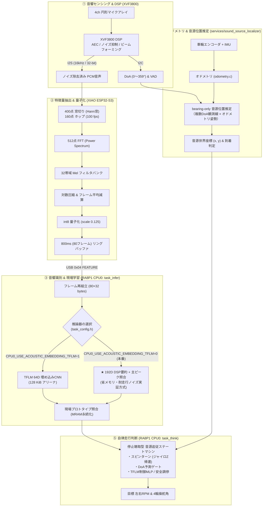
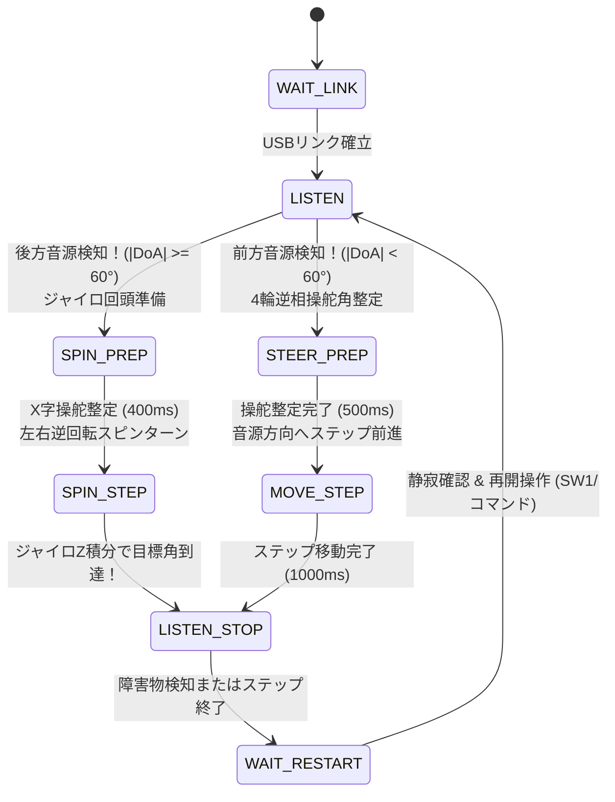

# 第6章: 音響信号処理・エッジAI・音源ナビゲーション

本章では、SEROVの中核機能である「**音響信号処理（DSP）**」、「**エッジAI（深層学習と推論）**」、およびオドメトリと融合した「**音源ナビゲーション（bearing-only位置推定）**」の全パイプラインを解説します。
XVF3800によるDoA推定、ESP32-S3でのLog-Mel特徴量抽出、TFLM音響埋め込みCNN実機検証の知見、192次元DSP要約ベースラインの優位性、および進化した停止聴取型音源追従ステートマシンについて詳解します。

> [!TIP]
> **より優しく・深く学びたい方へ: [エッジAI特化サブ教科書（全7章）](edgeai/README.md) も併せてご活用ください！**
> 音響DSPの物理・数学、Log-Melやint8量子化の直感的例え話、TFLMの仕組み、現場学習プロトタイプ照合などをステップバイステップで学べます。

---

## 6.1 音響・エッジAIパイプラインの全体アーキテクチャ

SEROVの音響探査は、物理音の集音から走行目標の生成まで、以下の多段パイプラインで処理されます。


```mermaid
flowchart TD
    subgraph SENSING["① 音響センシング & DSP (XVF3800)"]
        MIC["4ch 円形マイクアレイ"] --> DSP["XVF3800 DSP<br/>AEC / ノイズ抑制 / ビームフォーミング"]
        DSP -->|"I2C"| DOA["DoA (0〜359°) & VAD"]
        DSP -->|"I2S (16kHz / 32-bit)"| PCM["ノイズ除去済み PCM音声"]
    end

    subgraph PREPROC["② 特徴量抽出 & 量子化 (XIAO ESP32-S3)"]
        PCM --> FRAMING["400点 窓切り (Hann窓)<br/>160点 ホップ (100 fps)"]
        FRAMING --> FFT["512点 FFT (Power Spectrum)"]
        FFT --> MEL["32帯域 Mel フィルタバンク"]
        MEL --> LOG["対数圧縮 & フレーム平均減算"]
        LOG --> QUANT["int8 量子化 (scale 0.125)"]
        QUANT --> RING["800ms (80フレーム) リングバッファ"]
    end

    subgraph INFERENCE["③ 音響識別 & 現場学習 (RA8P1 CPU0: task_infer)"]
        RING -->|"USB 0x04 FEATURE"| REASSEM["フレーム再組立 (80×32 bytes)"]
        REASSEM --> ROUTE{"推論器の選択<br/>(task_config.h)"}
        ROUTE -- "CPU0_USE_ACOUSTIC_EMBEDDING_TFLM=1" --> TFLM["TFLM 64D 埋め込みCNN<br/>(128 KiB アリーナ)"]
        ROUTE -- "CPU0_USE_ACOUSTIC_EMBEDDING_TFLM=0 (本番)" --> BASE["★ 192D DSP要約 + 主ピーク照合<br/>(省メモリ・耐走行ノイズ実証方式)"]
        TFLM --> MATCH["現場プロトタイプ照合 (MRAM永続化)"]
        BASE --> MATCH
    end

    subgraph LOCALIZATION["④ オドメトリ & 音源位置推定 (services/sound_source_localizer)"]
        DOA --> SSL["bearing-only 音源位置推定<br/>（複数DoA観測線 × オドメトリ姿勢）"]
        ENC["車輪エンコーダ + IMU"] --> ODOM["オドメトリ (odometry.c)"]
        ODOM --> SSL
        SSL --> NAV["音源世界座標 (x, y) & 到着判定"]
    end

    subgraph CONTROL["⑤ 自律走行判断 (RA8P1 CPU0: task_think)"]
        MATCH --> SFSM["停止聴取型 音源追従ステートマシン<br/>・スピンターン (ジャイロZ帰還)<br/>・DoA予測ゲート<br/>・TFLM制御MLP / 安全調停"]
        NAV --> SFSM
        SFSM --> TARGET["目標 左右RPM & 4輪操舵角"]
    end
```

---

## 6.2 XVF3800によるフロントエンドDSP

### マイクアレイとハードウェア機能
- **マイク構成**: 直径約60mmの円周上に配置された4基の全指向性MEMSマイク。
- **XVF3800（XMOS製）の役割**:
  - **AEC（Acoustic Echo Cancellation）**: 反射音や残響を除去。
  - **ビームフォーミング（Beamforming）**: 音が到来する特定方向の感度を上げ、周囲ノイズを空間的に抑圧。
  - **DoA（Direction of Arrival）**: 音の到達時間差（TDOA: Time Difference of Arrival）に基づき、音源の水平方位角（0°〜359°）を推定。
  - **VAD（Voice Activity Detection）**: 音声区間の有無を判定。

### I2C Resource Command によるDoA/VADの取得（`xvf3800_control.c`）
XVF3800は一般的なレジスタマップではなく、XMOS独自の「**Resource-based Command**」を用いてI2C通信を行います。
- **I2Cアドレス**: 7-bit `0x2C`
- **Resource ID 20（GPO Servicer）**: Command 18 を読出しコマンド `(18 | 0x80) = 0x92` として送信し、5バイトの応答を受信。

```text
XVF3800 応答パケット (5バイト):
[Byte 0: raw_status] [Byte 1-2: DoA uint16_t (LE)] [Byte 3-4: Speech uint16_t (LE)]
```

> [!TIP]
> **AEC Fallback機構**: 一部のXVF3800ファームウェアでは、Command 18がステータス `65` を返す場合があります。このとき `xvf3800_control.c` は、Resource ID 35（Audio Manager）の `SELECTED_AZIMUTHS`、さらにResource ID 33（AEC）の `AZIMUTH_VALUES` へ自動的にフォールバックし、常に有効なDoAを取得し続けるように設計されています。

---

## 6.3 ESP32-S3でのLog-Mel特徴量抽出（固定契約）

エッジAIモデルが音源を識別するため、ESP32-S3上でPCM波形から「**Log-Melスペクトログラム**」をリアルタイム生成します。
この処理パラメータは、AI学習環境（Python）と組み込みCファームウェアで1ビットの狂いもなく厳密に一致させる必要があります。

### 音響特徴量の固定パラメータ仕様

| 項目 | 固定契約値 | 理由・技術的背景 |
|---|---|---|
| **サンプリング周波数** | **16,000 Hz / Mono** | 人間の声や警報音の主帯域（8kHz以下）をカバーする標準周波数。 |
| **フレーム長（窓幅）** | **400 samples (25 ms)** | 音響信号の短時間定常性を保つ標準幅。 |
| **ホップサイズ（周期）**| **160 samples (10 ms)** | 毎秒100フレーム（100 fps）のストリーミング出力を実現。 |
| **窓関数** | **Periodic Hann窓** | $w[n] = 0.5 - 0.5 \cos\left(\frac{2\pi n}{400}\right)$ （周波数漏れを抑制）。 |
| **FFT点数** | **512 points (ゼロパディング)** | 400サンプルの末尾に112サンプルの0を付加し、257 bins（$31.25\text{ Hz/bin}$）を算出。 |
| **Melフィルタバンク** | **32帯域 (125 Hz 〜 8000 Hz)** | 人間の聴覚特性（メル尺度）に近似した三角フィルタバンク。 |
| **対数変換** | **自然対数 $\ln(\max(E, 10^{-12}))$** | 動的レンジの圧縮。アンダーフロー防止の下限クリップ。 |
| **レベル正規化** | **フレーム内平均減算** | 各フレームの32帯域平均対数エネルギーを引くことで、音量変動（距離減衰）を吸収。 |
| **int8量子化** | **scale = 0.125, zero_point = 0** | $[-128, 127]$ へ飽和クリップ。1フレームあたりちょうど **32 bytes**。 |
| **イベント保持窓** | **800 ms (80 frames)** | イベント検知前の300ms＋後の500ms（合計 $80 \times 32 = 2560\text{ bytes}$）。 |

---

## 6.4 音響TFLM実機検証の知見とベースライン方式の確立

### 実機検証の背景（2026-09-26実証完了）
走行中のモータノイズや室内反響下での識別頑健性を高める目的で、**TFLMによる64次元音響埋め込みCNN** をRA8P1 CPU0へ組み込み、現場学習（Few-shot学習）と自律走行判定の実証実験を行いました。
その結果、組込み深層学習の運用において極めて重要な知見が得られました（`docs/firmware/validation/ACOUSTIC_TFLM_INTEGRATION_FINDINGS.md`）。

### 判明した4大課題と得られた知見

1. **TFLM 演算子（Resolver）の肥大化とCleanグラフの鉄則**:
   - Kerasモデル変換時、L2正規化レイヤ等により7つの暗黙演算子（`DEQUANTIZE`, `SQUARE`, `QUANTIZE`, `SUM`, `RSQRT`, `MINIMUM`, `MUL`）が混入し、未登録Opエラーで初期化失敗。
   - **知見**: マイコン向けNNではグラフ内で複雑な正規化を行わず、標準Op（`Conv2D`, `DepthwiseConv2D`, `MaxPool2D`, `FullyConnected`, `ReLU6`）のみに絞り、L2正規化等はC言語側で行うのが鉄則。
2. **テンソルアリーナの境界（112 KiB 〜 128 KiB）**:
   - 入力 $80 \times 32$ パッチの畳み込みでは第1層特徴マップ等でアリーナを大きく消費し、最低 **114,688 バイト（約112 KiB）**、安全マージン込みで **128 KiB** が必須と判明。
3. **現場音とオープンデータセットのドメインギャップ**:
   - ESC-50等でMetric LearningしたNN埋め込みは、実機のDCモータ駆動ノイズ・ギア噛み合い音・床面反響下で分離マージンが不足し、**1時間あたり約220回の偽陽性（誤検知）** が発生。

### 実機本番における「192次元DSP要約照合」の圧倒的優位性
この検証結果を受け、本番ファームウェアでは **従来の「192次元DSP要約 ＋ 主ピーク周波数bin制約」ベースラインを本採用**（`CPU0_USE_ACOUSTIC_EMBEDDING_TFLM = 0`）としました。

- **192次元DSP要約の仕組み**:
  - 80フレームの前半40フレーム（300ms前〜100ms後）と後半40フレーム（100ms〜500ms後）の2スロットに分割。
  - 各スロットで32帯域の「平均値(32)」「最大値(32)」「標準偏差(32)」を算出（$32 \times 3 \times 2 = 192$ 次元）。
- **物理周波数制約**:
  - 目的音（鳴子・救助笛）の基本周波数ピークbin（例: bin 28〜29、約2.0 kHz）を物理量として検証。指定帯域外のノイズを100%確実に排除。
- **効果**:
  - 誤検知ゼロの極めて安定した音源追従を達成。
  - RAM消費は数百バイト、推論遅延は 1 ms 未満。
  - CPU0のROMを約 82 KB、RAM（BSS）を約 134 KB 削減し、システムのリアルタイム応答性を最大化。

---

## 6.5 進化した「停止聴取型」音源ナビゲーション

### なぜ「走りながら」聴かないのか？
走行中は6つのDCモータやギアボックスから大きな走行ノイズが発生し、車体上のマイクアレイが自身のモータ音を捉えてDoAが狂ってしまいます。
そのため、SEROVは **「止まって聴き、方向を定めてから一気に移動する」** という停止聴取型（Stop & Listen）を貫いています。

さらに最新のファームウェアでは、**その場スピンターン** と **オドメトリ統合の音源位置推定** が追加され、自律ナビゲーション能力が飛躍的に進化しました。


```mermaid
stateDiagram-v2
    [*] --> WAIT_LINK
    WAIT_LINK --> LISTEN: USBリンク確立
    
    LISTEN --> SPIN_PREP: 後方音源検知！(|DoA| >= 60°)<br/>ジャイロ回頭準備
    LISTEN --> STEER_PREP: 前方音源検知！(|DoA| < 60°)<br/>4輪逆相操舵角整定
    
    SPIN_PREP --> SPIN_STEP: X字操舵整定 (400ms)<br/>左右逆回転スピンターン
    SPIN_STEP --> LISTEN_STOP: ジャイロZ積分で目標角到達！
    
    STEER_PREP --> MOVE_STEP: 操舵整定完了 (500ms)<br/>音源方向へステップ前進
    MOVE_STEP --> LISTEN_STOP: ステップ移動完了 (1000ms)
    
    LISTEN_STOP --> WAIT_RESTART: 障害物検知またはステップ終了
    WAIT_RESTART --> LISTEN: 静寂確認 & 再開操作 (SW1/コマンド)
```

### 最新音源追従の5大進化

1. **ジャイロZ軸帰還スピンターン（`SPIN_PREP` / `SPIN_STEP`）**:
   - 後方（$|\theta| \ge 60^\circ$）から目的音が聞こえた場合、大回りの前進旋回ではなく、4輪をX字（内向き $45^\circ$）に向けて左右モータを逆回転させる **低速最小並進回頭** を実行。
   - BMI270のジャイロZ軸（ヨーレート）を実時間積分し、目標角度に達した瞬間に正確に停止。
2. **bearing-only 音源位置推定（`sound_source_localizer.c`）**:
   - 複数地点で観測したDoA方位線と、車輪エンコーダ＋IMUによるオドメトリ（`odometry.c`）を組み合わせ、最小二乗法により世界座標系上の **音源位置 $(x, y)$ と直線距離** を推定。
   - 方位線の交差角（`crossing_deg`）と観測基線長（`baseline_mm`）、残差RMS（`residual_rms_mm`）を評価し、幾何学的に信頼できる場合のみ目標位置を更新。
   - 推定音源までの距離が接近閾値（例: 500 mm）を下回り、複数回確認されると **「到着（ARRIVED）」** と判定。
3. **移動中DoA予測ゲートと極性整合**:
   - 移動中は車体の回頭量から音源の相対方位を予測し、予測から $35^\circ$ 以上乖離した外れ値DoA（壁の反射音など）を自動でフィルタリング。
   - 車体全周（$0^\circ \sim 359^\circ$）のDoA極性を「右正・左負」の車体座標系へ厳密に統一。
4. **VAD非依存の音響トリガ判定（打音・鳴子対応）**:
   - 従来の判定ではXVF3800のVAD（音声区間検出）を必須としていましたが、鳴子などの打音や短い立ち上がり音ではVADが成立しない・持続しないケースが実機検証で確認されました。
   - そのため、最新ファームウェア（`task_think.c`）ではVADへの依存を排し、**音種識別器による見本一致（`TARGET`）＋DoA信頼度＋音量閾値（dBFS）** を主軸に判定を行うよう刷新され、短い打音や非音声ターゲットに対する見逃しを解消しました。
5. **正面不感帯と連続操舵変換（`sound_follow_steering_from_doa`）**:
   - 正面付近の音源方位の微小な揺れによる過敏な操舵振動を防ぐため、正面 $\pm 30^\circ$ を直進許容幅（`CPU0_SOUND_FRONT_TOLERANCE_DEG = 30`）に設定。
   - 許容幅の外側でも、操舵角をステップ状に跳ね上げず $0^\circ$ から連続的に立ち上げることで、急操舵によるスリップを防ぎ、滑らかで安定した直進追従を実現。

---

## 6.6 まとめ

- XVF3800 DSPとESP32-S3 Log-Mel抽出により、固定契約に基づいた高品質な音響特徴量を生成。
- TFLM音響埋め込みCNN実機検証を通じて組込み深層学習の限界と知見（アリーナ容量・未解決Op・走行ノイズ過適合）を解明。
- 実機本番ファームウェアでは、耐ノイズ性と省リソース性に圧倒的に優れた **192次元DSP要約照合ベースライン** を採用。
- ジャイロ帰還スピンターンとbearing-only音源位置推定により、後方音源への迅速な回頭と高精度な音源到達判定を実現。
次章では、これらを支える「センサ統合とTFLM制御MLPによる障害物回避」を学びます。
