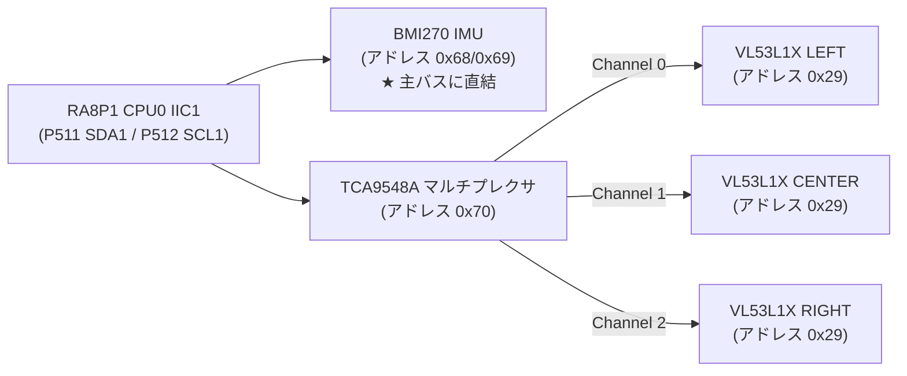
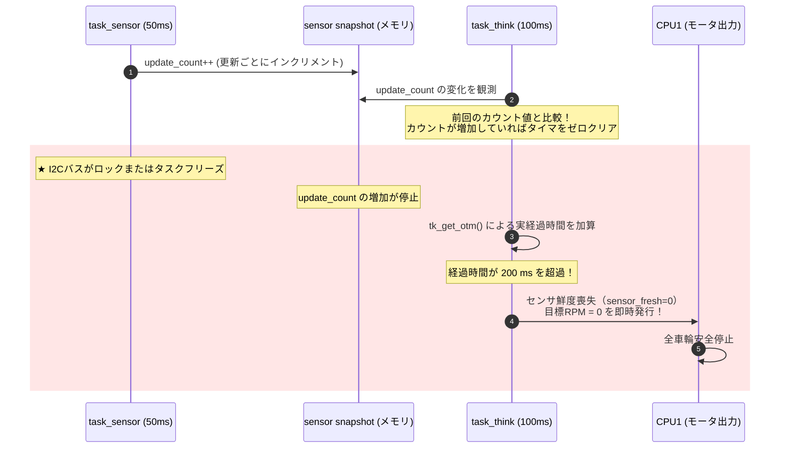

# 第7章: センサ統合と自律走行アルゴリズム

本章では、SEROVが音源に向かって走行する際の「目と平衡感覚」となるI2Cセンサ群（VL53L1X ToF測距センサ × 3、BMI270 6軸IMU、TCA9548A マルチプレクサ）、`sensor_hub` サービス層、ルールベース障害物回避アルゴリズム、および実機検証された「センサ生存性監視（Liveness Watchdog）」について詳解します。

---

## 7.1 センサ配置と幾何学的設計

前方障害物を死角なく検知するため、3台のST製 ToF（Time-of-Flight）光測距センサ **VL53L1X** と、車体中央にBosch製 6軸IMU **BMI270** を配置しています。

```text
               前方 (+y)
                  ▲
                  │   [CENTER ToF] (0, 0) mm, 0°
                  │        │
  [LEFT ToF] ◀────┼────────┼────▶ [RIGHT ToF]
(-90, +94) mm     │        │      (+90, +94) mm
  -45°            │        │        +45°
                  │   [BMI270 IMU]
                  │   車体重心付近
                  └──────────────────▶ 右方向 (+x)
```

### ToFセンサの配置幾何
- **LEFT**: 車体中心から $(-90, +94)\text{ mm}$、左前方 $-45^\circ$
- **CENTER**: 車体中心から $(0, 0)\text{ mm}$、正面直進方向 $0^\circ$
- **RIGHT**: 車体中心から $(+90, +94)\text{ mm}$、右前方 $+45^\circ$
- **光学コーン（FoV）の重なり**:
  - VL53L1Xの名目視野角（FoV）は約 $27^\circ$ です。
  - 計算上、隣接するビームが接触する距離は約 **234.4 mm** であり、危険停止距離である **250 mm** においては隣接ビーム間に約 **7.47 mm** の重なり（オーバーラップ）が生まれます。これにより、正面の細い柱や壁の角をすり抜けて衝突する「死角」を完全に排除しています。

---

## 7.2 I2CバスアーキテクチャとTCA9548Aの役割

### アドレス衝突の解決（I2Cマルチプレクサ）
VL53L1Xは工場出荷時の7-bit I2Cアドレスが固定で `0x29` です。3台を同一のI2Cバスに接続するとアドレスが衝突し通信できません。
そこで、I2Cマルチプレクサ（**TCA9548A**、アドレス `0x70`）を介してチャンネルを物理的に切り替えています。



- **BMI270の直結**: アドレスが異なる（`0x68` または `0x69`）ため、TCA9548Aを通さず主バスに直結。これにより、ToFの多重切り替え中であっても即座にIMUデータを取得可能。
- **バス速度**: Fast-mode（400 kbit/s）。

---

## 7.3 `sensor_hub` サービス層の責務

`firmware/ra8p1/SoundExplorationRover_CPU0/src/services/sensor_hub.c` は、個別のセンサドライバと上位の走行タスクの間で、以下の抽象化を行います。

1. **チャンネル切り替えの隠蔽**:
   - `sensor_hub` がTCA9548Aにチャンネル番号（CH0/1/2）を指示してから各ToFドライバを呼び出します。各ToFドライバ自身は、自分が何番ポートに接続されているかを知る必要がありません。
2. **測定値の平滑化（3:1 IIRフィルタ）**:
   - ToFの微小なノイズによる走行のバタつきを抑えるため、前回値と今回値を $3:1$ の比率でローパス平滑化します。
     $$d_{\text{filtered}} = \frac{3 \cdot d_{\text{prev}} + 1 \cdot d_{\text{raw}}}{4}$$
3. **健全性フラグ（`valid_flags`）の管理**:
   - 各センサが正常に通信できているかをビットマップで管理します。
     - `0x01`: LEFT 有効
     - `0x02`: CENTER 有効
     - `0x04`: RIGHT 有効
     - `0x08`: BMI270 有効
     - `0x0F`: **全センサ正常（自律走行許可条件）**

---

## 7.4 ルールベース障害物回避アルゴリズム

`obstacle_avoidance_controller.c` は、50ms周期で更新されるセンサスナップショットを評価し、安全第一の走行指示を決定します。

### 障害物回避のルールテーブル

| 条件 | 判定ルール | 操舵角 | モータ速度指令 | 車体動作 |
|---|---|:---:|---|---|
| 全センサ正常 ＆ $d_{\text{center}} > 1000\text{ mm}$ | `CLEAR_FORWARD` | 0° | 左右 55 RPM | 直進高速巡航 |
| $650\text{ mm} < d_{\text{center}} \le 1000\text{ mm}$ | `DECEL_FORWARD` | 0° | 左右 35 RPM | 減速直進 |
| $d_{\text{center}} \le 650\text{ mm}$ または $(d_{\text{left}} \le 450 \lor d_{\text{right}} \le 450)$ | `AVOID_OBSTACLE` | ±35° | 外輪 45 RPM<br/>内輪 25 RPM | 広い方向へ滑らかに旋回回避 |
| **$d_{\text{center}} \le 250\text{ mm}$** | `STOP_FRONT` | — | 左右 0 RPM | **至近距離緊急停止** |
| **$d_{\text{left}}, d_{\text{center}}, d_{\text{right}}$ 全て $\le 350\text{ mm}$** | `STOP_TRAPPED` | — | 左右 0 RPM | **行き止まり停止** |
| センサ異常（`valid_flags != 0x0F`） | `SENSOR_SAFE_STOP` | — | 左右 0 RPM | **安全停止** |
| IMU閾値超過（傾き・衝撃・横転） | `SENSOR_IMU_STOP` | — | 左右 0 RPM | **姿勢異常停止** |

> [!IMPORTANT]
> **なぜ「自律後退（バック）」をしないのか？**
> 現行のSEROVには後方ToFセンサが搭載されていません。障害物に囲まれた際に自律的に後退すると、見えない後方の障害物や落下段差に激突する二次事故を引き起こします。そのため、本システムでは「回避できなければ安全にその場で停止する」ことを鉄則としています。

### IMUによる姿勢・衝撃保護（`SENSOR_IMU_STOP`）
BMI270の加速度・角速度が以下の限界値を超えた場合、車体が横転・スタック・衝突したとみなし、即時出力を停止します。
- **過大傾斜**: X軸またはY軸の重力加速度成分が絶対値 **700 mg** 超（急傾斜での転倒防止）。
- **衝突衝撃**: 3軸合成加速度が **2400 mg** 超。
- **異常角速度**: いずれかの軸で **200.0 dps（度/秒）** 超（車体の急激な滑りや落下）。

---

## 7.5 センサ生存性監視（Sensor Liveness Watchdog）

### 発見された重大な潜在不具合
開発初期、ある重大な問題が特定されました。
「I2C通信がハングアップして `task_sensor` が停止した場合、公開メモリ上の直前のセンサスナップショット（`age_ms = 0`, `valid_flags = 0x0F`）がそのまま凍結し、**思考タスク（`task_think`）が『障害物なし・センサ正常』と誤認して壁に向かって走り続ける**」という不具合です。

### 独立生存性監視の実装
この問題に対し、`task_think` 側に **センサ非依存の独立ウォッチドッグ機構**（`control/sensor_liveness.h`）が導入されました。



- **実時間ベースの判定**: タスク周期のループ回数ではなく、`tk_get_otm()` によるOS実時刻で監視。
- **200 ms タイムアウト**: センサ更新が4回分（200ms）滞留した時点で、スナップショットの値がどれだけ安全を示していても強制停止。
- **実機検証の完了**: Live Watch変数 `g_task_sensor_test_pause = 1` を注入してセンサタスクを意図的に一時停止させ、走行中のローバーが200ms以内に確実に自動停止し、`test_pause = 0` に戻すと自動復帰することを確認済みです。

---

## 7.6 まとめ

- 前方3眼ToFの配置幾何学（27° FoV, 250mmオーバーラップ）により、正面の死角を完全排除。
- TCA9548Aと `sensor_hub` により、アドレス重複を透過的に解決し、3:1 IIRフィルタで測定値を安定化。
- ルールベース自律走行により、後方衝突リスクを排除した確実な回避・停止動作を実現。
- 独立ウォッチドッグによる「200msセンサ生存性監視」により、万が一のI2Cフリーズ時にも暴走を未然に防止。
次章では、これら複雑なシステムをPC上から監視・シミュレーション・検証する「ソフトウェアエコシステム」を学びます。
