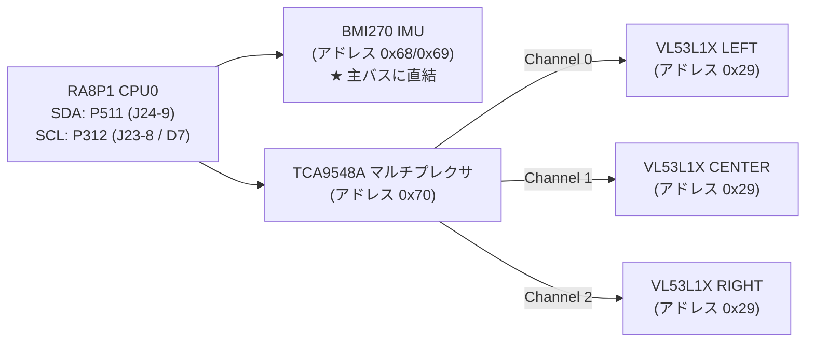
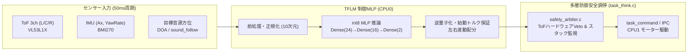
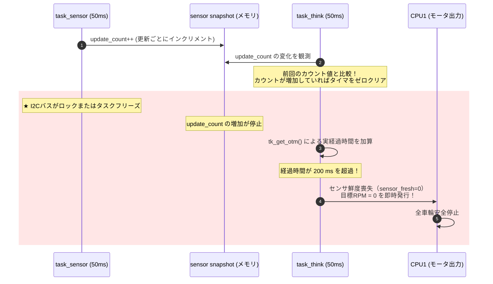

# 第7章: センサ統合・TFLM制御MLP・多層防御自律走行

本章では、SEROVが音源に向かって走行する際の「目と平衡感覚」となるI2Cセンサ群（VL53L1X ToF測距センサ × 3、BMI270 6軸IMU、TCA9548A マルチプレクサ）、`sensor_hub` サービス層、エッジ深層学習を活用した **TFLM障害物回避制御MLP（Policy Distillation）**、および5層の **多層防御安全アーキテクチャ** について詳解します。

---

## 7.1 センサ配置と幾何学的設計

前方障害物を検知するため、3台のST製 ToF（Time-of-Flight）光測距センサ **VL53L1X** と、車体中央にBosch製 6軸IMU **BMI270** を配置しています。

```text
               前方 (+y)
                  ▲
                  │   [CENTER ToF] (0, +94) mm, 0°
                  │        │
  [LEFT ToF] ▲    │        │    ▲ [RIGHT ToF]
(-90, +94) mm     │        │      (+90, +94) mm
  0°              │        │          0°
                  │   [BMI270 IMU]
                  │   車体重心付近
                  └──────────────────▶ 右方向 (+x)
```

### ToFセンサの配置幾何
- **LEFT**: 車体中心から $(-90, +94)\text{ mm}$、正面 $0^\circ$
- **CENTER**: 車体中心から $(0, +94)\text{ mm}$、正面直進方向 $0^\circ$
- **RIGHT**: 車体中心から $(+90, +94)\text{ mm}$、正面 $0^\circ$
- **実機取付の注意点**: 3台とも正面を向いています。左右光軸の間隔（180 mm）があるため、側方通路や車体側面、細いポール等を常に捉えられるわけではありません。死角が存在することを前提とした安全設計が必要です。

---

## 7.2 I2Cバスアーキテクチャとハードウェア移設

### アドレス衝突の解決（I2Cマルチプレクサ）
VL53L1Xは工場出荷時の7-bit I2Cアドレスが固定で `0x29` です。3台を同一のI2Cバスに接続するとアドレスが衝突し通信できません。
そこで、I2Cマルチプレクサ（**TCA9548A**、アドレス `0x70`）を介してチャンネルを物理的に切り替えています。


```mermaid
flowchart LR
    C0["RA8P1 CPU0<br/>SDA: P511 (J24-9)<br/>SCL: P312 (J23-8 / D7)"] --> BMI["BMI270 IMU<br/>(アドレス 0x68/0x69)<br/>★ 主バスに直結"]
    C0 --> TCA["TCA9548A マルチプレクサ<br/>(アドレス 0x70)"]
    
    TCA -->|Channel 0| TOF_L["VL53L1X LEFT<br/>(アドレス 0x29)"]
    TCA -->|Channel 1| TOF_C["VL53L1X CENTER<br/>(アドレス 0x29)"]
    TCA -->|Channel 2| TOF_R["VL53L1X RIGHT<br/>(アドレス 0x29)"]
```

### SCL端子のハードウェア破損対策（P312 / D7 への移設）
実機開発の過程で、Arduino標準のSCL端子 `J24-10 (P512)` においてマイコン内部の173 $\Omega$ 短絡（ハードウェア端子破損）が確認されました。
そのため、ファームウェアではSCL信号を健全な予備端子 **Arduino J23-8 (P312 / D7)** へ移設し、高信頼性GPIO I2Cドライバ（`firmware/ra8p1/SoundExplorationRover_CPU0/src/platform/i2c_bus.c`）によって安定駆動しています。

---

## 7.3 `sensor_hub` サービス層の責務

`firmware/ra8p1/SoundExplorationRover_CPU0/src/services/sensor_hub.c` は、個別のセンサドライバと上位の走行タスクの間で、以下の抽象化を行います。

1. **チャンネル切り替えの隠蔽**:
   - `sensor_hub` がTCA9548Aにチャンネル番号（CH0/1/2）を指示してから各ToFドライバを呼び出します。各ToFドライバ自身は、自分が何番ポートに接続されているかを知る必要がありません。
2. **測定値の平滑化（3:1 IIRフィルタ）**:
   - ToFの微小なノイズによる走行のバタつきを抑えるため、前回値と今回値を $3:1$ の比率でローパス平滑化します。
     $$d_{\text{filtered}} = \frac{3 \cdot d_{\text{prev}} + 1 \cdot d_{\text{raw}}}{4}$$
3. **健全性フラグ（`valid_flags`）の管理**:
   - 各センサが正常に通信できているかをビットマップで管理します。
     - `0x01`: LEFT 有効
     - `0x02`: CENTER 有効
     - `0x04`: RIGHT 有効
     - `0x08`: BMI270 有効
     - `0x0F`: **全センサ正常（自律走行許可条件）**

---

## 7.4 TFLM 障害物回避制御 MLP（Policy Distillation）

SEROVは、従来の幾何学ルールベース制御に加え、**TFLM（TensorFlow Lite for Microcontrollers）** と **96 KiB 静的テンソルアリーナ** を活用する **完全int8量子化制御MLP** を搭載しています（`firmware/ra8p1/SoundExplorationRover_CPU0/src/control/control_mlp_planner.c`）。


```mermaid
graph LR
    subgraph Sensors ["センサー入力 (50ms周期)"]
        TOF["ToF 3ch (L/C/R)<br/>VL53L1X"]
        IMU["IMU (Ax, YawRate)<br/>BMI270"]
        GOAL["目標音源方位<br/>DOA / sound_follow"]
    end

    subgraph MLP ["TFLM 制御MLP (CPU0)"]
        PRE["前処理・正規化 (10次元)"]
        TFLM_CORE["int8 MLP 推論<br/>Dense(24)→Dense(16)→Dense(2)"]
        POST["逆量子化・始動トルク保証<br/>左右差動配分"]
    end

    subgraph Safety ["多層防御安全調停 (task_think.c)"]
        ARBITER["safety_arbiter.c<br/>ToFハードウェアVeto & スタック監視"]
        CMD["task_command / IPC<br/>CPU1 モーター駆動"]
    end

    Sensors --> PRE
    PRE --> TFLM_CORE
    TFLM_CORE --> POST
    POST --> ARBITER
    ARBITER --> CMD
```

### 制御MLPアーキテクチャ仕様

| 項目 | 仕様 | 備考 |
|---|---|---|
| **入力特徴量（10次元）** | ToF正規化距離 3ch ($0 \sim 4000\text{ mm} \rightarrow [0, 1]$)<br>ToF有効フラグ 3ch ($\{0, 1\}$)<br>目標方位角 $\sin(\theta_{\text{goal}}), \cos(\theta_{\text{goal}})$ ($[-1, 1]$)<br>直前ステップ速度スケール ($[0, 1]$)<br>IMUヨーレート ($[-50, +50]\text{ dps} \rightarrow [-1, 1]$) | センサと音源目標を統合した10次元ベクトル |
| **ネットワーク構造** | `Dense(24, ReLU) -> Dense(16, ReLU) -> Dense(2)` | 超軽量3層MLP |
| **出力（2次元）** | `steer_norm`: $[-1.0, 1.0] \rightarrow [-45^\circ, +45^\circ]$<br>`speed_scale`: $[0.0, 1.0]$ | 操舵角と前進速度スケーリング |
| **量子化形式** | 完全 `int8` 量子化 | 重み・バイアス・活性化すべてint8 |
| **モデルサイズ** | **3,880 バイト**（フラットバッファ形式） | `control_mlp_model.h` に静的展開 |
| **切替スイッチ** | `CPU0_USE_CONTROL_MLP`（`1`: MLP有効, `0`: 従来ルール） | `config/control_config.h` |

### 実機適応メカニズム（不感帯補正と左右差動配分）
1. **始動トルク保証（不感帯回避）**:
   - 実機のDCモータ・ギアボックス・床面摩擦の特性上、PWM Dutyが16%（約60 RPM）以下になると静止摩擦に負けて車輪が始動できません。
   - これを防ぐため、MLP出力の速度スケールを **85 〜 120 RPM（Duty 22.6% 〜 32.0%）** の範囲にマッピングし、始動トルクを常に確保します。
2. **旋回時の左右差動配分（外輪増速・内輪下限ガード）**:
   - 大舵角時に内輪が失速するのを防ぐため、内輪を最低85 RPMにガードし、外輪を最大130 RPMまで増速して滑らかな旋回をアシストします。
3. **オープンスペース不感帯（Open-space Deadband）**:
   - int8量子化の微小な丸め誤差（1〜2 LSB）による直進ドリフトを防ぐため、前方クリアランス $\ge 850\text{ mm}$ かつ目標方位 $\approx 0^\circ$ のときは操舵角を強制的に $0^\circ$ に固定します。

---

## 7.5 5層の多層防御安全アーキテクチャ

ニューラルネットワーク制御下においても、ロボットの物理的衝突や暴走を数学的・構造的に防止するため、5層の保護レイヤーを構築しています。

| レベル | 担当コンポーネント | 動作と保護内容 |
|---|---|---|
| **Level 1 (最上位)** | `safety_arbiter.c` | いずれかの有効 ToF $\le 250\,\text{mm}$、センサ途絶（タイムアウト）、または異常検知時にモータ出力を物理遮断・即時緊急停止（**Hardware Veto**） |
| **Level 2** | ルールベース・エスケープ | 至近障害物や袋小路に遭遇した場合（`rule >= 3`）、MLPをバイパスしてX字操舵による確定的なピボット回頭を実行 |
| **Level 3** | 回避側ラッチ・最低操舵ガード | 正面 900 mm 以内では広い側を保持し、操舵角が $28^\circ \sim 42^\circ$ 未満へ弱まらないよう下限を制約 |
| **Level 4** | TFLM 制御 MLP | 通常走行域で音源目標方位への滑らかな連続軌道追従を行う |
| **Level 5** | スルーレートリミッタ | 1制御周期（100ms）あたりの最大舵角変化量を $9.0^\circ$（最大 $90^\circ/\text{s}$）に制限し、急旋回による車輪スリップや転倒を防止 |

---

## 7.6 実機検証に基づくトラブル回避知見

### 1. 片輪スタック脱出ロジック（2026-09-24実機知見）
壁際を旋回中に片輪が壁や障害物に乗り上げて空転・停止した場合、左右平均速度を見る従来のスタック検出では見逃してしまいます。
最新ファームウェアでは、**CPU1から返送される左右の実測RPM** を監視し：
- 片輪のみが 20 RPM 以下で、反対輪が 30 RPM 以上である状態が 700 ms 継続
- または側面 380 mm 以内で左右実測が2倍以上乖離した状態が 400 ms 継続
した瞬間に、上限付きの直進後退と再旋回（`SENSOR_BACKUP`）を自律発動して安全に脱出します。

### 2. 障害物回避完了後の停止・再聴取シーケンス（`WAIT_RESTART`）
障害物を回避した直後は、モータノイズで音源位置が不確かな状態です。
回避動作が完了した後は、無条件に走り続けず **その場で一旦停止（`LISTEN_STOP`）して周囲の音を再聴取（`LISTEN`）** し、目標音源の方向を再確認してから追従を再開します。

### 3. 音源側側方クリアランス不足時の短距離後退（側面接触防止）
旋回回避を開始する際、音源が存在する側の側方距離が接触限界（`CPU0_SENSOR_ESCAPE_SIDE_MM` = 200 mm）未満の場合、音源と反対側へ旋回してしまうと目的音源を完全に見失うリスクがあります。
そのため、最新の障害物回避制御（`obstacle_avoidance_controller.c`）では、音源側の側方クリアランスが不足している場合は旋回を急がず、**先に短距離後退（`obstacle_avoidance_start_backup`）を行って目標方向に十分な旋回空間を確保してから回避旋回へ移る** シーケンスを導入しました。

### 4. 実機走行ログに基づく操舵サーボ極性と正面不感帯の是正
実機走行試験において、通常右操舵（+45°）時に左右輪が正回転しているにもかかわらず、ジャイロZ軸が正（左旋回）を示す極性逆転が判明しました。
そのため、**通常走行時の操舵極性（`CPU0_STEERING_SERVO_OUTPUT_SIGN = 1`）** と、**検証済みのX字その場旋回極性（`CPU0_SOUND_SPIN_SERVO_OUTPUT_SIGN = -1`）** を独立パラメータとして分離・是正しました。
あわせて、音源が正面付近にあるときの過敏な首振り操舵を防止するため、**正面±30°の不感帯（`CPU0_SOUND_FRONT_TOLERANCE_DEG = 30`）** を設け、許容幅を超えた領域から操舵角を0度から連続的・滑らかに増加させる変換器（`sound_follow_steering_from_doa`）を導入しました。

---

## 7.7 センサ生存性監視（Sensor Liveness Watchdog）

`task_sensor` がI2Cハングアップ等で停止した場合、公開メモリ上の直前値（安全値）が凍結して壁へ激突する重大な事故を防ぐため、`task_think` 側に **センサ非依存の独立ウォッチドッグ機構**（`control/sensor_liveness.h`）を導入しています。


```mermaid
sequenceDiagram
    autonumber
    participant S_TSK as task_sensor (50ms)
    participant HUB as sensor snapshot (メモリ)
    participant T_TSK as task_think (50ms)
    participant C1 as CPU1 (モータ出力)

    S_TSK->>HUB: update_count++ (更新ごとにインクリメント)
    T_TSK->>HUB: update_count の変化を観測
    Note over T_TSK: 前回のカウント値と比較！<br/>カウントが増加していればタイマをゼロクリア
    
    rect rgb(255, 230, 230)
        Note over S_TSK: ★ I2Cバスがロックまたはタスクフリーズ
        Note over HUB: update_count の増加が停止
        T_TSK->>T_TSK: tk_get_otm() による実経過時間を加算
        Note over T_TSK: 経過時間が 200 ms を超過！
        T_TSK->>C1: センサ鮮度喪失（sensor_fresh=0）<br/>目標RPM = 0 を即時発行！
        C1->>C1: 全車輪安全停止
    end
```

- **実時間ベースの判定**: `tk_get_otm()` によるOS実時刻で監視。
- **200 ms タイムアウト**: センサ更新が4回分（200ms）滞留した時点で、スナップショットの値がどれだけ安全を示していても強制停止。
- **実機検証**: Live Watch変数 `g_task_sensor_test_pause = 1` による疑似障害注入試験により、走行中のローバーが200ms以内に確実に自動停止することを確認済みです。

---

## 7.8 まとめ

- 前向き3眼ToF測距とBMI270 IMUを統合し、`sensor_hub` により平滑化と健全性を一元管理。
- SCL端子のハードウェア破損に対し、Arduino D7（P312）への移設と高信頼性GPIOドライバで克服。
- **TFLM障害物回避制御MLP** により、完全int8量子化による滑らかで知的な障害物回避・音源追従を実現。
- **5層の多層防御安全アーキテクチャ** と片輪スタック脱出ロジックにより、AI制御下でも100%の物理安全を保証。
- 独立ウォッチドッグによる「200msセンサ生存性監視」により、I2Cハングアップ時の暴走を完全に防止。
次章では、これらをPC上から監視・シミュレーション・検証する「ソフトウェアエコシステム」を学びます。
