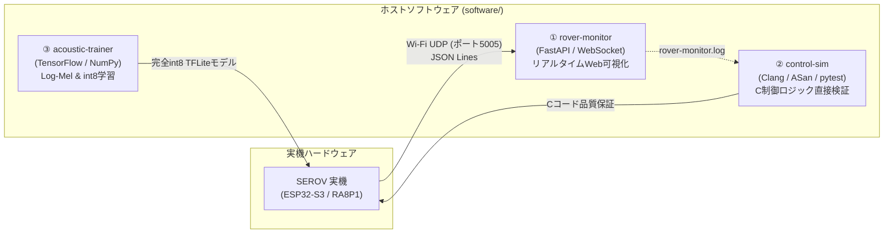

# 第8章: ソフトウェアエコシステムとシミュレーション

本章では、SEROVの開発効率・安全性・品質を劇的に高めているPCホスト上の3大ソフトウェア環境（`software/` 配下）について解説します。
リアルタイムWebテレメトリ監視ツール（`rover-monitor`）、Cファームウェア制御ロジックのホストシミュレーション・サニタイザ検証基盤（`control-sim`）、および音響特徴量参照実装とエッジAI学習パイプライン（`acoustic-trainer`）の全貌を紐解きます。

---

## 8.1 3大ホストツールの位置づけ

実機マイコンへの書き込みと実走テストには、配線の抜き差し、給電、バッテリ消耗、転倒破損のリスクが伴います。
SEROVプロジェクトでは、「**実機に触れる前にPC上でバグを叩き潰す（Shift-Left Testing）**」ため、以下の3つのホストツールを構築しています。



---

## 8.2 `rover-monitor`: リアルタイムWebテレメトリ

`software/rover-monitor/` は、ESP32-S3から送られてくるWi-Fi UDPテレメトリを受信し、ブラウザ上でローバーの内部状態を可視化するダッシュボードです。

```text
cd software/rover-monitor
uv run main.py
# ブラウザで http://127.0.0.1:8000 を開く
```

```text
[ESP32-S3] ──(UDP 5005: JSON Lines)──> [FastAPI Server] ──(WebSocket)──> [HTML5 Canvas UI]
```

### 可視化される主要情報
1. **走行オドメトリ & モータ状態**:
   - 左右モータの指令RPM、実測RPM、適用PWM Duty比（‰）のリアルタイム推移グラフ。
   - 車輪半径 54mm、実効トレッド 260mm に基づく推定移動軌跡。
2. **音響方位コンパス（DoA）**:
   - 車体を中心とする $360^\circ$ の円形コンパス上に、XVF3800が推定した音源方位（DoA）と音響レベル（dBFS）をベクトル描画。
3. **局所障害物マップ（Local Obstacle Map）**:
   - 前方を上とし、LEFT（$-45^\circ$）、CENTER（$0^\circ$）、RIGHT（$+45^\circ$）のToF測距値を円弧状に描画。現在発動している障害物回避ルール（`CLEAR_FORWARD`, `AVOID_OBSTACLE` 等）を表示。
4. **Log-Mel DSP診断（`Log-mel DSP` 欄）**:
   - ESP32-S3内部の自己テスト合否（`self_test_pass`）、フレーム生成fps（目標: 100 fps）、80フレームリングバッファ充填数、およびI2Sオーバーラン件数を監視。

---

## 8.3 `control-sim`: C制御ロジックのホスト検証

`software/control-sim/` は、本プロジェクトで最も技術的価値の高いテスト基盤の一つです。
マイコン用ファームウェアのCソースコード（`sound_follow_controller.c`, `obstacle_avoidance_controller.c`, `actuator_service.c` 等）を、**Pythonやシミュレータ上に再実装せず、ホストのClangコンパイラで直接ネイティブ共有ライブラリ（`.dylib` / `.so`）としてコンパイル** します。

```text
cd software/control-sim
uv run pytest -q
uv run python build.py --sanitized-smoke
uv run python build.py --feature-protocol
```

### なぜ再実装しないのか？
「Pythonでアルゴリズムをシミュレーションして合格したが、マイコンのC言語に移植した際にオーバーフローや境界値の扱いでバグが発生した」という事例は後を絶ちません。
`control-sim` は **「本番のCコードそのもの」** をテストするため、移植ミスが原理的に発生しません。

### `control-sim` を支える3大セーフティ技術

#### ① メモリ安全性検査（ASan / UBSan）
`build.py --sanitized-smoke` は、AddressSanitizer（メモリ境界外アクセス・Use-After-Free検知）および UndefinedBehaviorSanitizer（整数オーバーフロー・未定義シフト検知）を有効にしてCコードをビルド・実行します。

#### ② 構造体レイアウトガード（`layout_guard.py`）
マイコン（32-bit Arm）とPC（64-bit x86_64/Apple Silicon）では、ポインタ幅や構造体メンバのアライメントが異なります。
`layout_guard` は、C側の構造体サイズ・メンバオフセットと、Pythonの `ctypes.Structure` 定義が1バイトの狂いもなく一致しているかを自動検証します。

#### ③ 実機ログリプレイ（Replay Testing）
`rover-monitor` が実走時に記録した生ログ（`rover-monitor.log`）を読み込み、過去の実走行で得られたセンサ入力ストリームをC言語コントローラに再入力して、同一の回避判断・操舵出力が行われるかをオフラインで完全再現・検証します。

---

## 8.4 `acoustic-trainer`: 特徴量参照実装とエッジAI学習

`software/acoustic-trainer/` は、音響特徴量の生成から完全int8深層学習モデルの学習・変換までを一元管理するPython 3.12環境です。

```text
cd software/acoustic-trainer
uv run python tests/verify_vendor.py   # TFLMベンダ485ファイルのハッシュ検証
uv run python tests/build_runtime.py   # ホスト用TFLM Cラッパービルド
uv run python tests/smoke_test.py      # 合成CNN学習と完全int8 TFLite変換
uv run python tests/test_log_mel.py    # Log-Mel単精度演算のビット完全一致テスト
```

### 演算順序まで揃えた「ビット完全一致」検証
浮動小数点の計算順序がわずかに異なるだけで、量子化後の `int8` 値（$-128 \sim +127$）が $\pm 1$ LSB ずれることがあります。
`features.py` は、ESP32-S3のC言語実装（`log_mel_extractor.c`）と **全く同じ単精度演算順序（Hann窓乗算 → 512点FFT → Mel重み積算 → 自然対数 → 平均減算 → scale 0.125量子化）** を忠実に再現しています。

`test_log_mel.py` は、無音、インパルス、純音、ホワイトノイズ、およびI2Sブロック境界（256サンプル）をまたぐ不均一データにおいて、**C実装とPython実装の出力が 100% ビット完全一致すること** を数学的に証明しています。

---

## 8.5 まとめ

- `rover-monitor` により、走行中の内部状態（RPM、DoA、局所地図、DSPヘルス）をブラウザから直感的に把握可能。
- `control-sim` により、本番のC制御コードをClangで直接ホストビルドし、ASan/UBSanによるメモリ安全性検証と実機ログ再生テストを実現。
- `acoustic-trainer` により、エッジAIの学習入力と実機DSP抽出値のビット完全一致を担保。
次章では、これらのコードを実際にコンパイルし、RA8P1マイコンに書き込むための「開発ワークフローとビルド手順」を学びます。
