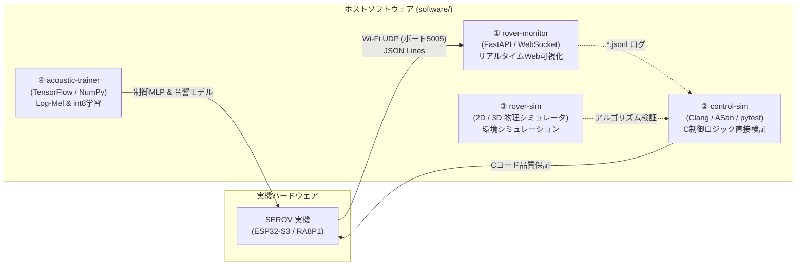

# 第8章: ソフトウェアエコシステムとシミュレーション

本章では、SEROVの開発効率・安全性・品質を劇的に高めているPCホスト上のソフトウェア環境（`software/` 配下）について解説します。
リアルタイムWebテレメトリ監視ツール（`rover-monitor`）、Cファームウェア制御ロジックのホストシミュレーション・サニタイザ検証基盤（`control-sim`）、物理挙動シミュレータ（`rover-sim`）、および音響特徴量参照実装とエッジAI学習パイプライン（`acoustic-trainer`）の全貌を紐解きます。

---

## 8.1 ホストツールの位置づけと全体像

実機マイコンへの書き込みと実走テストには、配線の抜き差し、給電、バッテリ消耗、転倒破損のリスクが伴います。
SEROVプロジェクトでは、「**実機に触れる前にPC上でバグを叩き潰す（Shift-Left Testing）**」ため、以下の強力なホストツール群を構築しています。


```mermaid
flowchart LR
    subgraph REAL["実機ハードウェア"]
        ROVER["SEROV 実機<br/>(ESP32-S3 / RA8P1)"]
    end

    subgraph SW["ホストソフトウェア (software/)"]
        MON["① rover-monitor<br/>(FastAPI / WebSocket)<br/>リアルタイムWeb可視化"]
        SIM["② control-sim<br/>(Clang / ASan / pytest)<br/>C制御ロジック直接検証"]
        RSIM["③ rover-sim<br/>(2D / 3D 物理シミュレータ)<br/>環境シミュレーション"]
        TRAIN["④ acoustic-trainer<br/>(TensorFlow / NumPy)<br/>Log-Mel & int8学習"]
    end

    ROVER -->|"Wi-Fi UDP (ポート5005)<br/>JSON Lines"| MON
    MON -.->|"*.jsonl ログ"| SIM
    TRAIN -->|"制御MLP & 音響モデル"| ROVER
    SIM -->|"Cコード品質保証"| ROVER
    RSIM -.->|"アルゴリズム検証"| SIM
```

---

## 8.2 `rover-monitor`: リアルタイムWebテレメトリ

`software/rover-monitor/` は、ESP32-S3から送られてくるWi-Fi UDPテレメトリを受信し、ブラウザ上でローバーの内部状態を可視化するダッシュボードです。

```text
cd software/rover-monitor
uv run main.py
# ブラウザで http://127.0.0.1:8000 を開く
```

```text
[ESP32-S3] ──(UDP 5005: JSON Lines)──> [FastAPI Server] ──(WebSocket)──> [HTML5 Canvas UI]
```

### 可視化される主要情報
1. **走行オドメトリ & モータ状態**:
   - 左右モータの指令RPM、実測RPM、適用PWM Duty比（‰）のリアルタイム推移グラフ。
   - 車輪半径 54mm、実効トレッド 260mm に基づく推定移動軌跡。
2. **音響方位コンパス & 音源位置プロット**:
   - XVF3800が生推定したDoA（生DoA）とESP32-S3の循環平均DoAをベクトル描画。
   - `sound_source_localizer` による推定音源世界座標 $(x, y)$、直線距離、および方位線をリアルタイムプロット。
3. **局所障害物マップ（Local Obstacle Map）**:
   - 前向き3眼ToF（LEFT: $(-90, +94)$, CENTER: $(0, +94)$, RIGHT: $(+90, +94)$ mm）の測距値を描画。
   - 現在発動中の走行ルール（`CLEAR_FORWARD`, `AVOID_OBSTACLE`, `PIVOT_*`, `SENSOR_BACKUP` 等）を表示。
4. **エッジAI & 分類器バッジ**:
   - 推論器種別（`[DSP SUMMARY (192D)]` または `[NN EMBEDDING]`）とTFLMランタイムの稼働状態（`DISABLED` / `ACTIVE`）を常時バッジ表示。
5. **背景オートエンコーダ（Background AE）診断**:
   - 固定乱数AEとRLSデコーダによる環境音学習の再構成誤差（MSE）、異常判定閾値、および外れ音検知フラグをリアルタイム監視。
6. **JSON Lines（`.jsonl`）形式での自動ログ記録**:
   - 実行セッションごとにタイムスタンプ付きの `.jsonl` ファイル（例: `rover-monitor-20260926-120000.jsonl`）として自動保存。再生テストや事後解析に活用。

---

## 8.3 `control-sim`: C制御ロジックのホスト検証

`software/control-sim/` は、本プロジェクトで最も技術的価値の高いテスト基盤の一つです。
マイコン用ファームウェアのCソースコード（`sound_follow_controller.c`, `obstacle_avoidance_controller.c`, `control_mlp_planner.c`, `sound_source_localizer.c`, `safety_arbiter.c` 等）を、**Pythonやシミュレータ上に再実装せず、ホストのClangコンパイラで直接ネイティブ共有ライブラリ（`.dylib` / `.so`）としてコンパイル** します。

```text
cd software/control-sim
uv run pytest -q                       # 全自動回帰テスト (200件以上)
uv run python build.py --sanitized-smoke # ASan/UBSan メモリ安全性スモーク
uv run python -m controlsim.train_control_mlp # 制御MLPの学習・量子化・Cヘッダ生成
```

### `control-sim` を支える4大セーフティ技術

#### ① メモリ安全性検査（ASan / UBSan）
AddressSanitizer（メモリ境界外アクセス・Use-After-Free検知）および UndefinedBehaviorSanitizer（整数オーバーフロー・未定義シフト検知）を有効にしてCコードをビルド・実行し、潜在的メモリ破壊バグを100%事前検出。

#### ② 制御MLPの数値パリティ検証
PythonのTensorFlow/TFLiteリファレンス実装と、CファームウェアのTFLM C ABI実行時出力の数値差が $\le 2\text{ LSB}$（完全int8パリティ）であることを自動検証。

#### ③ 閉ループ壁面接近テスト（54条件）
車速（100 / 200 RPM）、進入角度（$-45^\circ \sim +45^\circ$）、初期オフセット（$-150 \sim +150\text{ mm}$）の全54条件において、TFLM制御MLPが衝突ゼロ（クリアランス $> 300\text{ mm}$）で安全に壁面を回避することを自動シミュレーション。

#### ④ 実機ログリプレイ（Replay Testing）
`rover-monitor` が実走時に記録した `.jsonl` ログを読み込み、過去の実走行で得られたセンサ入力ストリームをC言語コントローラに再入力して、同一の回避判断・操舵出力が行われるかをオフラインで完全再現・検証。

---

## 8.4 `rover-sim`: 物理挙動シミュレータ

`software/rover-sim/` は、ロッカーボギー式サスペンションの車体幾何学、車輪スリップ、モータトルク特性、およびToFセンサの走査をブラウザ上でシミュレーションできる環境です。
障害物マップの配置や音源位置を変更しながら、ローバーの旋回挙動や接近軌道を視覚的にシミュレーションできます。

---

## 8.5 `acoustic-trainer`: 特徴量参照実装とエッジAI学習

`software/acoustic-trainer/` は、音響特徴量の生成から完全int8深層学習モデルの学習・変換、およびホストTFLM検証までを一元管理するPython環境です。

```text
cd software/acoustic-trainer
uv run python tests/verify_vendor.py       # TFLMベンダファイルのハッシュ検証
uv run python tests/test_log_mel.py        # Log-Mel単精度演算のビット完全一致テスト
uv run python review_acoustic_tflm_host.py # ホスト上でのTFLMアリーナ容量・初期化検証
```

### 演算順序まで揃えた「ビット完全一致」検証
浮動小数点の計算順序がわずかに異なるだけで、量子化後の `int8` 値がずれることがあります。
`features.py` は、ESP32-S3のC言語実装（`log_mel_extractor.c`）と **全く同じ単精度演算順序（Hann窓乗算 → 512点FFT → Mel重み積算 → 自然対数 → 平均減算 → scale 0.125量子化）** を忠実に再現しています。

### ホストTFLM事前検証ツール（`review_acoustic_tflm_host.py`）
マイコン実機へ書き込む前に、ホストPC上でTFLMランタイムを起動し、モデルの未解決演算子の有無や、テンソルアリーナの最低必要バイト数（64KiB / 96KiB / 112KiB / 128KiB）をスイープ測定して100%事前確認できます。

---

## 8.6 まとめ

- `rover-monitor` により、走行中の内部状態（RPM、DoA、音源推定位置、局所地図、AI種別）をブラウザからリアルタイム可視化。
- `control-sim` により、本番CコードをClangで直接ホストビルドし、ASan/UBSanテスト、制御MLP閉ループシミュレーション、実機ログ再生を実現。
- `acoustic-trainer` により、エッジAIの学習入力と実機DSP抽出値のビット完全一致を担保し、ホスト上でTFLMアリーナ容量を事前検証。
次章では、これらのコードを実際にコンパイルし、RA8P1マイコンに書き込むための「開発ワークフローとビルド手順」を学びます。
