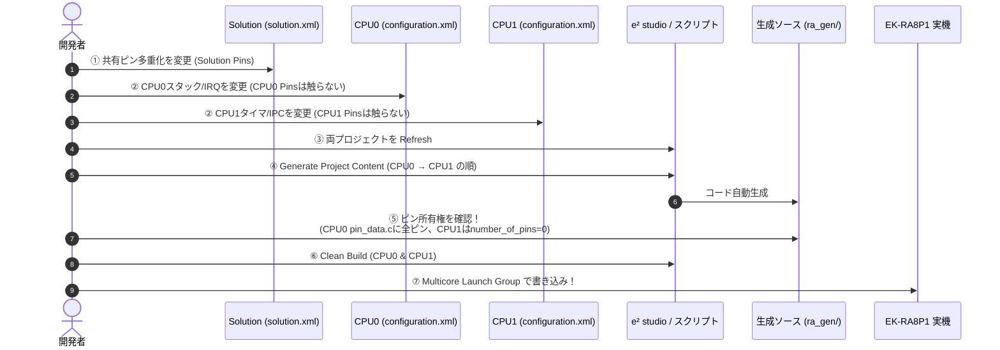

# 第9章: 開発ワークフロー・ビルド・FSP生成手順

本章では、SEROVプロジェクトの日常的な開発ワークフロー、VS Codeとe² studioの使い分け、macOS環境におけるRA8P1特有のヘッドレスビルド手順、およびFSP（Flexible Software Package）コード生成サイクルについて解説します。

---

## 9.1 開発環境の全体構成

本プロジェクトは、以下のツールチェインを標準環境として固定しています。

| 対象 | 開発環境 / ツール | バージョン | 用途 |
|---|---|:---:|---|
| **総合エディタ** | Visual Studio Code | 最新 | 日常のコード編集、Git操作、タスク実行 |
| **RA8P1 IDE** | Renesas e² studio | 2025-12 (25.12.0) | FSP設定（ピン・クロック・スタック変更）、GUIデバッグ |
| **RA8P1 FSP** | Flexible Software Package | 6.4.0 / 6.6.0 | ハードウェア抽象化レイヤ、HALドライバ、スタートアップ |
| **Arm コンパイラ** | GNU Arm Embedded Toolchain | 13.2.rel1 (13.2.1) | Cortex-M85 (CPU0) および Cortex-M33 (CPU1) のビルド |
| **ESP32 開発** | ESP-IDF / PlatformIO | 5.5.3 (IDF) / 6.13.0 (PIO) | XIAO ESP32-S3用ファームウェアのビルド・書込み |
| **Python 環境** | Astral `uv` | 最新 (Python 3.12/3.13) | `control-sim`, `acoustic-trainer`, `rover-monitor` |

日常の開発作業は、リポジトリ直下の `SoundExplorationRover.code-workspace` をVS Codeで開いて行います。

---

## 9.2 macOS環境におけるRA8P1ビルド運用ルール（最重要）

### なぜ `e2studio` バイナリを直接叩いてはいけないのか？
macOS版のe² studioにおいて、ターミナルやCIスクリプトから以下のようなヘッドレス（無画面）ビルドを実行しようとすると、**プロセスが `SIGABRT`（異常終了）で即座にクラッシュ** します。

```bash
# ❌ 絶対に実行してはならないコマンド（クラッシュする）
/Applications/Renesas/e2studio/e2studio.app/Contents/MacOS/e2studio --launcher.suppressErrors -nosplash -application org.eclipse.cdt.managedbuilder.core.headlessbuild ...
```

- **原因**: EclipseのmacOSラッパーバイナリ（`e2studio`）は、たとえ `-nosplash` や `-application headlessbuild` を指定されていても、内部でmacOSのGUIフレームワーク（AppKit / WindowServer）を初期化しようとします。サンドボックス環境やSSHセッション、CIコンテナなどWindowServerが存在しない環境では、`RegisterApplication` に失敗してmacOSのOSカーネルから強制終了（SIGABRT）させられます。

### 解決策: `Invoke-RaBuild.sh` スクリプト
この問題を回避するため、リポジトリ内に `.vscode/scripts/Invoke-RaBuild.sh` が用意されています。
このスクリプトは、GUIラッパーを経由せず、**e² studio同梱のJava VMからEclipse Equinoxランチャ（`.jar`）を直接起動** します。これにより、macOS環境下でもGUI権限を一切要求されず、完全なヘッドレスビルド・コード再生成が100%確実に実行できます。

```bash
# ✅ 正しいビルドコマンド（VS Codeタスクまたはターミナルから実行）
# CPU0 のコード生成 ＋ クリーンビルド
.vscode/scripts/Invoke-RaBuild.sh --target CPU0 --regenerate --clean

# CPU1 のコード生成 ＋ クリーンビルド
.vscode/scripts/Invoke-RaBuild.sh --target CPU1 --regenerate --clean

# 両コアの一括ビルド
.vscode/scripts/Invoke-RaBuild.sh --target All --regenerate --clean
```

---

## 9.3 FSP設定変更とコード生成サイクル（7ステップ）

RA8P1のピン多重化、クロック設定、タイマ（GPT）、通信機能（IPC, IIC, USB）を変更する際は、必ず以下の **「黄金の7ステップ」** を遵守してください。



### ステップごとの注意点
- **ステップ①（ピン変更はSolutionでのみ行う）**:
  - 各CPUプロジェクト（CPU0/CPU1）のPin Configurationタブで直接ピンを割り当ててはいけません。ピンはSolutionレベルで一元管理します。
- **ステップ⑤（ピン所有権のチェック）**:
  - 生成後、`firmware/ra8p1/SoundExplorationRover_CPU1/ra_gen/pin_data.c` を開き、テーブル要素数が `0`（`number_of_pins = 0`）であることを必ず目視確認してください。
- **ステップ⑦（書き込みはペアで行う）**:
  - CPU0とCPU1はIPCプロトコルで緊密に結合しています。一方のELFだけをフラッシュに書き込むと、プロトコルの不整合でハングアップします。必ず `SoundExplorationRover Debug_Multicore Launch Group` を使用し、**同一ビルド世代のELFをペアで書き込みます**。

---

## 9.4 XIAO ESP32-S3 のビルドと書き込み手順

XIAO ESP32-S3のファームウェアは、VS CodeのPlatformIO拡張機能、またはESP-IDFターミナルからビルド・書き込みを行います。

```bash
# PlatformIOの場合
# VS Codeの「タスクの実行」から「ESP32: Build」「ESP32: Upload」を選択

# ESP-IDF CLIの場合
cd firmware/esp32s3
idf.py set-target esp32s3
idf.py build
idf.py -p /dev/cu.usbmodem* flash
```

### ROMダウンロードモード（書き込み待機モード）への手動移行
XIAO ESP32-S3は、実行時にオンボードUSB-CポートをTinyUSB CDCデバイスとして占有しています。そのため、PCからの自動リセット・ダウンロードモード移行が失敗する場合があります。
`Connecting...` でタイムアウトする場合は、以下の手順で手動移行してください。

```text
1. EK-RA8P1のJ7からXIAOのUSBケーブルを外し、PCへ直接接続する。
2. XIAO基板上の小さな「BOOT」ボタンを押したままにする。
3. その状態のまま「RESET」ボタンを1回カチッと押して離す。
4. 最後に「BOOT」ボタンを離す。
5. PCのポート一覧にブートローダCOMポートが現れるのを確認し、Uploadを再実行する。
```

> [!CAUTION]
> ReSpeakerマザーボード側（3.5mmジャックの隣）にあるRESETボタンは **XVF3800用** のリセットボタンです。ESP32-S3をリセットするには、**XIAOドーターボード本体の米粒大のボタン** を押す必要があります。

---

## 9.5 Git運用ルールと生成物の扱い

- **Git LFS（Large File Storage）**:
  - `hardware/` 配下のSTEPファイル（CADデータ）およびSTLファイル（3Dメッシュ）はGit LFSで管理されています。初回クローン時は `git lfs pull` を必ず実行してください。
- **Git Submodules**:
  - `firmware/ra8p1/common/mtk3_bsp2`（μT-Kernel）および `hardware/papaya-pathfinder` はサブモジュールです。`git submodule update --init --recursive` で最新固定コミットを取得します。
- **FSP再生成による改行・空白差分の整理**:
  - FSP 6.4/6.6のバージョン差異やWindows/macOSの環境差により、`ra_cfg/` や `ra_gen/` に実質的な変更のないインデント差分が出ることがあります。Gitコミット時は `git diff` を確認し、意味のある変更（モジュール追加等）と形式的差分を区別して整理してください。

---

## 9.6 まとめ

- macOS環境でのRA8P1ビルドは、GUIクラッシュを避けるため `Invoke-RaBuild.sh` によるEquinox直接起動を使用。
- FSPのピン多重化はSolutionを唯一の正とし、CPU0が全ピンを所有し、CPU1は0ピンを維持する。
- デュアルコアのバイナリは常にペアでビルド・書き込みを行い、プロトコル世代の不一致を防ぐ。
次章では、実機を動かした際の「実機キャリブレーション、Live Watchデバッグ、トラブルシューティング」を学びます。
