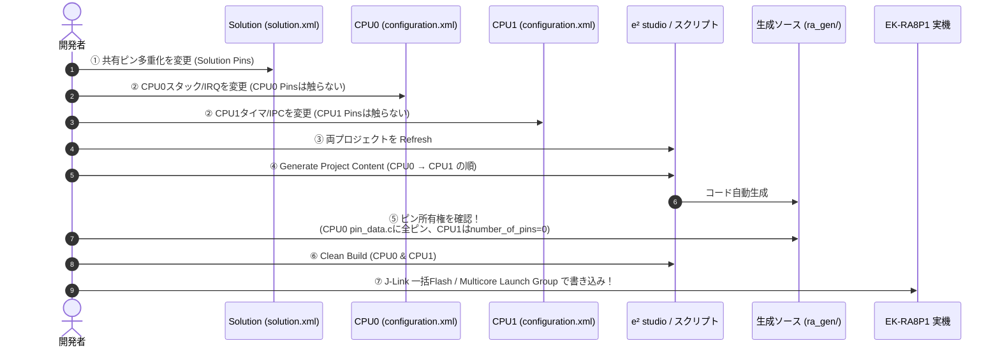

# 第9章: 開発ワークフロー・ビルド・FSP生成手順

本章では、SEROVプロジェクトの日常的な開発ワークフロー、VS Codeとe² studioの使い分け、macOS環境におけるRA8P1特有のヘッドレスビルド手順、高速並列ビルド（Fast Build）、J-Link一括書き込み、およびFSP（Flexible Software Package）コード生成サイクルについて解説します。

---

## 9.1 開発環境の全体構成

本プロジェクトは、以下のツールチェインを標準環境として固定しています。

| 対象 | 開発環境 / ツール | バージョン | 用途 |
|---|---|:---:|---|
| **総合エディタ** | Visual Studio Code | 最新 | 日常のコード編集、Git操作、ビルド・書き込みタスク実行 |
| **RA8P1 IDE** | Renesas e² studio | 2025-12 (25.12.0) | FSP設定（ピン・クロック・スタック変更）、GUIデバッグ |
| **RA8P1 FSP** | Flexible Software Package | 6.4.0 / 6.6.0 | ハードウェア抽象化レイヤ、HALドライバ、スタートアップ |
| **Arm コンパイラ** | GNU Arm Embedded Toolchain | 13.2.rel1 (13.2.1) | Cortex-M85 (CPU0) および Cortex-M33 (CPU1) のビルド |
| **ESP32 開発** | ESP-IDF / PlatformIO | 5.5.3 (IDF) / 6.13.0 (PIO) | XIAO ESP32-S3用ファームウェアのビルド・書込み |
| **Python 環境** | Astral `uv` | 最新 (Python 3.12/3.13) | `control-sim`, `acoustic-trainer`, `rover-monitor` |

日常の開発作業は、リポジトリ直下の `SoundExplorationRover.code-workspace` をVS Codeで開いて行います。

---

## 9.2 高速並列ビルドとmacOSヘッドレスビルド

### なぜ `e2studio` バイナリを直接叩いてはいけないのか？
macOS版のe² studioにおいて、ターミナルやCIスクリプトから以下のようなヘッドレス（無画面）ビルドを実行しようとすると、**プロセスが `SIGABRT`（異常終了）で即座にクラッシュ** します。

```bash
# ❌ 絶対に実行してはならないコマンド（クラッシュする）
/Applications/Renesas/e2studio/e2studio.app/Contents/MacOS/e2studio --launcher.suppressErrors -nosplash -application org.eclipse.cdt.managedbuilder.core.headlessbuild ...
```

- **原因**: EclipseのmacOSラッパーバイナリ（`e2studio`）は、たとえ `-nosplash` や `-application headlessbuild` を指定されていても、内部でmacOSのGUIフレームワーク（AppKit / WindowServer）を初期化しようとします。サンドボックス環境やSSHセッション、CIコンテナなどWindowServerが存在しない環境では、`RegisterApplication` に失敗してmacOSのOSカーネルから強制終了（SIGABRT）させられます。

### 解決策: `Invoke-RaBuild.sh` / `.ps1` スクリプト
この問題を回避し、さらに高速なビルドを実現するため、`.vscode/scripts/Invoke-RaBuild.sh`（macOS/Linux用）および `Invoke-RaBuild.ps1`（Windows用）が用意されています。

1. **Equinox直接起動**: e² studio同梱のJava VMからEclipse Equinoxランチャ（`.jar`）を直接起動するため、macOS環境下でもGUI権限を一切要求されず、100%確実にヘッドレスビルド・コード再生成が実行できます。
2. **高速並列ビルド（Fast Build）**: 生成済みの makefile を利用し、CPUコア数に応じた並列コンパイル（`make -j`）を行うことで、わずか数秒で差分ビルドが完了します。
3. **J-Link一括書き込み（`--flash`）**: J-Link Commanderスクリプトを自動生成し、CPU0とCPU1のELFバイナリを1回のコマンドで両コアへ一括書き込みできます。

```bash
# CPU0 のコード生成 ＋ クリーンビルド
.vscode/scripts/Invoke-RaBuild.sh --target CPU0 --regenerate --clean

# CPU1 のコード生成 ＋ クリーンビルド
.vscode/scripts/Invoke-RaBuild.sh --target CPU1 --regenerate --clean

# 両コアの高速差分ビルド
.vscode/scripts/Invoke-RaBuild.sh --target All --fast

# 両コアのビルド ＋ J-Link一括書き込み
.vscode/scripts/Invoke-RaBuild.sh --target All --flash
```

---

## 9.3 VS Codeタスク一覧

VS Codeのコマンドパレット（`Ctrl+Shift+P` / `Cmd+Shift+P`）から `Tasks: Run Task` を開くと、以下の定型タスクをワンクリックで実行できます。

| タスク名 | 用途 |
|---|---|
| **`Firmware: Build All`** | CPU0、CPU1、ESP32を順番にビルド（`Ctrl+Shift+B` の既定） |
| **`RA8P1: Fast Build All`** | makefileメタデータを用いたCPU0/CPU1の超高速並列差分ビルド |
| **`RA8P1: Flash CPU0 & CPU1 (J-Link)`** | ビルド後、J-Link経由で両コアのFlashを一括プログラミング |
| **`RA8P1: Generate + Clean Build All`** | FSPコード再生成を行い、CPU0→CPU1の順で完全リビルド |
| **`RA8P1: Fast Build CPU0 / CPU1`** | 指定した片方のコアだけを高速差分ビルド |
| **`ESP32: Build`** | PlatformIOでXIAO ESP32-S3用ファームウェアをビルド |
| **`ESP32: Upload`** | XIAOのUSB-Cポートからバイナリを書き込み |
| **`ESP32: Monitor`** | XIAOのシリアルモニタ（バイナリ通信専用） |

---

## 9.4 FSP設定変更とコード生成サイクル（黄金の7ステップ）

RA8P1のピン多重化、クロック設定、タイマ（GPT）、通信機能（IPC, IIC, USB）を変更する際は、必ず以下の **「黄金の7ステップ」** を遵守してください。


```mermaid
sequenceDiagram
    autonumber
    actor DEV as 開発者
    participant SOL as Solution (solution.xml)
    participant C0_CFG as CPU0 (configuration.xml)
    participant C1_CFG as CPU1 (configuration.xml)
    participant IDE as e² studio / スクリプト
    participant SRC as 生成ソース (ra_gen/)
    participant FLASH as EK-RA8P1 実機

    DEV->>SOL: ① 共有ピン多重化を変更 (Solution Pins)
    DEV->>C0_CFG: ② CPU0スタック/IRQを変更 (CPU0 Pinsは触らない)
    DEV->>C1_CFG: ② CPU1タイマ/IPCを変更 (CPU1 Pinsは触らない)
    DEV->>IDE: ③ 両プロジェクトを Refresh
    DEV->>IDE: ④ Generate Project Content (CPU0 → CPU1 の順)
    IDE->>SRC: コード自動生成
    DEV->>SRC: ⑤ ピン所有権を確認！<br/>(CPU0 pin_data.cに全ピン、CPU1はnumber_of_pins=0)
    DEV->>IDE: ⑥ Clean Build (CPU0 & CPU1)
    DEV->>FLASH: ⑦ J-Link 一括Flash / Multicore Launch Group で書き込み！
```

### ステップごとの注意点
- **ステップ①（ピン変更はSolutionでのみ行う）**:
  - 各CPUプロジェクト（CPU0/CPU1）のPin Configurationタブで直接ピンを割り当ててはいけません。ピンはSolutionレベルで一元管理します。
- **ステップ⑤（ピン所有権のチェック）**:
  - 生成後、`firmware/ra8p1/SoundExplorationRover_CPU1/ra_gen/pin_data.c` を開き、テーブル要素数が `0`（`number_of_pins = 0`）であることを必ず目視確認してください。
- **ステップ⑦（書き込みはペアで行う）**:
  - CPU0とCPU1はIPCプロトコルで緊密に結合しています。一方のELFだけをフラッシュに書き込むと、プロトコルの不整合でハングアップします。必ず同一ビルド世代のELFをペアで書き込みます。

---

## 9.5 XIAO ESP32-S3 のビルドと書き込み手順

XIAO ESP32-S3のファームウェアは、VS CodeのPlatformIO拡張機能、またはESP-IDFターミナルからビルド・書き込みを行います。

```bash
# PlatformIOの場合
# VS Codeの「タスクの実行」から「ESP32: Build」「ESP32: Upload」を選択

# ESP-IDF CLIの場合
cd firmware/esp32s3
idf.py set-target esp32s3
idf.py build
idf.py -p /dev/cu.usbmodem* flash
```

### ROMダウンロードモード（書き込み待機モード）への手動移行
XIAO ESP32-S3は、実行時にオンボードUSB-CポートをTinyUSB CDCデバイスとして占有しています。そのため、PCからの自動リセット・ダウンロードモード移行が失敗する場合があります。
`Connecting...` でタイムアウトする場合は、以下の手順で手動移行してください。

```text
1. EK-RA8P1のJ7からXIAOのUSBケーブルを外し、PCへ直接接続する。
2. XIAO基板上の小さな「BOOT」ボタンを押したままにする。
3. その状態のまま「RESET」ボタンを1回カチッと押して離す。
4. 最後に「BOOT」ボタンを離す。
5. PCのポート一覧にブートローダCOMポートが現れるのを確認し、Uploadを再実行する。
```

> [!CAUTION]
> ReSpeakerマザーボード側（3.5mmジャックの隣）にあるRESETボタンは **XVF3800用** のリセットボタンです。ESP32-S3をリセットするには、**XIAOドーターボード本体の米粒大のボタン** を押す必要があります。

---

## 9.6 まとめ

- macOS環境でのRA8P1ビルドは、GUIクラッシュを避けるため `Invoke-RaBuild.sh` によるEquinox直接起動を使用。
- `Fast Build` と J-Link一括書き込みタスクにより、編集から実機テストまでのイテレーション時間を劇的に短縮。
- FSPのピン多重化はSolutionを唯一の正とし、CPU0が全ピンを所有し、CPU1は0ピンを維持する。
- デュアルコアのバイナリは常にペアでビルド・書き込みを行い、プロトコル世代の不一致を防ぐ。
次章では、実機を動かした際の「実機キャリブレーション、Live Watchデバッグ、トラブルシューティング」を学びます。
