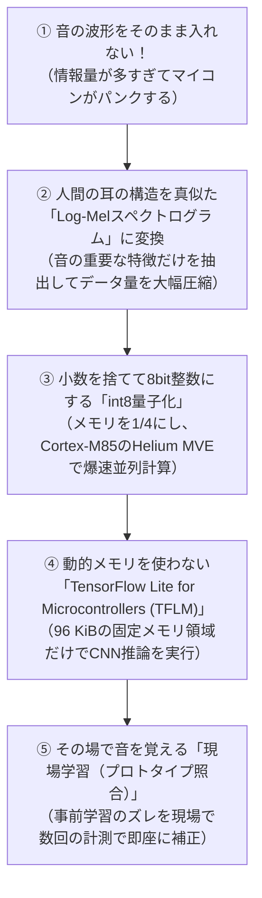

# 第1章: なぜマイコンでAIなのか？（クラウド依存の限界と組込みの挑戦）

AI（人工知能）やディープラーニング（深層学習）と聞くと、多くの人は「巨大なデータセンターにある超高性能GPUサーバー」や「クラウドAPI（ChatGPTなど）」を思い浮かべるでしょう。
では、なぜSEROVは高価なクラウドや外部PCに頼らず、**「ローバー自身の小さなマイコン基板（エッジ環境）」** でAIを動かさなければならないのでしょうか？

本章では、エッジAIが必要不可欠となる物理的な理由と、マイコンならではの過酷な制約、そしてSEROVが導き出した解決策を解説します。

---

## 1.1 クラウドAIが「現場」で使えない3つの理由

もしローバーがマイクで拾った音を毎回Wi-Fiや4G/5G経由でクラウドに送信し、クラウド側でAI判定を行おうとすると、次の3つの壁に直面して任務に失敗します。

```text
  [災害現場・地下配管]                       [クラウドサーバー]
       SEROV  ───────( × 電波が届かない！ )───────▶   クラウドAI
       SEROV  ───────( 1秒以上の通信遅延！ )──────▶   クラウドAI (衝突事故)
       SEROV  ───────( 大電力を食い尽くす！ )─────▶   クラウドAI (バッテリ切れ)
```

### ① 電波が届かない（オフライン必須の環境）
SEROVが想定する活躍の場は、地震で倒壊した家屋の瓦礫の下、崩落したトンネル、地下配管、あるいは濃煙が充満した工場内部です。
このような極限環境では、**そもそもWi-Fiの電波も携帯キャリアの電波も届きません**。通信が切れた瞬間にローバーが動けなくなるようでは、レスキュー探査ロボット失格です。車体自身が完全にオフラインで思考・完結する必要があります。

### ② 通信遅延（レイテンシ）による衝突事故
時速数kmで走行しているローバーにとって、ミリ秒の遅延が生死を分けます。
- 音をサンプリング → Wi-Fiパケット化 → クラウドへ送信 → サーバーが推論 → 結果を受信
この一連の流れには、通信環境が良くても **数百ミリ秒〜1秒以上** かかります。
もし「前方に危険な異音・壁がある」という判定結果が1秒後に返ってきたときには、ローバーは既に障害物に激突して走行不能に陥っています。
**「今鳴った音」を「数十ミリ秒以内」に現場で判定し、即座にブレーキをかける** には、車体内で計算するしかありません。

### ③ バッテリの持ち（消費電力の壁）
高性能なGPU（NVIDIA Jetsonなど）や高速セルラー通信モジュールを車載すると、それだけで数十ワットの電力を消費し、わずか30分程度でバッテリが干上がってしまいます。
これに対し、SEROVが採用しているルネサス **RA8P1マイコンはわずか数百ミリワット（0.5W以下）** で動作します。小さなバッテリで何時間も探査を継続するためには、マイコンによる超省電力なAI駆動が絶対条件なのです。

---

## 1.2 マイコンの「過酷すぎる制約」

しかし、「じゃあマイコンでAIを動かそう！」と簡単に言っても、そこにはソフトウェアエンジニアにとって目眩がするほどの制約が立ちはだかります。

| 比較項目 | クラウド / 一般PC | 一般的なマイコン | SEROVのRA8P1マイコン |
|---|---|---|---|
| **メインメモリ (RAM)** | **16 GB 〜 64 GB** | 数十 KB 〜 数百 KB | **約 1.8 MB (1872 KB)** |
| **ストレージ** | 512 GB 〜 数 TB | 数百 KB 〜 数 MB | **内蔵フラッシュ 2 MB** |
| **動作周波数 (CPU)** | 3.5 GHz 〜 5.0 GHz (多コア) | 48 MHz 〜 160 MHz | **1.0 GHz (Cortex-M85)** |
| **消費電力** | 100 W 〜 500 W | 0.05 W 〜 0.2 W | **約 0.3 W 〜 0.5 W** |
| **OS** | Linux / Windows | なし (ベアメタル) / RTOS | **μT-Kernel 3.0** |

### メモリが「数万分の一」しかない！
PCで動く一般的な画像認識モデル（ResNet-50など）のモデルサイズは **約100 MB**、大規模言語モデル（LLM）に至っては **数GB〜数十GB** のメモリを平気で消費します。
しかし、マイコンのメモリは **たったの 1〜2 MB（PCの数万分の一）** です。
モデルのファイルを開くことすらできず、当然 `import tensorflow as tf` などとPythonスクリプトを実行することもできません。

### 動的メモリ確保（`malloc`）が許されない
PCプログラミングでは、`malloc()` や `new` を使って実行時にメモリを自由に確保します。
しかし、24時間365日絶対に落ちてはならない高信頼組み込み機器（μT-Kernel環境）では、**メモリの断片化（フラグメンテーション）によっていつかメモリ確保が失敗するリスクがあるため、動的メモリ確保の使用は固く禁止** されます。
AIの入力データも、ニューラルネットワークの中間計算バッファも、すべて **「起動時にあらかじめ確保した固定のメモリ配列（静的アリーナ）」** の中に収め切らなければなりません。

---

## 1.3 SEROVが導き出した「エッジ音響AI」の最適解

この過酷な制約を乗り越え、マイコンで本格的な深層学習を動かすために、SEROVは以下の画期的な最適化パイプラインを確立しました。



1. **生データを捨てて「特徴量」にする**: 毎秒何万回も揺れる生の音波ではなく、人間の聴覚メカニズム（メル尺度）に沿った **Log-Melスペクトログラム** に変換し、本質的な周波数成分だけをギュッと凝縮します。
2. **小数を切り捨てて「整数（int8）」にする**: 32ビット浮動小数点を8ビット整数に変換（量子化）し、メモリ使用量を $\frac{1}{4}$ に圧縮。Arm Cortex-M85のベクトル演算命令（Helium MVE）で整数を4個〜16個同時に並列計算させます。
3. **固定アリーナによる省メモリ推論**: Googleの軽量ランタイム **TFLM** をμT-Kernelに組み込み、たった96 KiBの静的バッファで深層学習を実行します。

---

## 1.4 まとめ

- 災害現場や崩落現場では電波が届かず、通信遅延で激突するため、クラウドAIは使えない。
- マイコンはメモリがPCの数万分の一しかなく、動的メモリ確保（`malloc`）も許されない。
- この壁を突破するため、SEROVは **「音響DSP ＋ Log-Mel圧縮 ＋ int8量子化 ＋ TFLM静的アリーナ」** という極限の組み込みAIアーキテクチャを採用した。

次章では、すべての出発点となる **「音とは何か？ なぜ波形のままではAIが理解できないのか？」** を、DSP（デジタル信号処理）の基礎から優しく紐解いていきます。
