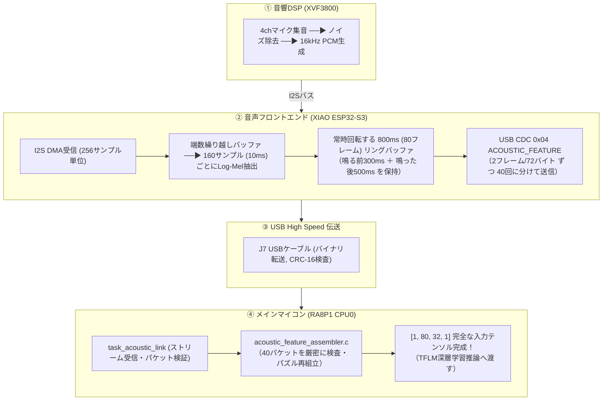
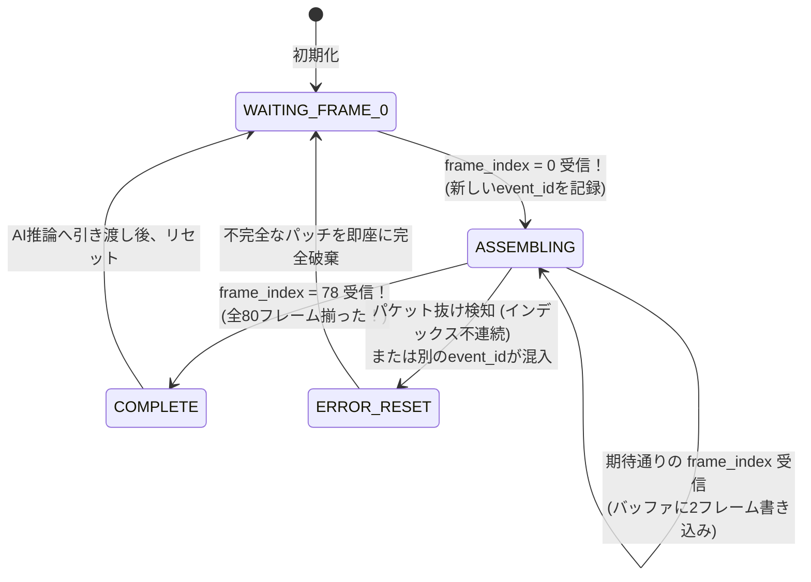

# 第5章: 音のバトンパス（I2S → 800msリング → USB → CPU0再組立）

前章までで、生の音波が「1フレームあたり32バイトのint8数値列」に変換される仕組みを学びました。
しかし、この特徴量は **XIAO ESP32-S3** の中で生まれたばかりです。
実際に深層学習モデル（TFLM）が動いているのは、隣にあるメインマイコン **RA8P1（CPU0）** です。

本章では、音響データがハードウェアのバッファのズレを乗り越え、タイムマシン（800msリングバッファ）に蓄えられ、USBケーブルを渡ってCPU0で完全なテンソル（AI入力データ）へと組み上がるまでの **「音のバトンパス」** の全貌を解説します。

---

## 5.1 音のバトンリレー全体図

音響データは、以下の4つのステージを経てCPU0のAI推論エンジンに届きます。



---

## 5.2 256サンプルI2S読出しと160サンプルホップのズレ

組み込みプログラミングで誰もが直面するのが、**「ハードウェアが持ってくるデータの単位」と「アルゴリズムが欲しいデータの単位」が一致しない問題** です。

- **I2Sハードウェア（DMA）の都合**: 効率的なメモリ転送のため、**256サンプル（16 ms分）** 単位でデータをまとめて渡してきます。
- **Log-Melアルゴリズムの都合**: 毎秒100フレーム（100 fps）の滑らかなスペクトログラムを作るため、**160サンプル（10 ms分）** 刻みで計算したいのです。

$$256 \div 160 = 1 \text{ あまり } 96$$

```text
I2S第1ブロック受信 (256サンプル):
[ 0 ────────────── 159 ][ 160 ────────────── 255 ]
       第1フレーム計算          ★ 96サンプル余る！
                                      ↓
I2S第2ブロック受信 (256サンプル):     ↓ 前回の余り(96)と合体！
[ 0 ────── 63 ][ 64 ────────────── 223 ][ 224 ── 255 ]
   (96+64=160)        第3フレーム計算      ★ 32サンプル余る...
  第2フレーム計算
```

### `log_mel_extractor.c` の端数繰り越し処理
このズレを解決するため、`log_mel_extractor.c` は内部に小さな一時リングバッファを持っています。
I2Sから256サンプル届くたびに一時バッファに追記し、**「中に160サンプル以上溜まったら、160サンプルを取り出してフレーム計算を実行し、残りを次回に繰り越す」** という処理を繰り返します。
この丁寧なバッファ管理のおかげで、ハードウェアの都合に左右されず、正確無比な100fps（10ms間隔）のフレーム生成が実現されているのです。

---

## 5.3 800msリングバッファ: 「タイムマシン」が必要な理由

### 音が鳴ってから録音を始めても手遅れ！
「大きな音が鳴った（VADが反応した）瞬間に録音を開始すればいいのでは？」と思うかもしれません。
しかし、**音が鳴ったと判定された時点では、すでに音の一番大事な「出だし（アタック部分・子音）」は通り過ぎてしまっています**。
人間の言葉でも「カ」や「パ」などの子音（破裂音）は最初の数十ミリ秒で決まります。出だしを聞き逃したAIは、正しく音を識別できません。

### 「鳴る前300ms ＋ 鳴った後500ms」
そこでESP32-S3は、**常に過去80フレーム（800ms分）のint8特徴量をドーナツ状のリングバッファ（リングメモリ）に上書き保存し続けています**。

```text
               [ 80フレーム (800ms) リングバッファ ]
                       
                  鳴る前 300ms      鳴った後 500ms
                  (30フレーム)       (50フレーム)
               ┌───────────────┬───────────────────┐
  過去の音 ───▶│   助走区間    │   イベント本番    │───▶ イベント確定！
               └───────────────┴───────────────────┘
                               ▲
                      ★ 音源検知トリガ！
```

音が検知された瞬間、ESP32-S3は **「トリガの300ms前にタイムマシンで巻き戻り、そこから500ms後までの合計80フレーム」** を1つの音響イベント（Event Patch）として確定します。
これにより、音の発生の瞬間を1ミリ秒も取りこぼすことなくAIに届けることができるのです。

---

## 5.4 USB CDCでの分割パケット伝送（`0x04 ACOUSTIC_FEATURE`）

確定した80フレームのデータ量は、以下の通りです：

$$80 \text{ フレーム} \times 32 \text{ バイト} = \mathbf{2,560 \text{ バイト}}$$

しかし、USB CDCの共有プロトコル（第5章）において、1フレームの最大ペイロード長は **96バイト** に制限されています。2.5 KBのデータを一度にドサッと送ると、USBバッファがパンクして制御パケットが遅延してしまいます。

そこで、1パケットに **「2フレーム（64バイト）」** ずつ小分けにし、メタデータ（8バイト）を添えた **計72バイトのパケットを40回に分けて連続送信** します。

```text
0x04 ACOUSTIC_FEATURE ペイロード構造 (72バイト):
┌──────────┬─────────────┬─────────────┬────────┬────────┬─────────────────────────┐
│ event_id │ frame_index │ frame_count │ n_bins │ flags  │ int8 Mel特徴量 (2フレーム)│
│ (2 byte) │  (2 byte)   │  (2 byte)   │ (1byte)│ (1byte)│  32 bins × 2 = 64 bytes │
└──────────┴─────────────┴─────────────┴────────┴────────┴─────────────────────────┘
```

---

## 5.5 CPU0での80フレーム厳密再組立（`acoustic_feature_assembler.c`）

RA8P1（CPU0）側では、届いた40個のパケットをバラバラのジグソーパズルのように受け取り、1つの大きなテンソル（$80 \times 32$ 配列）に組み立て直します（`acoustic_feature_assembler.c`）。



### 一切の妥協を許さない安全検査
組み込みAIにおいて、「1パケット抜けたけど、まあいいや」と不完全なデータをAIに入れると、全くデタラメな誤認識をしてローバーが暴走します。
`acoustic_feature_assembler.c` は以下の厳格なチェックを行っています：
1. **シーケンス連続性チェック**: 期待するフレーム番号（`next_frame_index`）と一致しないパケットが届いた瞬間に即座にエラーとし、組み立て中のデータを全破棄する。
2. **イベントID混線チェック**: 前のパケットと異なる `event_id` が届いたら、古いイベントを破棄して新しいイベントの組み立てとして仕切り直す。
3. **メタデータ整合性**: `n_bins == 32`、`frame_count == 80` でないパケットは不正フォーマットとして即時拒絶。

40パケットすべてが無傷で届いた瞬間にのみ、関数の戻り値として **`CPU0_ACOUSTIC_FEATURE_COMPLETE`** が返され、CPU0の深層学習推論エンジンへと渡されます。

---

## 5.6 まとめ

- I2Sの256サンプル受信とLog-Melの160サンプルホップの端数は、リングバッファの繰り越し処理で美しく吸収される。
- 音の立ち上がり（子音）を取りこぼさないため、常に過去800msを蓄えるタイムマシン（リングバッファ）から **「鳴る前300ms ＋ 鳴った後500ms」** を切り出す。
- 2560バイトの特徴量は、**2フレーム（72バイト）ずつ40パケットに小分け** してUSB送信される。
- CPU0の `acoustic_feature_assembler.c` がパケット抜けや順序狂いを厳密に検査し、**1ビットの欠落もない完全な $80 \times 32$ テンソル** を復元する。

パズルは完全に組み上がりました！
次章では、この $80 \times 32$ の音響スペクトログラムを入力として受け取る **「TensorFlow Lite for Microcontrollers（TFLM）深層学習推論」** の心臓部を覗いてみましょう！
