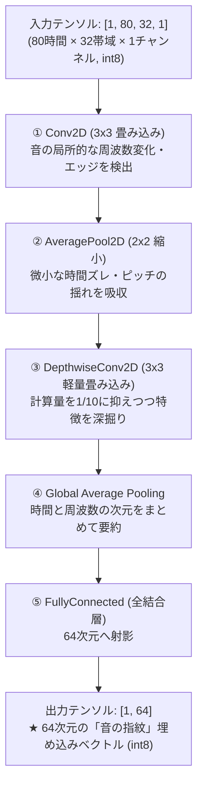

# 第6章: マイコン上の深層学習（TFLMアリーナ・Helium MVE・CNNモデル）

前章で、80フレーム（800ms分）のLog-Melスペクトログラムが、メインマイコンRA8P1（CPU0）のメモリ上に $80 \times 32$ バイトの完全な配列として揃いました。
いよいよ、このデータを使って **深層学習（ニューラルネットワーク）による推論** を行います。

本章では、Googleが開発した超軽量組込み推論エンジン **TensorFlow Lite for Microcontrollers（TFLM）** の仕組み、動的メモリを使わない「96 KiB テンソルアリーナ」、および音を画像のように認識する「畳み込みニューラルネットワーク（CNN）」の内部構造を解説します。

---

## 6.1 TFLM（TensorFlow Lite for Microcontrollers）とは？

### なぜ普通のTensorFlowやPyTorchはマイコンで動かないのか？
PCやサーバーで機械学習をするときは、`pip install tensorflow` や `torch` を使います。
しかし、これらはマイコンでは絶対に動きません。
- **ファイルシステム依存**: モデルファイル（`.h5` や `.pt`）をハードディスクから読み込む前提になっている。
- **OS依存**: LinuxやWindowsのマルチスレッド（pthread）や共有ライブラリ（`.so` / `.dll`）を要求する。
- **メモリの無制限消費**: 計算の途中で大量のメモリを `malloc()` で確保しては解放する。

### マイコン専用に極限まで削ぎ落とされたTFLM
**TFLM** は、Googleがオープンソースで開発している「マイコン（Cortex-M、ESP32など）で深層学習を動かすための専用ランタイム」です。
1. **OS非依存**: Linuxがなくても、ベアメタルやμT-KernelなどのリアルタイムOS上でそのまま動作。
2. **静的メモリオンリー**: **実行中の `malloc()` 呼び出しはゼロ（0回）**。すべての計算バッファを起動時に1個の固定配列の中にパズルのように配置。
3. **C言語からの呼出しやすさ**: モデルデータは `.tflite` ファイルをバイナリ配列（`const unsigned char g_model[] = {...}`）に変換してフラッシュメモリに直接焼き込む。

---

## 6.2 96 KiB 静的テンソルアリーナ（Tensor Arena）の仕組み

TFLMで最も特徴的なのが、**「テンソルアリーナ（Tensor Arena）」** と呼ばれるメモリ管理手法です。

```text
               +───────────────────────────────────────────────+
               |  静的テンソルアリーナ配列 (96 KiB / BSSセクション)  |
               +───────────────────────────────────────────────+
               │ [A] モデル構造情報 (TFLM内部管理データ)       │
               ├───────────────────────────────────────────────┤
               │ [B] 入力テンソルバッファ [1, 80, 32, 1]       │
               ├───────────────────────────────────────────────┤
               │ [C] 中間計算バッファ (Activation Memory)      │
               │     ※ レイヤー1の出力をレイヤー2が読んだら、 │
               │        そのメモリ領域をレイヤー3が再利用する！  │
               ├───────────────────────────────────────────────┤
               │ [D] 出力テンソルバッファ [1, 64]              │
               ├───────────────────────────────────────────────┤
               │ (余白マージン)                                │
               +───────────────────────────────────────────────+
```

### なぜ「アリーナ（競技場）」と呼ぶのか？
古代ローマのコロシアム（円形闘技場）のように、**「決められた1つの区画（アリーナ）の中で、各層のデータが代わる代わる登場して計算を行う」** からです。
- 第1層（Conv2D）が計算を終えて第2層（Pool）にデータを渡したら、第1層の計算に使っていたバッファは用済みです。
- TFLMのプランナーは、**メモリの同じ番地を第3層の計算バッファとして再利用（メモリの使い回し）** します。

これにより、層が何十層あってもメモリ消費量が膨れ上がらず、SEROVでは **たったの 96 KiB（`0x18000` バイト）** の固定メモリ配列だけで、モデル全体の推論が完全に完結します。
実行中にメモリが足りなくなって突然落ちる（Out of Memory）という事故が原理的に発生しません。

---

## 6.3 音を「画像」として見るCNNモデル構造

「畳み込みニューラルネットワーク（CNN: Convolutional Neural Network）」は、通常、画像認識（写真に写った猫や車を当てる）に使われます。
では、なぜSEROVは音の識別にCNNを使っているのでしょうか？

### スペクトログラムは「2次元の画像」である！
前章で組み立てた $80 \times 32$ のデータを見てみましょう。
- **縦軸（80コマ）**: 時間の経過（$0\text{ ms} \sim 800\text{ ms}$）
- **横軸（32ドット）**: 音の高さ（$125\text{ Hz} \sim 8000\text{ Hz}$）
- **ピクセルの明るさ**: その周波数の音の強さ（int8値）

```text
 周波数 (高)
   ▲  . . . . . . . . . . . . . . . . . . . . . . . .
   │  . . . . . . . # # # # # . . . . . . . . . . . .  救助笛の高音 (ピーッ！)
   │  . . . . . . . . . . . . . . . . . . . . . . . .
   │  # # # # # # # # # # # # # # # # # # # # # # # #  モータの低周波うなり音
   ▼  . . . . . . . . . . . . . . . . . . . . . . . .
   └──────────────────────────────────────────────────▶ 時間 (0〜800ms)
```

こうして並べると、音は完全に **「横長の白黒画像（ピクセル数: $80 \times 32$）」** です！
救助笛の音は「上の方に引かれた細い一本の水平線」、人の声は「倍音の縞模様（ハーモニクス）」、衝突音は「縦に走る一瞬の閃光」として、画像上の模様（テクスチャ）として現れます。
画像認識の超強力な武器であるCNNを使えば、この模様の特徴を圧倒的な精度で捉えることができるのです。

---

## 6.4 SEROVの完全int8 CNNモデルのレイヤー構成

SEROVが採用しているCNNモデルのアーキテクチャは、モバイル向けの超軽量設計（MobileNetの思想）に基づいています。



### レイヤーごとの役割
1. **入力**: `[1, 80, 32, 1]`（計2560要素のint8）。
2. **Conv2D**: 周波数と時間の2次元平面上で $3 \times 3$ の小さなフィルタを滑らせ、音の立ち上がりや固有のピッチ変化を検出。
3. **AveragePool2D**: 縦横を半分に圧縮。タイミングのわずかな揺れ（ジッタ）を吸収して頑健にする。
4. **DepthwiseConv2D**: チャンネルごとに独立して畳み込みを行う軽量化の決定打。通常の畳み込みに比べて計算量が約 $\frac{1}{9}$ に削減されます。
5. **出力（64次元埋め込み）**: クラスの確率（猫70%など）を直接出すのではなく、**「その音の特徴をギュッと要約した64個のint8数値（音の指紋）」** を出力します。

---

## 6.5 C++17実装とC言語境界ラッパー（`tflm_runtime.h/.cc`）

μT-KernelやSEROVのメイン制御コードは高信頼な **C言語（C99）** で書かれています。
しかし、TFLMのライブラリ本体はモダンな **C++（C++17）** のクラスベースで実装されています。

この2つを美しく接続するため、`firmware/ra8p1/SoundExplorationRover_CPU0/src/ai/tflm_runtime.h/.cc` という **薄いC言語ラッパー** を用意しています。

### C言語ヘッダ（`tflm_runtime.h`）
Cコード側からは、C++特有のクラスやテンプレートを一切見せず、プレーンな関数呼び出しとして定義されています：

```c
#ifdef __cplusplus
extern "C" {
#endif

/* TFLMランタイムの初期化（アリーナ割り当てとモデル展開） */
EXPORT BOOL tflm_runtime_init(const void * p_model_data, UW model_size);

/* 入力テンソル（80x32配列）のアドレスを取得 */
EXPORT B * tflm_runtime_get_input_tensor(void);

/* 推論実行！ (Helium MVEによる爆速整数演算) */
EXPORT BOOL tflm_runtime_invoke(void);

/* 出力テンソル（64次元埋め込み）のアドレスを取得 */
EXPORT const B * tflm_runtime_get_output_tensor(void);

#ifdef __cplusplus
}
#endif
```

呼び出し側のC言語タスクは、まるで普通のCライブラリを呼ぶのと同じ感覚で、最先端のディープラーニング推論を実行できるのです。

---

## 6.6 まとめ

- **TFLM（TensorFlow Lite for Microcontrollers）** は、マイコンのために動的メモリ確保（`malloc`）を完全排除した超軽量深層学習ランタイム。
- **96 KiB 静的テンソルアリーナ** 内でメモリ番地を使い回すことで、超省メモリでの推論を実現。
- 音響スペクトログラムを **「時間 × 周波数の2次元画像」** とみなすことで、強力な画像認識CNN（Conv2D / DepthwiseConv2D）がそのまま威力を発揮する。
- 出力は分類名ではなく、**「64次元のint8埋め込みベクトル（音の指紋）」**。

しかし、なぜモデルの最終出力が「救助笛」「モータ音」といったクラス名ではなく、「64個の数値（指紋）」なのでしょうか？
次章では、これこそがSEROVの秘密兵器である **「現場学習（Few-shot Learning）とプロトタイプ最近傍照合」** である理由を明かします！
