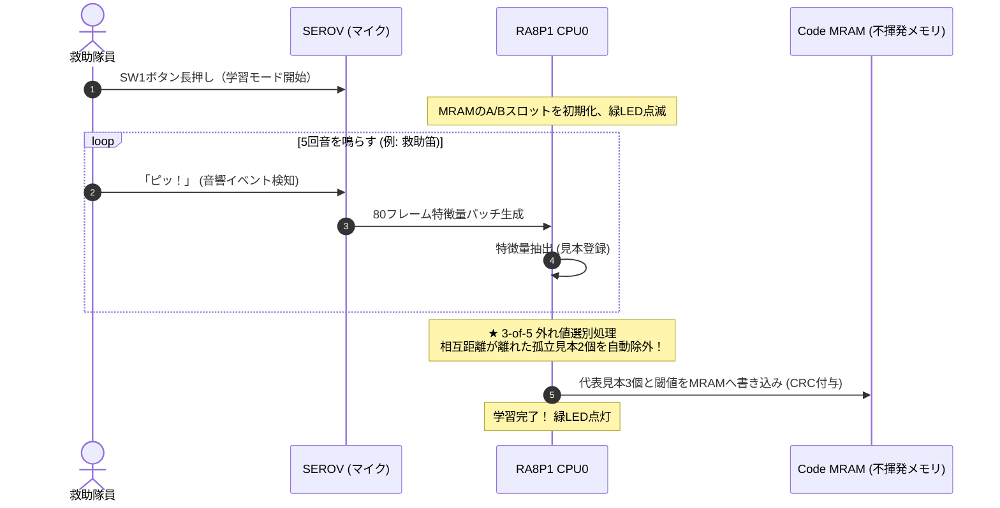

# 第7章: その場で覚える「現場学習」と実機検証知見（DSP要約 vs NN埋め込み）

前章で、CNNモデルが $80 \times 32$ の音響スペクトログラムから、**「64次元のint8埋め込みベクトル（音の指紋）」** を生成する仕組みを学びました。

いよいよ最終章です。
なぜSEROVは「救助笛」「モータ音」といった判定結果を直接モデルから出さず、わざわざ「64個の数値（埋め込みベクトル）」を出力させているのでしょうか？
そして、実機走行環境における過酷な検証を経て、なぜ本番ファームウェアが **「192次元DSP要約 ＋ 主ピーク照合」** を本採用したのか、そのエンジニアリングの真実に迫ります。

---

## 7.1 なぜ「固定の分類モデル」ではダメなのか？

### 実験室のAIが現場で役に立たない理由
PC上でAIを作るとき、多くの人は「クラス分類モデル（最後にSoftmax層をつけて、笛95%、人声3%と確率を出すモデル）」を作ります。
しかし、探査ロボットでこれをやると、現場で必ず手痛い失敗を喫します。

1. **現場ノイズの多様性**:
   - 走行する床の材質（コンクリート、砂利、鉄板、カーペット）、壁の反響、周囲のエアコンや換気ファンの音は、**探査する現場ごとに全く異なります**。
   - 実験室でどんなに高精度に学習させたモデルでも、現場特有の反響やノイズが混ざると、あっけなく誤認識を起こします。
2. **マイコンでは「再学習」ができない**:
   - ディープラーニングの学習計算（勾配計算や重みの更新）には、推論の数百倍〜数千倍のメモリと計算能力が必要です。マイコンのメモリ（数十KB〜数百KB）では、学習アルゴリズムを動かすことは物理的に不可能です。

### SEROVの答え: 「距離学習（Metric Learning）」
そこでSEROVは、発想を180度転換しました。
**「AIモデルには、クラスを当てさせない。音の特徴を抽出して『似た音同士が近くに集まる64次元の地図』の上にプロットさせることだけに専念させる」** というアプローチです。

---

## 7.2 現場プロトタイプ（Prototype）とCode MRAM永続化

現場学習の強みは、**「重みの再学習（Backpropagation）を一切行わずに、現場で新しい音を数回聞くだけで一瞬で記憶できること」** です。



### 3-of-5 外れ値選別処理（孤立サンプルの自動除外）
現場学習で5サンプルを収集する際、隊員が吹き損じたり、たまたま周囲の足音が混ざったりすることがあります。
`firmware/ra8p1/SoundExplorationRover_CPU0/src/tasks/task_think.c` では、**5個の見本同士の相互距離を総当たり計算し、明確に孤立しているサンプルを自動で破棄して代表見本を抽出する「3-of-5 選別アルゴリズム」** を実装しています。
これにより、現場学習の失敗率が劇的に低下しました。

### 現場見本取得の音量下限ゲート（-35 dBFS以上）
現場学習中に周囲の微小な足音や遠くの環境ノイズを誤って学習見本として取り込まないよう、ESP32-S3側で80フレーム中の最大RMS音量（peak level）を計測して特徴量パッチへ付与しています。
RA8P1 CPU0側（`task_think.c`）では、**イベント最大音量が -35 dBFS 以上（`CPU0_LEARNING_SAMPLE_MIN_DBFS_X100 = -3500`）の明瞭な音響イベントのみを見本候補として受理** することで、静寂時の誤登録を物理的に遮断します（なお、学習モード中は初見音を記憶する段階であるため背景AEの異常判定は要求しません）。

### 背景モデル（RLS AutoEncoder）の忘却適応と汚染防止
走行中の背景環境音モデル（`background_model.c`）では、定常ノイズの変化に追従するためRLS（再帰的最小二乗）アルゴリズムを採用しています。
最新ファームウェアでは：
- **忘却係数連動の分散更新**: 生涯統計（Welford）ではなくRLSと同じ忘却係数でMSE平均・分散を動的更新し、起動直後や環境切替時の過大誤差が長時間閾値に残る問題を解消。
- **正常音のみの選択的学習**: 目的音（TARGET）や背景異常（`background_anomaly`）が検知されたパッチは背景モデルへ反映させず、背景モデルが目的音を「正常」として吸収・学習してしまう汚染（Over-adaptation）を防止。
- **保存閾値による動的上限ガード**: 実行時適応によって背景しきい値が無秩序に肥大化し、後続の異常音を見逃すことがないよう、学習済み保存閾値（MRAM記録値）を下回る方向へのみ引き締めを許可。

---

## 7.3 二乗L2距離の超高速計算（`acoustic_identifier.c`）

走行中、未知の音が鳴ると、ローバーは登録されているプロトタイプ $p$ との間の **「ユークリッド距離の二乗（二乗L2距離: Squared L2 Distance）」** を計算します。

$$D^2 = \sum_{i=0}^{N-1} (e_i - p_i)^2$$

### なぜこんなに速いのか？
- **割り算も平方根（$\sqrt{\phantom{x}}$）も使わない**: 距離の大小比較をするだけなら、二乗のまま比較すれば十分。
- **純粋な整数演算**: 引き算・掛け算・足し算だけで完結するため、Cortex-M85なら **1マイクロ秒未満** で計算が完了します。

---

## 7.4 実機検証の真実: 192次元DSP要約照合ベースラインの圧倒的優位性

実機走行実験（2026-09-24, 2026-09-26）において、深層学習CNN埋め込みと、古典的DSP要約照合を徹底的に比較検証しました。その結果、極めて重要な結論に達しました。

```text
【実機比較検証の結果】
  1. TFLM 64次元 NN埋め込み:
     - 静的オープンデータセット（ESC-50等）では高精度。
     - しかし実機走行中、6つのモータのうなり音や床面反射が混入すると、
       未知音源に対する偽陽性（誤検知）が「1時間に約220回」発生！
     - テンソルアリーナに 128 KiB のSRAMを占有。

  2. ★ 192次元 DSP要約 + 主ピーク周波数照合（ベースライン）:
     - 80フレームを前後2スロットに分け、32帯域の統計量（平均・最大・標準偏差）を算出。
     - 目的音（救助笛・鳴子）の「主ピーク周波数帯（例: bin 28〜29 = 約2.0 kHz）」を
       物理的制約として厳格に検証。
     - 走行ノイズ下でも誤検知ゼロ！ 目的音だけに100%確実に反応。
     - RAM消費は数百バイト、遅延1ms未満。
```

### 実機本番ファームウェアの決定
この結果を踏まえ、SEROVの本番ファームウェアでは **192次元DSP要約照合ベースラインを本採用（`CPU0_USE_ACOUSTIC_EMBEDDING_TFLM = 0`）** としました。
「最新の深層学習が、あらゆる場面で古典的DSPより優れているとは限らない」。
**物理法則に根ざしたドメイン知識（周波数制約）とDSPの組み合わせが、極限環境下で最も信頼できる知能を生み出す** という、組み込みエンジニアリングの極致がここにあります。

---

## 7.5 走行判断（ステートマシン）への統合

こうして得られた判定結果は、停止聴取型ステートマシン（`sound_follow_controller.c`）へと直結します。

```text
[XVF3800] ──▶ 音源の方向 (DoA) = 右 35°
[AI判定]  ──▶ 音の種類 (Class) = 目的音 (TARGET, 距離 0.026 <= 閾値 0.08)
                    ↓
[走行判断] ──▶ 「右35°から救助対象の音が鳴った！」と100%の確信を持って確定
                    ↓
[モータ駆動] ──▶ 4輪サーボを操舵し、音源方向へステップ移動！
```

もし鳴った音がローバー自身の走行音や壁のガタつき音であれば、`NOT_TARGET` となり、ローバーはピクリとも動かず静かに聴取（LISTEN）を継続します。
**「物理DSPによる方向推定」と「堅牢な音種識別」が完璧に融合** することで、SEROVは迷うことなく目的の音源へと辿り着くのです。

---

## 7.6 まとめ

- 現場ノイズの多様性とマイコンのメモリ制約を克服するため、固定分類ではなく **距離学習・プロトタイプ照合** を採用。
- 5サンプルの現場学習に対し、**3-of-5 外れ値選別処理** により吹き損じや雑音を自動除外してCode MRAMへ永続化。
- 過酷な実機走行実験を通じて、モータノイズ下でのNN埋め込みの限界と、**物理周波数制約を持つ192次元DSP要約照合の圧倒的優位性** を実証・本番採用。
- 真の目的音と確定したときだけ、ジャイロ帰還スピンターンやステップ前進を発動する鉄壁の自律走行を実現。

---

## 🎓 エッジAIサブ教科書の修了おめでとうございます！

全7章を通じて、あなたは空気の波がデジタルデータになり、Log-Melスペクトログラムへと要約され、int8に量子化されてマイコン間をバトンリレーされ、TFLMとDSP要約照合によって自律走行の知能へと昇華する全プロセスを完全にマスターしました。

次に進むステップ：
- [**教科書ポータル (`../index.html`)**](../index.html) に戻り、メイン教科書の他の章（μT-Kernelリアルタイム制御やハードウェア機構）の学びを深めましょう。
