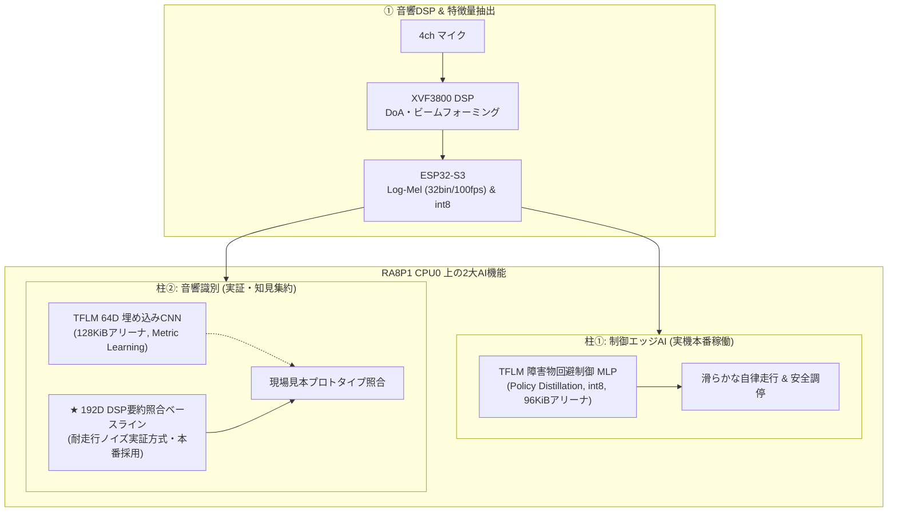

# エッジAI & 音響DSP 完全理解サブ教科書

本ディレクトリ（`docs/textbook/edgeai/`）は、Sound Exploration ROVer（SEROV）に搭載されている最先端の「**音響信号処理（DSP）**」と「**エッジ深層学習（Edge AI）**」を、初学者から組み込みエンジニアまでが直感的に・優しく・深く理解できるように構成された特化型サブ教科書です。

---

## 🎧 なぜこのサブ教科書を作ったのか？

現代のロボットにおいて、カメラによる画像認識は広く普及しています。しかし、SEROVが挑むのは **「煙や濃霧、暗闇、障害物の死角」** という光学系センサが一切通用しない極限環境です。
そこで唯一の手がかりとなるのが **「音（Sound）」** です。

ところが、音の信号処理とエッジAIは、一般的なプログラミング学習では最も挫折しやすい難所の一つです。
- 「サンプリング周波数？ 窓関数？ フーリエ変換？ なぜ波形のままAIに入れないの？」
- 「メル尺度（Mel Scale）？ 対数スペクトログラム？ なぜ人間の耳を真似るの？」
- 「int8量子化？ なぜわざわざ小数を切り捨てて整数にするの？」
- 「TensorFlow Lite for Microcontrollers（TFLM）？ なぜ普通のTensorFlowじゃ動かないの？」
- 「現場学習（Few-shot learning）？ 64次元埋め込みベクトル？ プロトタイプ照合？」
- 「実機の走行ノイズとオープンデータセットの壁（ドメインギャップ）とは？」

本サブ教科書では、これらの疑問に対して **「日常の例え話 → 直感的な図解 → 物理と数学 → 実機のC/Pythonコード → 実機検証の真実」** の流れで、誰でも挫折せずに楽しく読み進められるように徹底解説します。

---

## 📖 学習カリキュラム（全7章 ＋ 対話型Web教材）

```text
【基礎編: 音とDSPを直感的に知る】
  ├─ 01_why_edge_ai.md                   : 第1章 なぜマイコンでAIなのか？（クラウド依存の限界と組込みの挑戦）
  ├─ 02_audio_dsp_basics.md              : 第2章 音の基礎とDSP入門（サンプリング・窓関数・フーリエ変換）
  └─ 03_log_mel_spectrogram.md           : 第3章 人間の耳を模倣する「Log-Mel特徴量」の仕組み

【中級編: マイコンで高速に動かす魔術】
  ├─ 04_int8_quantization.md             : 第4章 なぜint8なのか？（浮動小数点から整数への量子化）
  ├─ 05_stream_pipeline_and_comm.md      : 第5章 音のバトンパス（I2S → 800msリング → USB → CPU0再組立）
  └─ 06_tflm_runtime_and_model.md        : 第6章 マイコン上の深層学習（TFLMアリーナ・Helium・CNN & 制御MLP）

【応用編: 現場で賢くなるAIと実機知見】
  └─ 07_few_shot_learning_and_prototype.md : 第7章 「現場学習」プロトタイプ照合と実機検証知見（DSP要約 vs NN埋め込み）
```

---

## ⚡ SEROVにおけるエッジAIの2大柱

本プロジェクトでは、マイコン向け深層学習ランタイム **TFLM（TensorFlow Lite for Microcontrollers）** を駆使し、以下の2つの高度なAI機能を実装・検証しています。



1. **柱①：TFLM 障害物回避制御 MLP（実機本番で大活躍！）**:
   - 3眼ToF測距、IMUヨーレート、目標音源方位を統合した10次元入力を完全int8で推論。
   - 人間のエキスパート走行を模倣した滑らかな連続軌道計画をマイコン内で完結。
2. **柱②：音響識別と現場学習（実機検証とベースライン本採用）**:
   - 64次元TFLM音響埋め込みCNNの実機統合実証を実施。実機走行ノイズ環境下での比較検証を経て、極めて安定した **192次元DSP要約照合ベースライン** を本番採用。

---

## 🎓 読み始める準備
難しい大学レベルの数学知識は不要です。「掛け算と足し算」「サイン波（波の揺れ）」のイメージさえあれば、誰でも読み進められます。
まずは [**第1章: なぜマイコンでAIなのか？**](01_why_edge_ai.md) からスタートしましょう！
